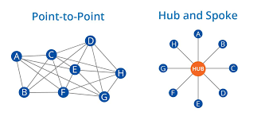
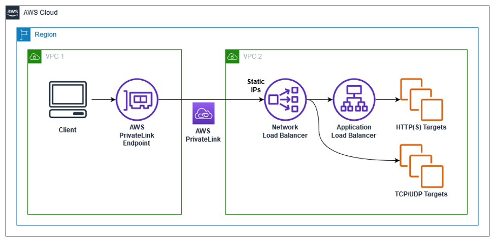

Sure! Here's a **clear and structured version** of your comparison between **VPC Peering** and **PrivateLink**:

* * *

# **VPC Peering vs PrivateLink**

Both **VPC Peering** and **PrivateLink** enable private connectivity between Virtual Private Clouds (VPCs), but they differ significantly in scope, architecture, and use case.

* * *

## **1\. VPC Peering**

**Definition:**

- A direct, point-to-point network connection between two VPCs.
    
- Instances in either VPC can communicate as if they are on the same network.
    

**Key Characteristics:**

- **Scope:** Entire VPC network (Layer 3 connectivity).
    
- **Connectivity:** Bidirectional.
    
- **Route Management:** Manual route table and security group configuration required.
    
- **IP Addressing:** CIDR blocks **cannot overlap**.
    
- **Transitive Routing:** Not supported — each peering must be explicitly created.
    
- **Shared Responsibility:** Both VPC owners must create and accept the connection.
    

**Use Case:**

- Trusted networks within the same organization (e.g., development → staging).
    
- Small-scale or simple architectures.
    

**Limitations:**

- Difficult to scale in multi-VPC environments (mesh network complexity).
    
- Opens the entire network; security requires careful management.
    

* * *

## **2\. PrivateLink**

**Definition:**

- Provides **private access to a specific service**, not the entire network.
    
- Creates a private endpoint (ENI) in your VPC to access a service in another VPC via a private IP.
    

**Key Characteristics:**

- **Scope:** Specific service or application.
    
- **Connectivity:** Unidirectional (consumer → service).
    
- **Route Management:** Automatic routing via endpoint.
    
- **IP Addressing:** Overlapping CIDR blocks allowed.
    
- **Separation of Concerns:** Service provider exposes an “endpoint service”; consumer only creates an interface endpoint.
    
- **Multi-Account/SaaS Ready:** Ideal for securely exposing services to multiple accounts or customers.
    

**Use Case:**

- Connecting to cloud provider services or third-party SaaS.
    
- Multi-account service sharing in large organizations.
    

**Advantages:**

- Easier management (no route table conflicts or IP overlap issues).
    
- Fine-grained security (access only to specific services).
    
- Highly scalable (hub-and-spoke model).
    

* * *

## **3\. Head-to-Head Comparison**

| Feature | VPC Peering | PrivateLink |
| --- | --- | --- |
| **Scope** | Entire VPC | Specific service/application |
| **Connectivity** | Bidirectional (Layer 3) | Unidirectional (Layer 4) |
| **IP Addressing** | Requires non-overlapping CIDR | Overlapping CIDR allowed |
| **Routing** | Manual route table config | Automatic via private endpoint |
| **Scaling** | Hard to scale (mesh complexity) | Highly scalable (hub-and-spoke) |
| **Security** | Opens full network; complex | Fine-grained access to single service |
| **Use Case** | Trusted networks in same org | SaaS, multi-account service sharing |

* * *

## **4\. Which is Easier?**

**PrivateLink is generally easier and more scalable**, especially for large or complex environments:

- **Simplified Management:** Automatic routing; no CIDR conflicts.
    
- **Better Security:** Access limited to a single service (least privilege).
    
- **Scalability:** Supports many consumer VPCs connecting to a single service without creating a mesh network.
    

**VPC Peering** can be easier for **simple, small-scale scenarios**:

- Connecting two VPCs within the same organization.
    
- Full network connectivity is desired, and setup is straightforward.
    

* * *

&nbsp;

**VPC Peering (mesh) vs PrivateLink (hub-and-spoke)**

&nbsp;

