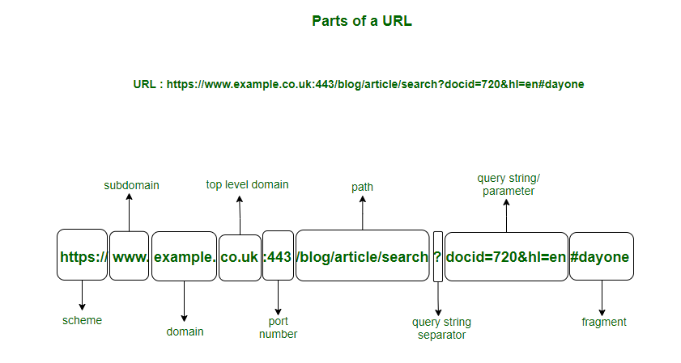

&nbsp;

https://www.indusface.com/learning/what-is-dns/


Here is a **clear, concise summary** of your content, while preserving all the key ideas and technical accuracy.

* * *

## Summary: Domain Name System (DNS)

The **Domain Name System (DNS)** is a behind-the-scenes internet service that enables users to browse websites using easy-to-remember domain names instead of numeric IP addresses. DNS translates human-readable names like `www.example.com` into machine-readable IP addresses such as `192.168.1.1`, allowing computers to locate and communicate with servers on the internet.

### How DNS Works

Whenever a user accesses a website, a DNS lookup process occurs almost instantly:

1.  The user’s device sends a query to a **Recursive DNS Resolver** (usually provided by an ISP or public DNS service).
    
2.  If the resolver does not have the answer cached, it queries the **Root Name Server**, which directs it to the appropriate **Top-Level Domain (TLD) server** (e.g., `.com`, `.org`).
    
3.  The TLD server points the resolver to the **Authoritative Name Server**, which holds the actual DNS records.
    
4.  The authoritative server returns the IP address, which is then sent back to the user’s browser to load the website.
    

### Key DNS Components

- **Domain Names:** Human-readable website addresses (e.g., `example.com`)
    
- **IP Addresses:** Numeric identifiers used by computers
    
- **DNS Servers:** Infrastructure responsible for domain-to-IP translation
    

### Types of DNS Servers

- **Recursive Resolver:** Acts as an intermediary, handling client queries and caching results.
    
- **Root Name Server:** Directs queries to the correct TLD servers.
    
- **TLD Name Server:** Maintains domain directories for specific extensions like `.com` or `.org`.
    
- **Authoritative Name Server:** Stores actual DNS records and provides final answers.
    

### DNS Records

Authoritative servers manage zone files containing records such as:

- **A / AAAA:** Map domain names to IP addresses
    
- **CNAME:** Create domain aliases
    
- **MX:** Define mail servers
    
- **NS:** Specify authoritative name servers
    

### DNS Caching

DNS responses are cached based on their **Time-to-Live (TTL)** value, improving performance and reducing load on DNS infrastructure. Caching leads to faster response times, better network efficiency, and improved scalability.

### Importance of DNS

DNS is essential for:

- Simplifying internet navigation
    
- Supporting large-scale internet growth
    
- Providing fault tolerance through distributed servers
    
- Enhancing performance through caching
    

### DNS Security

DNS is vulnerable to threats like spoofing and DDoS attacks. Security measures such as **DNSSEC**, encrypted DNS resolvers, controlled zone transfers, and continuous monitoring help protect DNS integrity and ensure safe internet usage.

* * *

If you want, I can also:

- Make this **even shorter (executive summary)**
    
- Rewrite it in **blog-ready format**
    
- Convert it into **interview notes**
    
- Add **simple diagrams (text-based)**
    

Just tell me 👍

&nbsp;

&nbsp;

&nbsp;

Sure, Raushan — let’s go **from absolute basics to advanced**, the way Route 53 is actually used in real AWS environments.

* * *

# 🌍 What is Amazon Route 53?

**Amazon Route 53 is AWS’s managed DNS (Domain Name System) service.**

In simple words:

> **Route 53 converts human-friendly names (like `www.example.com`) into machine-friendly IP addresses (like `54.182.91.10`) and decides *where* traffic should go.**

It is used for:

- **DNS (name → IP resolution)**
    
- **Traffic routing**
    
- **Health checks**
    
- **Domain registration**
    

* * *

## 🧠 Why is it called Route 53?

- **Route** → it routes traffic
    
- **53** → DNS uses **port 53** (TCP/UDP)
    

* * *

# 1️⃣ DNS BASICS (Before Route 53)

## What is DNS?

DNS is like the **phonebook of the internet**.

| You type | DNS finds |
| --- | --- |
| `google.com` | `142.250.77.14` |

### Without DNS:

You would have to remember IP addresses 😵

* * *

## How DNS resolution works (High level)

1.  You type `www.example.com`
    
2.  Your OS asks a **DNS resolver** (ISP / corporate / AWS VPC resolver)
    
3.  Resolver asks:
    
    - Root DNS servers
        
    - TLD servers (`.com`)
        
    - Authoritative DNS server (Route 53, Cloudflare, etc.)
        
4.  IP address is returned
    
5.  Browser connects to the IP
    

* * *

# 2️⃣ Where Route 53 Fits

Route 53 acts as the **Authoritative DNS server** for your domain.

Example:

```
example.com
│
├── www.example.com → ALB
├── api.example.com → EKS
├── db.example.com  → RDS
```

Route 53 answers:

> “For this name, send traffic here.”

* * *

# 3️⃣ Core Concepts in Route 53

Let’s build step-by-step.

* * *

## 🏠 1. Domain

A **domain** is a name like:

- `example.com`
    
- `mycompany.in`
    

You can:

- Buy it from Route 53
    
- Or use Route 53 only for DNS while domain is bought elsewhere
    

* * *

## 📦 2. Hosted Zone (VERY IMPORTANT)

A **Hosted Zone** is a **container for DNS records**.

### Two types:

### 🔹 Public Hosted Zone

- For **internet-facing domains**
    
- Example:
    
    ```
    example.com
    www.example.com
    ```
    

### 🔹 Private Hosted Zone

- Only works **inside a VPC**
    
- Not visible on the internet
    
- Example:
    
    ```
    db.internal.example.com
    consul.service.local
    ```
    

💡 You already saw similar concepts in Kubernetes (CoreDNS).

* * *

## 📜 3. DNS Records

Records define **what name points to what**.

### Common record types:

| Record | Purpose |
| --- | --- |
| A   | Name → IPv4 |
| AAAA | Name → IPv6 |
| CNAME | Alias to another name |
| ALIAS | AWS-specific CNAME replacement |
| MX  | Mail servers |
| TXT | Verification, SPF, DKIM |
| NS  | Name servers |
| SOA | Zone metadata |

* * *

### Example Records

```text
www.example.com   A      54.182.91.10
api.example.com   CNAME  api-alb-123.ap-south-1.elb.amazonaws.com
```

* * *

## ⭐ ALIAS Record (AWS Special)

ALIAS is **better than CNAME** for AWS services.

### Why ALIAS exists:

- CNAME **cannot** be used at root domain (`example.com`)
    
- ALIAS **can**
    
- No extra DNS lookup
    
- Free (no query charge)
    

### Supports:

- ALB / NLB
    
- CloudFront
    
- S3 static website
    
- API Gateway
    

Example:

```
example.com → ALIAS → CloudFront
```

* * *

# 4️⃣ How Route 53 Routes Traffic

This is where Route 53 becomes **powerful**.

* * *

## 🔀 Routing Policies (Key Feature)

### 1️⃣ Simple Routing

- One record → one target
    
- Default behavior
    

```
www.example.com → ALB
```

* * *

### 2️⃣ Weighted Routing

- Split traffic by percentage

Example:

```
v1.example.com → 80%
v2.example.com → 20%
```

Used for:

- Canary deployments
    
- A/B testing
    

* * *

### 3️⃣ Latency-Based Routing

- Sends users to **nearest region**

Example:

```
User in India → ap-south-1
User in US → us-east-1
```

* * *

### 4️⃣ Failover Routing (DR setup)

- Primary + Secondary
    
- Health checks decide
    

```
Primary ALB → unhealthy → traffic goes to DR
```

* * *

### 5️⃣ Geolocation Routing

- Route based on **country/continent**

Example:

```
India → India website
US → US website
```

* * *

### 6️⃣ Geoproximity Routing

- Like geolocation but **distance-based**
    
- Can bias traffic (shift load intentionally)
    

* * *

### 7️⃣ Multi-Value Answer Routing

- Returns multiple healthy IPs
    
- Client chooses
    

* * *

# 5️⃣ Health Checks (Very Important)

Route 53 can:

- Ping an endpoint
    
- Check HTTP response
    
- Monitor HTTPS status codes
    

Used with:

- Failover routing
    
- Weighted routing
    

### Example:

```
If /health returns 200 → healthy
Else → unhealthy
```

* * *

# 6️⃣ Private Hosted Zones (Enterprise Usage)

Used heavily in:

- Microservices
    
- EKS / ECS
    
- Hybrid networking
    

Example:

```
db.internal.mycorp → RDS
auth.internal.mycorp → EKS service
```

Only resolvable:

- Inside associated VPCs
    
- Over VPN / Direct Connect
    

* * *

# 7️⃣ Route 53 + VPC DNS

Inside a VPC:

- AWS provides a **VPC DNS resolver**
    
- IP: `VPC CIDR + 2` (example: `10.0.0.2`)
    

Flow:

```
EC2 → VPC Resolver → Route 53 Private Hosted Zone
```

* * *

# 8️⃣ Route 53 + Load Balancers

Very common architecture:

```
User
 ↓
Route 53
 ↓
ALB
 ↓
EKS / EC2
```

Why?

- ALB IPs change
    
- Route 53 ALIAS handles this automatically
    

* * *

# 9️⃣ Route 53 vs ELB vs CloudFront

| Service | Role |
| --- | --- |
| Route 53 | DNS + traffic decision |
| ALB/NLB | Layer 7/4 load balancing |
| CloudFront | CDN + caching |

* * *

# 🔟 Real-World Example (End-to-End)

### You want:

```
example.com → CloudFront
api.example.com → ALB
internal.example.com → Private VPC only
```

### Setup:

1.  Create **Public Hosted Zone** `example.com`
    
2.  Add:
    
    - `example.com` → ALIAS → CloudFront
        
    - `api.example.com` → ALIAS → ALB
        
3.  Create **Private Hosted Zone** `internal.example.com`
    
4.  Associate VPC
    
5.  Add internal records
    

* * *

# 🔐 Security & Reliability

- Global anycast DNS
    
- Highly available (AWS-managed)
    
- DDoS resistant
    
- Integrated with IAM & CloudTrail
    

* * *

# 🧠 Key Takeaways (Interview-Ready)

- Route 53 is **authoritative DNS**
    
- Hosted Zones store DNS records
    
- ALIAS > CNAME for AWS
    
- Routing policies control traffic flow
    
- Health checks enable failover
    
- Private Hosted Zones enable internal DNS
    

* * *

If you want, next we can:

- 🔍 Deep-dive **Route 53 vs CoreDNS**
    
- 🧩 Design **multi-region DR architecture**
    
- 🛠️ Walk through **AWS Console + CLI setup**
    
- ❓ Do **interview Q&A with scenarios**
    

Just tell me 👍