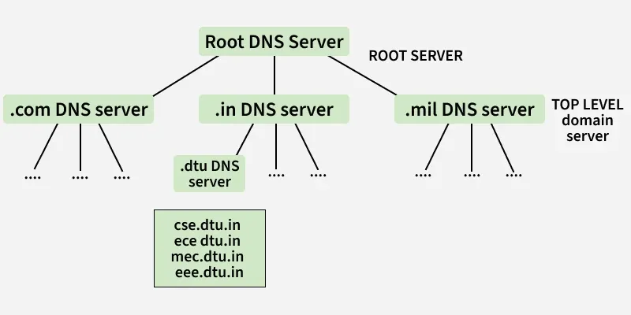

Argo Project ---- https://chatgpt.com/share/692e77be-04e4-8006-9829-9c1f18143e59

&nbsp;

To understand **Argo CD**, it is best to look at it as a collection of specialized microservices working together to achieve the GitOps goal.

Here are the core components and their specific roles:

* * *

## 1\. API Server

The **API Server** is the entry point for all interactions with Argo CD. It is a gRPC/REST server that exposes the API used by the Web UI, the CLI, and external CI/CD systems.

- **Authentication & RBAC:** It handles user login and ensures that users have the correct permissions to view or sync specific applications.
    
- **Credential Management:** It manages the storage of cluster and repository secrets.
    
- **Action Triggering:** When you click "Sync" on the UI, the API Server receives that request and passes it to the controller.
    

## 2\. Repository Server (Repo Server)

The **Repo Server** is an internal service that maintains a local cache of the Git repositories containing your manifests.

- **Manifest Generation:** This is its most important job. It takes the raw files from Git (Helm charts, Kustomize files, or plain YAML) and "renders" them into standard Kubernetes manifests that the cluster can understand.
    
- **Caching:** It caches the generated manifests to improve performance, so it doesn't have to re-render everything for every small check.
    

## 3\. Application Controller

The **Application Controller** is the "brain" of Argo CD. It is a Kubernetes controller that continuously monitors running applications.

- **Comparison (Diffing):** It constantly compares the **Live State** (what is actually running in the cluster) against the **Desired State** (the rendered manifests from the Repo Server).
    
- **Status Reporting:** It updates the application status (e.g., `Synced`, `OutOfSync`, `Healthy`, `Degraded`).
    
- **Reconciliation:** If configured for "Auto-Sync," the controller will automatically apply the changes to the cluster to fix any drift it detects.
    

## 4\. Redis

Argo CD uses **Redis** as a temporary data store and cache.

- **Role:** It stores the state of the Repo Server's rendered manifests and the API Server's session information.
    
- **Benefit:** Using Redis significantly reduces the load on the Git repositories and the Kubernetes API by serving cached data for frequent UI refreshes.
    

## 5\. Dex (Optional but common)

**Dex** is an identity service that handles authentication with external identity providers.

- **Role:** It allows you to log into Argo CD using your company's existing identity systems like **GitHub, SAML, LDAP, or Okta**.

* * *

### 🔄 How they work together (The Sync Flow)

1.  **User** requests a Sync via the **API Server**.
    
2.  **API Server** tells the **Application Controller** to start a sync.
    
3.  **Application Controller** asks the **Repo Server** for the latest "Desired State" from Git.
    
4.  **Repo Server** clones the Git repo (or uses cache), renders the YAML, and sends it back.
    
5.  **Application Controller** compares this to the cluster, finds the differences, and uses the **Kubernetes API** to apply the changes.
    
6.  **Redis** caches the result so the UI updates instantly.
    

Would you like to see a breakdown of how to configure the **Repo Server** to handle custom plugins or private Git repositories?

&nbsp;

&nbsp;

## **Step 1: Install Argo CD**

1.  Create a namespace for Argo CD (optional, default is `argocd`):

```bash
kubectl create ns argocd
```

2.  Apply the official Argo CD manifests:

```bash
kubectl apply -n argocd -f https://raw.githubusercontent.com/argoproj/argo-cd/stable/manifests/install.yaml
```

- Deploys Argo CD components:
    
    - **Server** (UI/API)
        
    - **Application Controller**
        
    - **Repo Server**
        
    - **Dex** (optional for SSO)
        
    - Services, RBAC, CRDs, Secrets
        

* * *

## **Step 2: Access Argo CD**

1.  Expose Argo CD Server:

- NodePort / LoadBalancer / port-forward:

```bash
kubectl port-forward svc/argocd-server -n argocd 8080:443
```

2.  Get initial admin password:

```bash
kubectl -n argocd get secret argocd-initial-admin-secret -o jsonpath="{.data.password}" | base64 -d
```

3.  Login via CLI:

```bash
argocd login localhost:8080 --username admin --password <password> --insecure
```

* * *

## **Step 3: Prepare Git repository for Nginx**

1.  Create a Git repo (e.g., `nginx-argo-managed`)
    
2.  Add Kubernetes manifests for Nginx:
    

- **Deployment** (with `resources.requests` and `resources.limits` to satisfy quotas)
    
- **Service** (NodePort if you want external access)
    

3.  Commit and push changes to the repo.

* * *

## **Step 4: Handle ResourceQuota (if applicable)**

- Check quotas in the target namespace:

```bash
kubectl get resourcequota -n raushan
```

- If needed, **delete** or **adjust quotas**:

```bash
kubectl delete resourcequota firstrq -n raushan
```

- Or update manifests to fit within the quota limits.

* * *

## **Step 5: Create Argo CD Application**

- **Via CLI**:

```bash
argocd app create nginx \
  --repo <your-git-repo-url> \
  --path . \
  --dest-server https://kubernetes.default.svc \
  --dest-namespace raushan \
  --project default
```

- **Via UI**: Fill in Application Name, Project, Repo URL, Path, Cluster, Namespace → Create.

* * *

## **Step 6: Sync Application (Deploy Nginx)**

- **Via CLI**:

```bash
argocd app sync nginx
```

- **Via UI**: Click **Sync → Synchronize**
    
- Argo CD will create Deployment + Service in the `raushan` namespace.
    

* * *

## **Step 7: Verify Deployment**

```bash
kubectl get pods -n raushan -l app=nginx
kubectl get svc -n raushan nginx
```

- Check that Pods are running and NodePort Service is available.

* * *

## **Step 8: Access Nginx**

- If NodePort = 30080 and node IP = 172.21.251.198:

```
http://172.21.251.198:30080
```

- Or via SSH tunnel if private network:

```bash
ssh -L 30080:localhost:30080 <user>@172.21.251.198
```

- Then visit: `http://localhost:30080`

* * *

## **Step 9: Future GitOps Updates**

1.  Make changes to manifests in Git (replicas, image, etc.)
    
2.  Commit & push
    
3.  Argo CD detects **OutOfSync** → sync again
    

- Optional: Enable **auto-sync**:

```bash
argocd app set nginx --sync-policy automated
```

- Cluster automatically stays in sync with Git.

* * *

✅ **Outcome:**

- Argo CD is managing your Nginx deployment.
    
- Any change in Git is reflected in the cluster automatically.
    
- You have full visibility via Argo CD UI/CLI.
    

* * *

&nbsp;

&nbsp;

&nbsp;

&nbsp;

&nbsp;

&nbsp;

Let’s break down **each manifest and component** carefully so you know exactly what you’re deploying and how Argo CD will manage it.

* * *

## **1️⃣ Deployment (`deployment.yaml`)**

```yaml
apiVersion: apps/v1
kind: Deployment
metadata:
  name: nginx
  labels:
    app: nginx
spec:
  replicas: 2
  selector:
    matchLabels:
      app: nginx
  template:
    metadata:
      labels:
        app: nginx
    spec:
      containers:
      - name: nginx
        image: nginx:latest
        ports:
        - containerPort: 80
```

**Explanation:**

| Field | Meaning |
| --- | --- |
| `apiVersion: apps/v1` | Kubernetes API version for Deployment resources. |
| `kind: Deployment` | Tells K8s to create a Deployment object, which manages Pods. |
| `metadata.name` | Name of this Deployment (`nginx`). |
| `metadata.labels` | Labels attached to the Deployment; used for selection and grouping. |
| `spec.replicas` | Number of Pods to run (here 2 replicas). |
| `spec.selector.matchLabels` | Selects Pods that belong to this Deployment based on labels. |
| `spec.template` | Pod template that defines what each Pod looks like. |
| `spec.template.metadata.labels` | Labels applied to Pods created by this Deployment. |
| `spec.template.spec.containers` | List of containers in each Pod. |
| `name: nginx` | Container name. |
| `image: nginx:latest` | Docker image to pull for this container. |
| `ports.containerPort` | Port that the container exposes (80). |

**Summary:** Deployment ensures that **2 Nginx Pods** are always running. If a Pod dies, Kubernetes will recreate it automatically.

* * *

## **2️⃣ Service (`service.yaml`)**

```yaml
apiVersion: v1
kind: Service
metadata:
  name: nginx
spec:
  type: NodePort
  selector:
    app: nginx
  ports:
    - port: 80
      targetPort: 80
      nodePort: 30080
```

**Explanation:**

| Field | Meaning |
| --- | --- |
| `apiVersion: v1` | Core Kubernetes API version for Services. |
| `kind: Service` | Service resource exposes Pods to the network. |
| `metadata.name` | Service name (`nginx`). |
| `spec.type: NodePort` | Exposes the Service on a port on every node in the cluster. |
| `spec.selector` | Selects Pods that this Service will route traffic to (all Pods labeled `app=nginx`). |
| `spec.ports.port` | Port inside the cluster to expose (Service port). |
| `spec.ports.targetPort` | Port on the Pod to route traffic to (containerPort). |
| `spec.ports.nodePort` | Fixed port on **every node** to access this Service externally (here `30080`). |

**Summary:**

- The Service allows you to **access Nginx Pods reliably**, even though Pods might move around.
    
- NodePort allows access **from outside the cluster** via `<node-ip>:30080`.
    

* * *

## **3️⃣ How Argo CD uses these**

When you create an Argo CD Application pointing to this repo:

1.  Argo CD **pulls the manifests** from Git.
    
2.  It calculates the **desired state** (2 Pods + NodePort Service).
    
3.  It applies the manifests to the cluster (`kubectl apply`).
    
4.  Argo CD continuously **monitors the cluster**. If someone deletes a Pod or changes the Service, Argo CD will automatically restore it to match the Git repo.
    

* * *

✅ **Key idea:**

- **Deployment** → ensures Pods run.
    
- **Service** → exposes Pods to the network.
    
- **Argo CD** → GitOps controller that ensures the cluster state matches what’s in Git.
    

* * *

&nbsp;

&nbsp;

&nbsp;

&nbsp;

&nbsp;

&nbsp;

Now that your **Nginx manifests are pushed to Git**, the next steps are to **create an Argo CD Application** and **deploy it to your cluster**. Let’s go step by step.

* * *

## **Step 1: Create an Argo CD Application**

You can do this **via UI** or **CLI**. I’ll explain both.

* * *

### **Option A: Via UI (recommended for first time)**

1.  Open Argo CD UI: `https://localhost:8080`
    
2.  Click **\+ New App**
    
3.  Fill in the fields:
    

| Field | Value |
| --- | --- |
| **Application Name** | `nginx` |
| **Project** | `default` |
| **Repository URL** | `<your Git repo URL>` |
| **Revision** | `HEAD` (or the branch name) |
| **Path** | `.` (or the folder where manifests are, e.g., `base`) |
| **Cluster URL** | `https://kubernetes.default.svc` |
| **Namespace** | `default` |

4.  Click **Create**

> This tells Argo CD: “Deploy the manifests in this repo to the default namespace on this cluster.”

* * *

### **Option B: Via CLI**

```bash
argocd app create nginx \
  --repo <your-repo-url> \
  --path . \
  --dest-server https://kubernetes.default.svc \
  --dest-namespace default \
  --project default
```

- Replace `<your-repo-url>` with your Git repo URL.

* * *

## **Step 2: Sync (deploy) the Application**

Once the app is created, Argo CD needs to **apply the manifests to the cluster**.

### **Via UI**

1.  Go to the Application page
    
2.  Click **Sync → Synchronize**
    
3.  Wait for all resources to appear **Healthy** and **Synced**
    

### **Via CLI**

```bash
argocd app sync nginx
```

- This applies the Deployment + Service to your cluster.
    
- You can check status:
    

```bash
argocd app get nginx
```

- It shows which resources are deployed and their health.

* * *

## **Step 3: Verify in Kubernetes**

Check Pods:

```bash
kubectl get pods -n default -l app=nginx
```

Check Service:

```bash
kubectl get svc -n default nginx
```

- `NodePort: 30080` → accessible externally if you have network access to node IP.

* * *

## **Step 4: Access Nginx**

- If NodePort is 30080 and node IP is `172.21.251.198`, open:

```
http://172.21.251.198:30080
```

- Or, if behind private network, you can SSH tunnel like we did for Argo CD.

* * *

## **Step 5: Future GitOps updates**

- Any **change you make to the manifests in Git** (e.g., replicas, image, ports) → commit & push
    
- Argo CD will detect the changes → you can **Sync** → cluster automatically updates
    

* * *

✅ **Summary of GitOps flow now:**

1.  Make changes in Git → push
    
2.  Argo CD monitors repo → detects OutOfSync
    
3.  Click **Sync** (or auto-sync if enabled) → cluster matches Git
    

* * *

&nbsp;

&nbsp;

&nbsp;

&nbsp;

Let’s go **field by field** and explain what each of these means in Argo CD when creating an Application:

* * *

### **1️⃣ Application Name → `nginx`**

- This is the **name of the Argo CD Application** itself.
    
- It’s how you’ll refer to this app in the UI and CLI (`argocd app get nginx`).
    
- Does **not affect the Kubernetes resources**; just Argo CD’s internal tracking.
    

* * *

### **2️⃣ Project → `default`**

- Argo CD organizes applications under **Projects**.
    
- Projects define **boundaries, permissions, and policies**.
    
- `default` is the built-in project; suitable for small setups.
    
- You can later create your own projects to manage multiple apps with rules.
    

* * *

### **3️⃣ Repository URL → `<your Git repo URL>`**

- This is the **Git repository** where your Kubernetes manifests live.
    
- Example: `https://github.com/raushan/nginx-argo-managed.git`
    
- Argo CD will **pull manifests from this repo** to deploy your application.
    

* * *

### **4️⃣ Revision → `HEAD` (or branch name)**

- This tells Argo CD **which Git branch, tag, or commit to deploy**.
    
- `HEAD` → deploy latest commit on default branch (usually `main` or `master`).
    
- You can specify a tag or specific commit if you want a fixed version.
    

* * *

### **5️⃣ Path → `.` (or folder where manifests are)**

- This is the **path inside the repository** where your manifests are located.
    
- Example:
    
    - If your manifests are in the root → `.`
        
    - If in a folder `base/` → `base`
        
- Argo CD only looks at this path for manifests when syncing.
    

* * *

### **6️⃣ Cluster URL → `https://kubernetes.default.svc`**

- The **Kubernetes API server URL** where the app will be deployed.
    
- `https://kubernetes.default.svc` → deploy to **same cluster where Argo CD is running**.
    
- If deploying to another cluster, you register the cluster in Argo CD and use its API URL here.
    

* * *

### **7️⃣ Namespace → `default`**

- The **namespace in the target cluster** where the manifests will be applied.
    
- Example: your Nginx Deployment + Service will be created in `default` namespace.
    
- Can be any existing namespace; if it doesn’t exist, Argo CD can create it (depending on permissions).
    

* * *

### ✅ **Summary**

| Field | Purpose |
| --- | --- |
| Application Name | Argo CD’s identifier for your app |
| Project | Grouping & policy for apps |
| Repository URL | Git repo with Kubernetes manifests |
| Revision | Branch, tag, or commit to deploy |
| Path | Folder inside the repo containing manifests |
| Cluster URL | Target Kubernetes cluster API |
| Namespace | Kubernetes namespace to deploy the resources |

* * *

Essentially, these fields tell **Argo CD where to look in Git, which cluster & namespace to deploy to, and what to call the app in Argo CD**.

* * *

&nbsp;

&nbsp;

&nbsp;

&nbsp;

&nbsp;

Using yaml file for Application

* * *

## **1️⃣ What is an Argo CD Application**

An **Argo CD Application** is a **Kubernetes custom resource** (`Application`) that tells Argo CD:

1.  **Where to find the manifests** (Git repo, path, branch)
    
2.  **Which cluster and namespace to deploy to**
    
3.  **Sync policy** (manual or automated)
    
4.  **Project** it belongs to (defines permissions, destinations)
    

It’s essentially **the link between Git and your target cluster**.

* * *

## **2️⃣ Argo CD Application YAML Example**

Here’s a minimal YAML for your Nginx app:

```yaml
apiVersion: argoproj.io/v1alpha1  # Argo CD Application CRD API version
kind: Application                 # The type of Kubernetes resource (Argo CD Application)
metadata:
  name: nginx-03                  # Name of this Argo CD Application
  namespace: argocd               # Namespace where Argo CD itself is installed (argocd namespace)
spec:
  project: default                # Argo CD project this app belongs to (default project if no custom project is used)
  source:
    repoURL: https://github.com/rick-raush/nginx-argo-managed  # Git repository containing Kubernetes manifests/Helm charts
    targetRevision: HEAD         # Branch, tag, or commit to deploy. HEAD means latest commit on the default branch
    path: .                      # Path inside the repo where the manifests are located (here, root of the repo)
  destination:
    server: https://kubernetes.default.svc  # Kubernetes API server to deploy to (default is the cluster Argo CD is running in)
    namespace: raushan           # Target namespace in the cluster where resources will be deployed
  syncPolicy: {}                 # Sync policy controls automated deployment behavior:
                                 # {} means manual sync (no auto-sync). Could also specify auto-sync settings.

```

**Explanation of fields:**

| Field | Meaning |
| --- | --- |
| `metadata.name` | Name of the Argo CD Application |
| `metadata.namespace` | Namespace where Argo CD is running (usually `argocd`) |
| `spec.project` | Argo CD Project (default or custom) |
| `spec.source.repoURL` | Git repository with manifests |
| `spec.source.targetRevision` | Branch, tag, or commit (HEAD for default branch) |
| `spec.source.path` | Path in repo where manifests are located |
| `spec.destination.server` | Kubernetes API server URL (in-cluster or external) |
| `spec.destination.namespace` | Namespace to deploy resources in the cluster |
| `spec.syncPolicy` | Optional auto-sync settings (prune deletes extra resources, selfHeal fixes drift) |

* * *

## **3️⃣ Apply the YAML**

```bash
kubectl apply -f nginx-argo-application.yaml
```

- This creates an **Application CR** in Argo CD.
    
- Argo CD will start tracking the Git repo and show the app in its UI.
    

* * *

## **4️⃣ Sync the Application**

- **Via CLI**:

```bash
argocd app sync nginx
```

- **Via UI**: Click **Sync → Synchronize**
    
- Argo CD will deploy your Nginx resources to the target namespace.
    

* * *

✅ **Tip:** You can version control this YAML too — put it in Git so your Argo CD setup itself is under GitOps.

* * *

&nbsp;

&nbsp;

&nbsp;

&nbsp;

&nbsp;

**Kubernetes contexts and configs** are central to working with multiple clusters or environments.

* * *

## 1\. **Kubeconfig file**

- Kubernetes uses a **kubeconfig file** (usually `~/.kube/config`) to store **cluster connection information** and **user credentials**.
    
- It defines **how `kubectl` should connect** to clusters and authenticate.
    

A kubeconfig has three main sections:

1.  **Clusters** → info about the API server
    
    ```yaml
    clusters:
    - name: dev-cluster
      cluster:
        server: https://dev.example.com
        certificate-authority: /path/to/ca.crt
    ```
    
2.  **Users** → credentials to access the cluster
    
    ```yaml
    users:
    - name: dev-user
      user:
        token: <token>
    ```
    
3.  **Contexts** → which user talks to which cluster by default
    
    ```yaml
    contexts:
    - name: dev-context
      context:
        cluster: dev-cluster
        user: dev-user
        namespace: dev
    ```
    

- **Default context** is used if you don’t specify one.

* * *

## 2\. **Kube context**

A **context** is a **shortcut that tells kubectl**:

> “When I run commands, use this cluster, this user, and this namespace by default.”

- It references **one cluster + one user + one default namespace**.
    
- Switching contexts allows you to **work with multiple clusters or namespaces without manually specifying credentials each time**.
    

Example commands:

```bash
# Show current context
kubectl config current-context

# Switch to another context
kubectl config use-context dev-context

# List all contexts
kubectl config get-contexts
```

* * *

## 3\. **How this is used in multiple environments**

Suppose you have **prod and non-prod clusters**:

| Cluster | Context Name | Namespace |
| --- | --- | --- |
| Dev Cluster | dev-context | dev |
| QA Cluster | qa-context | qa  |
| Prod Cluster | prod-context | default |

- You can switch context to deploy to **Dev**, test in **QA**, and finally deploy to **Prod**, all using the **same kubectl CLI**.
    
- Each context ensures you **don’t accidentally deploy dev code to prod**.
    

* * *

### 4\. **Summary**

- **Kubeconfig file** → stores clusters, users, and contexts.
    
- **Context** → tells kubectl **which cluster, user, and namespace** to use.
    
- **Why useful** → multiple clusters, multiple environments, multiple namespaces, one CLI.
    

* * *

&nbsp;

you don’t need to copy the entire kubeconfig file into Argo CD’s cluster. Argo CD just needs **credentials to talk to Cluster B’s API server**.

Here’s how it works:

* * *

## **1️⃣ How Argo CD accesses another cluster**

Argo CD runs a **controller in Cluster A**. To deploy to Cluster B, it needs:

- **API server URL of Cluster B**
    
- **Credentials** (token or kubeconfig context) with sufficient permissions
    

* * *

## **2️⃣ Using `argocd cluster add`**

To **temporarily add a kubeconfig** so Argo CD can register or access Cluster B, you don’t need to overwrite your default `~/.kube/config`. You can just **point kubectl or Argo CD CLI to the kubeconfig file** using the `--kubeconfig` flag or environment variable.

Here’s how:

```sh
# List contexts in the Cluster B kubeconfig
    kubectl --kubeconfig=/path/to/clusterB-kubeconfig config get-contexts
# Add Cluster B to Argo CDargocd cluster 
    add <context-name-of-cluster-B> --kubeconfig /path/to/clusterB-kubeconfig


```

- `--kubeconfig` tells kubectl/argocd CLI to **temporarily use that file**.
    
- No changes are made to your default kubeconfig.
    

&nbsp;

The standard method:

```bash
kubectl --kubeconfig=<clusterB-kubeconfig> config get-contexts
argocd cluster add <context-name-of-cluster-B>
```

What happens:

1.  Argo CD reads the kubeconfig for Cluster B.
    
2.  It creates a **ServiceAccount `argocd-manager`** in Cluster B.
    
3.  It binds this SA to a **ClusterRole** allowing Argo CD to create/update/delete resources.
    
4.  The credentials are stored **inside Argo CD (Cluster A)**, no manual file copy needed.
    

After this, Argo CD can talk to Cluster B’s API securely.

* * *

## **3️⃣ Key points**

| Thing | Notes |
| --- | --- |
| kubeconfig | Needed only temporarily for `argocd cluster add` command |
| No permanent copy | Argo CD stores credentials internally (in secrets) |
| Network access | Cluster A (Argo CD) must be able to reach Cluster B API server (private network, VPN, or public endpoint) |
| Namespace | You specify the namespace in Cluster B when creating the Argo CD Application |

* * *

So yes, you **use Cluster B’s kubeconfig** to register it with Argo CD in Cluster A — after that, Argo CD handles all communication.

&nbsp;

&nbsp;

what if i put the application file in the repo and apply it.

&nbsp;       how does flux and kustomize solve this.

&nbsp;

&nbsp;

&nbsp;

&nbsp;

* * *

* * *

* * *

* * *

* * *

# Part -2

&nbsp;

&nbsp;

&nbsp;

&nbsp;

Control Plane (Master Node)  
├─ kube-apiserver  
├─ kube-controller-manager  
├─ kube-scheduler  
└─ etcd  
    └─ /var/lib/etcd (data stored here)  
        ├─ Pods  
        ├─ ConfigMaps  
        ├─ Secrets  
        ├─ PVC metadata  
        └─ Cluster state

&nbsp;

Cluster etcd  
├─ ConfigMap: nginx-html -> projected into Pod as /usr/share/nginx/html/index.html  
├─ PVC: my-pvc -> binds to PV  
| └─ PV: hostPath /mnt/data (node) OR EBS/GCE disk (cloud)  
Pod  
└─ Container nginx  
    ├─ /usr/share/nginx/html -> ConfigMap  
    └─ /data -> mounted PVC (persistent storage)

&nbsp;

Great — this is a **very important concept** and once you understand it, PV/PVC becomes super clear.  
Let’s break it down deeply and visually.

* * *

# ✅ **What goes into etcd? What does NOT go into etcd?**

### **etcd stores *cluster metadata*, NOT actual application data.**

Kubernetes uses etcd only for **state**, not for storing files, logs, databases, etc.

* * *

# 🔹 **1️⃣ What is stored in etcd (metadata only)?**

etcd stores **information *about* the PV**, not the PV’s content.

Example stored in etcd:

```
PersistentVolume:
  name: my-pv
  type: awsElasticBlockStore
  capacity: 5Gi
  status: Bound
  nodeAffinity: <some nodes>
  path: /dev/xvdf
```

So etcd only knows:

- What the PV is
    
- What storage type it uses
    
- Which PVC it is bound to
    
- What namespace it belongs to
    
- What its capacity is
    
- What pod is using it
    

👉 **But etcd does NOT store what is inside the PV** (files, DB data, logs, etc).

* * *

# 🔹 **2️⃣ Where does the *actual PV data* live?**

This depends on the storage type:

### **If PV type = hostPath, local**, then:

- Data is on the **node’s filesystem**  
    Example:

```
/mnt/data
/var/lib/mysql
```

### **If PV type = AWS EBS**

- Data is stored inside **an AWS EBS volume**.

### **If PV type = GCE Persistent Disk**

- Data is on **Google Cloud block storage**.

### **If PV type = NFS**

- Data is on **the NFS server**.

### **If PV type = Ceph/GlusterFS**

- Data is inside **the distributed storage cluster**.

👉 In ALL cases:  
**Actual application data is NOT stored inside etcd**.

* * *

# 🔹 **3️⃣ Why does Kubernetes work this way?**

Because etcd is:

- a **small, fast key-value store**
    
- meant only for **cluster state**
    
- NOT designed to store GBs of files
    

If Kubernetes tried to store PV data inside etcd:

❌ etcd would crash  
❌ the cluster would become slow  
❌ network traffic would explode  
❌ etcd could no longer perform fast reads/writes

So Kubernetes simply stores *metadata* in etcd and points to *external storage* for actual data.

* * *

# ⚡ **4️⃣ Example: How PV/PVC works end-to-end**

Let’s say you create:

```yaml
apiVersion: v1
kind: PersistentVolumeClaim
metadata:
  name: my-pvc
spec:
  resources:
    requests:
      storage: 1Gi
```

### What happens:

### **⚙️ Step 1: PVC is stored in etcd**

- etcd stores “PVC my-pvc wants 1Gi”.

### **⚙️ Step 2: Kubernetes finds a matching PV**

PV object is also stored in etcd.

### **⚙️ Step 3: PV is bound to PVC**

etcd stores binding relationship.

### **⚙️ Step 4: Pod mounts the PV**

Pod’s volumeMount configuration is stored in etcd.

### **📁 Step 5: Actual data**

The file data written by the Pod goes to **the real underlying storage volume**, e.g.:

- `/mnt/data` (node)
    
- `/var/lib/postgres/data` (node)
    
- AWS EBS volume
    
- GCP Persistent Disk
    
- NFS server
    
- Ceph cluster
    

NOT to etcd.

* * *

# ✅ **5️⃣ Visual Diagram**

```
               +--------------+
               |    etcd      |
               +--------------+
               | PV metadata  |
               | PVC metadata |
               | Pod specs    |
               | ConfigMaps   |
               | Secrets      |
               +--------------+
                     |
                     | (metadata only)
                     v
           +---------------------+
           | Kubernetes Control  |
           |     Plane           |
           +---------------------+
                     |
                     | (mount volume)
                     v
          +------------------------+
          |   Node (worker)       |
          +------------------------+
          |    Actual PV data     |
          |  /mnt/data  (local)   |
          |  EBS volume (cloud)   |
          |  NFS server (network) |
          +------------------------+
```

👉 etcd = **instructions & references**  
👉 PV = **real storage**

* * *

# 🟢 **Final Summary**

| Component | Lives in etcd? | Where data actually lives? |
| --- | --- | --- |
| **ConfigMaps** | Yes | etcd |
| **Secrets** | Yes | etcd |
| **PV object** | Yes | etcd |
| **PVC object** | Yes | etcd |
| **Pod definitions** | Yes | etcd |
| **Actual PV data (files)** | ❌ No | Node disk / cloud volume / NFS |

* * *

If you want, I can explain the difference between **static provisioning** vs **dynamic provisioning** of PVs next — that ties perfectly into this topic.

&nbsp;

&nbsp;

&nbsp;

&nbsp;

&nbsp;

* * *

* * *

* * *

&nbsp;

&nbsp;

### TLS Handshaking

&nbsp;

Here is a **clean, complete, end-to-end summary** of everything we discussed — from HTTP → HTTPS → TLS → Certificates → CA → Trust Store → Certificate Chain → Verification → What your device stores → What server sends.

This is the full picture you were building.

* * *

# 🟥 **1\. What is HTTP?**

- Plain text communication.
    
- No encryption.
    
- Anyone on the network can read or modify data (MITM attack).
    

* * *

# 🟩 **2\. What is HTTPS?**

HTTPS = HTTP + TLS (Transport Layer Security)

TLS encrypts the connection so:

- No one can read your data
    
- No one can alter your data
    
- You know you're talking to the real server
    

* * *

# 🟦 **3\. What is TLS?**

TLS does three things:

1.  **Authentication** — proves the server is genuine
    
2.  **Encryption** — hides data so only server can read
    
3.  **Integrity** — ensures no tampering happens
    

TLS uses:

- **Public–private key cryptography**
    
- **Certificates signed by trusted CAs**
    

* * *

# 🟨 **4\. What is a Certificate?**

A **certificate** is a digital identity card for a server.

It contains:

- Domain name (CN / SAN)
    
- Validity dates
    
- Issuer (CA)
    
- Signature made by CA
    
- Server’s **public key**
    

The certificate basically says:

> “This public key belongs to this domain, and a trusted CA vouches for it.”

* * *

# 🟧 **5\. What is a Certificate Authority (CA)?**

A CA is a trusted third party whose responsibility is to:

- Verify the identity of a website owner
    
- Issue certificates
    
- Sign those certificates with its **private key**
    

CAs include:

- DigiCert
    
- GlobalSign
    
- Let’s Encrypt
    
- GoDaddy
    
- Entrust
    

Your device already trusts them.

* * *

# 🟩 **6\. What is the Trust Store? (In your device)**

Your device has a **Root Trust Store**, containing **Root CA certificates**.

On macOS → Keychain Access → System Roots  
On Windows → certmgr.msc → Trusted Root CAs  
On Linux → /etc/ssl/certs

Trust store contains:

- ~100–300 **Root CA public keys**
    
- These are the ultimate trust anchors
    

Not all website certificates are stored, only the CAs.

* * *

# 🟪 **7\. How HTTPS handshake works (simplified)**

### When you open `https://example.com`:

### **STEP 1 — Server sends its certificates**

Server sends:

1.  **Website certificate**
    
    - Public key of website
        
    - Signed by intermediate CA
        
2.  **Intermediate CA certificate(s)**
    
    - Signed by Root CA

Root CA is **not** sent because your device already has it.

### **STEP 2 — Browser verifies signature chain**

The browser checks:

1.  **Root CA public key** verifies Intermediate CA certificate
    
2.  **Intermediate CA public key** verifies Website certificate
    

If both check out → browser trusts this website.

* * *

# 🟫 **8\. How digital signature verification works**

### When CA signs a certificate:

1.  They take some certificate data
    
2.  Hash it (usually **SHA-256**)
    
3.  Encrypt the hash with CA's **private key**  
    → This becomes the **signature**
    

### When browser verifies:

1.  Takes the certificate data from server
    
2.  Hashes it again (SHA-256)
    
3.  Decrypts the signature using CA’s **public key**
    
4.  Compares the two hashes
    

If hashes match → certificate is valid, not modified.

* * *

# 🟧 **9\. What does the CA store?**

Internally CA stores:

- Its **private key** (used for signing)
    
- Its **own certificate** (public key)
    
- A database of all certificates it has issued
    
- Revocation lists (CRL)
    

* * *

# 🟩 **10\. What does your device/browser store?**

Only:

- **Root CA certificates**
    
- Their **public keys**
    

Does NOT store:

- Every certificate on the internet
    
- Intermediate CAs
    
- Website certificates
    

Intermediate certificates come **from the server**.

* * *

# 🟦 **11\. Certificate Chain Explained (final understanding)**

```
[Root CA Certificate - in your device]
        |
        | verifies
        v
[Intermediate CA Certificate - sent by server]
        |
        | verifies
        v
[Website Certificate - sent by server]
```

So the browser can build trust because:

- It already trusts the Root CA
    
- Intermediate CA is signed by the Root
    
- Website certificate is signed by the Intermediate
    

This creates a **Chain of Trust**.

* * *

# 🟥 **12\. Why is it secure if server sends the certificate and public key?**

Because:

- Public keys are safe to share
    
- Only the CA has the private key to sign
    
- Only the server has the private key for decryption
    

Anyone can generate public keys, but only the **trusted CA** can sign certificates that browsers accept.

* * *

# 🟪 **13\. Where can you see these certificates on your device?**

### macOS

Open **Keychain Access** → System Roots

### Chrome

Click ⚓ lock icon → Certificate → View chain

### OpenSSL (CLI)

```
openssl s_client -connect google.com:443 -showcerts
```

* * *

# 🟩 **14\. What happens next?**

Once certificate verification passes:

1.  Browser generates a **random symmetric key**
    
2.  Encrypts it using server’s **public key**
    
3.  Server decrypts using its **private key**
    
4.  Both now share the symmetric key
    
5.  All data encrypted with fast AES/GCM
    

This establishes the secure tunnel.

* * *

# 🎉 FINAL SUMMARY

HTTPS works because of a chain of trust:

1.  **Root CAs** – trusted by your OS
    
2.  **Intermediate CAs** – trusted because Root signed them
    
3.  **Website certificates** – trusted because Intermediate signed them
    
4.  **Browser verifies chain** using signatures and public keys
    
5.  **Secure encryption** begins once trust is established
    

Everything depends on:

- Public–private key cryptography
    
- Digital signatures
    
- Trust store
    
- Certificate chain
    
- TLS handshake
    

You now understand the entire system end-to-end like a security engineer.

* * *

If you want, next I can explain:

🔹 How to generate your own CA  
🔹 How to issue a certificate for Nginx  
🔹 How to configure HTTPS in Nginx  
🔹 How to create a full certificate chain  
🔹 How to mount certs in Kubernetes using Secrets

&nbsp;

&nbsp;

* * *

* * *

&nbsp;

&nbsp;

### TLS Handshaking detailed

&nbsp;

1.  **What is HTTP?**
    
2.  **What is HTTPS?**
    
3.  **What is SSL/TLS?**
    
4.  **Why do we need certificates?**
    
5.  **How certificates work (full handshake flow)?**
    
6.  **What is a CA (certificate authority)?**
    
7.  **How browsers trust certificates?**
    
8.  **How this applies to your Nginx in Kubernetes**
    

* * *

# 🔵 1. What is HTTP?

**HTTP = HyperText Transfer Protocol**  
It is how browsers and servers communicate.

Example:

```
GET /index.html HTTP/1.1
Host: example.com
```

HTTP is:  
❌ **not encrypted**  
❌ **can be read by anyone in between**  
❌ **not secure**

If someone captures your network traffic, they can see everything:

- passwords
    
- cookies
    
- API data
    
- pages you visit
    

This is why we needed something secure.

* * *

# 🟢 2. What is HTTPS?

**HTTPS = HTTP + encryption (TLS)**

```
HTTP + TLS = HTTPS
```

The “S” means **secure**.

Everything sent between browser and server is:  
✔ encrypted  
✔ cannot be read  
✔ cannot be modified  
✔ identity is verified

* * *

# 🟣 3. What is SSL/TLS?

### SSL = old protocol (1995)

Deprecated for security reasons.

### TLS = new secure protocol (1999)

Current version = TLS 1.3.

Today people say “SSL certificate” but actually:  
✔ It is a TLS certificate  
✔ The industry still uses the old term

Think of SSL vs TLS like:

- SSL = old phone
    
- TLS = smartphone
    

* * *

# 🔴 4. Why do we need certificates?

Certificates solve **3 problems**:

### **1\. Encryption**

Data is scrambled so only the server can read it.

### **2\. Authentication**

Browser verifies the server is real, not fake.

### **3\. Integrity**

Data cannot be changed in the middle.

* * *

# 🟡 5. How TLS works (simple explanation)

Here is the TLS handshake (modern):

### Step 1 — Browser → Server

“Hello, I want to start a secure conversation.”

### Step 2 — Server → Browser

“Here is my **certificate** and my **public key**. Verify me.”

### Step 3 — Browser

- Checks if certificate is real
    
- Checks if CA is trusted
    
- Validates domain (CN/SAN)
    

If valid → OK  
If invalid → Browser warns.

### Step 4 — Browser creates a **session key**

This is a random symmetric key.

### Step 5 — Browser encrypts the session key using server’s public key

So only the server can decrypt it with private key.

### Step 6 — Both sides now use the same key

All communication is encrypted.

* * *

# 🔵 6. What is a Certificate Authority (CA)?

A **CA** is a trusted organization that signs certificates.

Examples:

- DigiCert
    
- GoDaddy
    
- Let’s Encrypt
    
- GlobalSign
    

Your browser already trusts these.

### Why do we need CA?

To avoid fake websites.

If CA signs a certificate for `google.com`, it means:  
✔ This server really belongs to Google  
✔ The certificate is authentic

Browsers trust CA → so they trust certificates signed by CA.

* * *

# 🟣 7. Self-signed vs CA-signed certificate

### Self-signed:

- You sign your own certificate
    
- Browsers do NOT trust it
    
- Good for testing, internal systems
    

### CA-signed:

- Signed by a trusted authority
    
- Browsers immediately trust it
    
- Used for production websites
    

* * *

# 🔥 8. Putting Everything Together (Full Flow)

Here is exactly what happens when you open:

```
https://example.com
```

### 1) Browser connects to server

Sends: “Hello, let’s do TLS handshake.”

### 2) Server sends its SSL/TLS certificate

Contains:

- domain name
    
- certificate validity
    
- server public key
    
- CA signature verifying it
    

### 3) Browser verifies:

✔ Certificate not expired  
✔ Domain matches  
✔ Certificate signed by trusted CA

If valid → continue  
If not valid → warning ⚠

### 4) Browser creates a secret key

Encrypts it using server’s **public key**.

### 5) Server decrypts using **private key**

Now both have the same key.

### 6) Encrypted HTTP communication begins

This is HTTPS.

* * *

# 🔵 9. How this applies to YOUR case (Kubernetes)

You want:

- Nginx serving on HTTPS
    
- Your own CA to sign the Nginx cert
    
- Browser shows “secure” connection
    

This means you need:

1.  **Your own CA**
    
2.  **A certificate for nginx signed by your CA**
    
3.  **TLS secret in Kubernetes**
    
4.  **Nginx configured to use TLS**
    
5.  **Browser trusts your CA**
    

You already understand why now.

&nbsp;

&nbsp;

Great question — and this is the point where most people get confused at first.

You’re asking:

> **If the server gives the certificate AND the public key to the browser, why is HTTPS secure?  
> Can’t an attacker also take that public key and decrypt the data?**

Let’s break it down VERY clearly.

* * *

# 🚀 **SHORT ANSWER**

Because **public key ≠ private key**  
and **only the private key can decrypt the data**, and the private key **never leaves the server**.

Even if the attacker has:

✔ the certificate  
✔ the public key  
✔ everything the server sent

they **still cannot decrypt** the data because:

🔐 **The private key is required — and it stays secret on the server.**

Let’s go deeper.

* * *

# 🔥 **THE CORE IDEA**

Public-key cryptography has **two keys**:

| Key | Who gets it | What it does |
| --- | --- | --- |
| **Public key** | Given to everyone | Encrypts data |
| **Private key** | Stays on server | Decrypts data |

They are **mathematically linked**, but:

👉 **You cannot derive the private key even if you have the public key.**

This is the magic of modern cryptography.

* * *

# 🧠 **WHY IT’S SECURE EVEN IF PUBLIC KEY IS PUBLIC**

Imagine a box with a padlock:

- Anyone can **lock** the box using the padlock → (public key)
    
- But only the person with the **key** can unlock it → (private key)
    

Even if I give you the padlock, you **cannot** open the box.

That's exactly how public/private key cryptography works.

* * *

# 🌎 **Step-by-step HTTPS security logic**

### **1️⃣ Server sends certificate + public key**

This is okay.  
Public key is meant to be **public**.

### **2️⃣ Browser checks the certificate**

- Is it signed by trusted CA?
    
- Does domain match?
    
- Is it expired?
    

If all good → continue.

### **3️⃣ Browser generates a secret session key**

This is a random symmetric key (fast for encryption).

### **4️⃣ Browser encrypts this session key using server’s public key**

Only the matching **private key** can decrypt it.

Even if attacker steals the public key:  
❌ They STILL cannot decrypt the session key  
❌ They still don't know the private key  
❌ They cannot read your data

### **5️⃣ Server decrypts session key using PRIVATE KEY**

Now both sides share a secret.

### **6️⃣ All future traffic uses that shared secret key**

Using symmetric encryption (fast, strong).

* * *

# 🛡️ **SO WHAT IF AN ATTACKER COPIES THE PUBLIC KEY?**

Let’s see what an attacker can do:

### Attacker intercepts traffic:

✔ sees certificate  
✔ sees public key  
✔ sees encrypted session key  
✔ sees encrypted data

But they CANNOT:  
❌ decrypt session key (needs private key)  
❌ decrypt data  
❌ fake identity (certificate must be signed by CA)

Everything is useless without the private key.

* * *

# 🔥 **BUT WAIT… what about Man-in-the-Middle (MITM)?**

Good question.

What if attacker sits in the middle and gives you their own public key?

→ This is prevented by **CA signatures**.

Because:

✔ Browsers trust CA root certificates  
✔ Server certificate is signed by CA  
✔ Attacker cannot forge CA signature  
✔ Browser will show big red warning if certificate is fake

So MITM fails.

* * *

# 🎯 **Final Understanding**

Security does NOT come from hiding the public key.

Security comes from:

### ✔ Private key secrecy

### ✔ Certificate signed by trusted CA

### ✔ Browser rejecting fake certificates

### ✔ Math that makes private key impossible to guess

### ✔ Encrypted session keys used for actual data

* * *

# 🧩 **If you understood this, you now get:**

- Why TLS is secure
    
- Why public key can be public
    
- Why certificates matter
    
- Why CA matters
    
- Why MITM fails
    

* * *

# 👉 If you want next:

I can explain:

🔹 How public/private key math works (RSA/ECDSA)  
🔹 Full diagram of TLS handshake  
🔹 Why we need symmetric key AFTER handshake  
🔹 Why self-signed certs give a warning  
🔹 How Kubernetes stores TLS secrets

&nbsp;

&nbsp;

&nbsp;

Great question — and this is where most people misunderstand how browsers validate certificates.

You asked:

> **Does the browser go to the CA and ask “is this certificate valid?”**

**ANSWER: No.**  
**Browser usually does NOT contact the CA directly** to verify normal certificates.

Let me explain clearly.

* * *

# ✅ **How the Browser Validates a Certificate (NO network call needed)**

When the browser receives a server certificate, it validates it using its **local trust store**.

Your computer has a built-in list of trusted CA certificates.

Examples:

- Chrome → uses OS trust store
    
- Firefox → has its own CA list
    
- macOS → Keychain Access
    
- Windows → Certificate Manager
    

These stores contain ~150+ trusted CA certificates.

* * *

# 🟢 **Validation Step 1: Check CA Signature (local test)**

The browser receives the website certificate, which contains:

- domain name
    
- public key
    
- expiry dates
    
- CA signature
    

It then:

### **1\. Finds the CA public key from its own trust store**

(no network call)

### **2\. Uses the CA public key to verify the signature**

If signature matches → certificate is legitimate.  
If not → browser shows “Not Secure”.

This is **pure cryptography**, no internet connection needed.

* * *

# 🟢 **Validation Step 2: Domain Match**

Browser checks:

- Certificate says `CN=google.com`
    
- The URL you visited is `https://google.com`
    

If mismatch → browser blocks it.

Again → done locally.

* * *

# 🟢 **Validation Step 3: Expiry Date**

Browser checks:

- NotBefore date
    
- NotAfter date
    

If expired → browser warns.

Done locally.

* * *

# 🟢 **Validation Step 4 (Optional): OCSP / CRL check**

This is the ONLY part where the browser *may* contact the CA.

Why?

To check if certificate was **revoked**.

There are two methods:

### **1\. OCSP (Online Certificate Status Protocol)**

Browser might ask CA:

```
Is this certificate revoked?
```

### **2\. CRL (Certificate Revocation List)**

Browser may download a file containing revoked cert IDs.

**But this is optional and not always performed.**

Even if OCSP fails (because you are offline), HTTPS still works.

* * *

# 🔴 **Important: Browsers do NOT ask the CA to “verify” the cert**

Because:

- That would be slow
    
- It would break if you were offline
    
- CAs would be overloaded
    
- It’s unnecessary — signature validation already proves authenticity
    

Verification is based on **cryptographic proof**, not CA lookup.

* * *

# 🧠 **Summary: Who verifies what?**

| Check | Done by browser? | Network call? | Why? |
| --- | --- | --- | --- |
| CA signature | ✔ Yes | ❌ No | Done using local trust store |
| Domain match | ✔ Yes | ❌ No | Local check |
| Expiry | ✔ Yes | ❌ No | Local check |
| Certificate chain | ✔ Yes | ❌ No | Local check |
| Revocation check | ✔ Yes | 🟡 Maybe | OCSP/CRL |
| Certificate authenticity | ✔ Yes | ❌ No | Math verification |

* * *

# 🏁 **Final Understanding**

### ✔ Browser does NOT ask CA to validate certificate

### ✔ Browser validates CA signature *locally*

### ✔ Browser only *may* contact CA for revocation

### ✔ All trust is based on cryptographic signatures

This is why HTTPS still works even if:

- You have no internet
    
- CA server is down
    
- You are inside a private network
    

* * *

# 🎉 You're understanding real security fundamentals now.

If you want next, I can explain:

🔹 What exactly is “signature verification”?  
🔹 How public key + signature proves authenticity  
🔹 How certificate chain works (root → intermediate → server)  
🔹 How OCSP stapling works  
🔹 Why self-signed certs fail in browser

Just tell me **“explain signature verification”** or ask anything.

&nbsp;

Great — now we go **deep into signatures**, from absolute zero, step-by-step, using simple analogies → then full cryptographic explanation.

You asked:

> **How does signature verification happen? What exactly is a signature?**

Let’s go slowly.

* * *

# 🔵 1. What is a digital signature? (simple definition)

A **digital signature** is a special piece of data created using a **private key** that proves:

✔ the data was created by the owner of the private key  
✔ the data was not changed

It is like a **tamper-proof stamp**.

* * *

# 🔵 2. Analogy: A real-world signature (basic understanding)

Imagine:

- A famous artist signs a painting.
    
- Anyone can see the signature.
    
- But only the artist can produce that signature.
    

Same idea in digital signatures:

| Real world | Digital world |
| --- | --- |
| Artist signature | Digital signature |
| Artist's hand | Private key |
| People verifying signature | Public key |
| Painting | Certificate or data |

Anyone can verify.  
Only the creator can sign.

* * *

# 🔵 3. Public and Private Keys (before signature)

A key pair has:

- **Private key** → SECRET (only server/CA has it)
    
- **Public key** → PUBLIC (everyone can have it)
    

These are mathematically linked.

BUT:

👉 You **cannot compute** the private key from the public key.  
👉 You **cannot forge** a signature without the private key.

* * *

# 🟣 4. What exactly is a digital signature?

A signature is:

```
Signature = Encrypt(Hash(data), PrivateKey)
```

Let’s break this:

### 🧩 Step A: Hashing the Data

The issuer (CA or server) first does:

```
hash = SHA256(data)
```

Hash:

- is a unique fingerprint
    
- changes if even 1 bit of data changes
    
- cannot be reversed
    

### 🧩 Step B: Encrypt the Hash using Private Key

The issuer then encrypts this hash:

```
signature = Encrypt_with_PrivateKey(hash)
```

This creates the **digital signature**.

This signature is included in the certificate.

* * *

# 🟢 5. Now the browser verifies the signature (NO CA contact needed)

When browser receives the certificate + signature:

### Step 1 → Browser extracts:

- the certificate data
    
- the signature
    
- the CA name
    

### Step 2 → Browser finds CA’s **public key**

From its local trust store.

### Step 3 → Browser decrypts the signature using the CA public key

```
decrypted_hash = Decrypt_with_PublicKey(signature)
```

### Step 4 → Browser hashes the certificate data itself

```
browser_hash = SHA256(data)
```

### Step 5 → Browser compares:

```
if decrypted_hash == browser_hash:
        SIGNATURE VALID
else:
        INVALID / FAKE / MODIFIED
```

This proves:

✔ Certificate was signed by the CA  
✔ Certificate was not modified  
✔ Certificate is authentic

* * *

# 🔥 BUT WHY DOES THIS PROVE AUTHENTICITY?

Because:

- The **private key** used to sign the certificate is **known ONLY** to the CA.
    
- The matching **public key** is already trusted by your browser.
    
- If decryption works → signature is from that CA.
    
- No one else in the world can create a valid signature without CA’s private key.
    

Thus:

👉 Anyone can **verify** signature using CA’s public key  
👉 Only CA can **create** a signature using its secret private key

* * *

# 🔒 6. What guarantees security here?

### 1\. The private key is never shared

Only the CA has it.

### 2\. Math of cryptography

Public key cannot be used to derive private key.

### 3\. Hash ensures integrity

If the certificate changes → signature fails.

### 4\. Browser trust store

Browser knows which CA public keys are legitimate.

* * *

# 🧠 7. Summary in 20 seconds

**Signing:**

1.  CA hashes the certificate
    
2.  CA encrypts hash with private key → signature
    
3.  Signature stored inside certificate
    

**Verifying:**

1.  Browser decrypts signature using CA public key
    
2.  Browser hashes certificate again
    
3.  If hashes match → certificate is real & unmodified
    

* * *

# 🟢 If you want, I can explain next:

✔ **Certificate chain** (Root CA → Intermediate → Server)  
✔ **Why servers don’t use root CA directly**  
✔ **How MITM attack is prevented by signatures**  
✔ **RSA vs ECDSA signature math (simple)**  
✔ **Difference between encryption and signature**

Just tell me *what you want next*.

G

reat questions — let’s go **slow and from absolute basics** so the entire signature concept becomes crystal clear.

* * *

# ✅ **What exactly is being hashed in a certificate signature?**

When a CA signs a certificate, it signs the **certificate’s contents**, except the signature field itself.

This includes fields like:

- **Subject** (domain name, e.g., `www.example.com`)
    
- **Public key** of the server
    
- **Issuer** (which CA issued it)
    
- **Validity period** (start & expiry date)
    
- **Other metadata** (usage, extensions, etc.)
    

Think of it like signing the **entire certificate body**.

### 👉 The *data* = “TBSCertificate”

TBSCertificate → **To-Be-Signed Certificate**

This is a standard structure defined in X.509 spec.

* * *

# ✅ **What hashing function is used?**

Common ones:

- SHA256 → **most common**
    
- SHA384
    
- SHA512
    

These are written in certificates as:

- `sha256WithRSAEncryption`
    
- `sha384WithRSAEncryption`
    
- `ecdsa-with-SHA256`
    

### ❗The hash function is NOT always the same.

The CA chooses which one it supports (usually SHA256 today).

* * *

# 🔍 **Why hashing first? Why not sign the data directly?**

Because:

1.  Certificates are large → hashing compresses to a 32-byte digest.
    
2.  Signing large data is slow.
    
3.  Hash ensures integrity (any bit changed changes digest completely).
    

Hashing + signing = **digital signature**

* * *

# 🔐 **Full Signature Process — Step by Step**

## **📌 Step 1 — CA builds the data**

CA prepares the certificate structure without a signature.

```
TBSCertificate = {
  subject: www.example.com,
  public_key: <server public key>,
  issuer: <CA name>,
  validity: <dates>,
  ...other fields...
}
```

* * *

## **📌 Step 2 — Hash the data**

```
hash = SHA256(TBSCertificate)
```

This hash is a 32-byte digest.

* * *

## **📌 Step 3 — CA signs the hash with its PRIVATE key**

Example: using RSA

```
signature = encrypt_with_private_key_CA(hash)
```

This is the **digital signature** stored in the certificate.

Only the CA’s private key can create this signature.

* * *

# 🧠 **Now the browser verifies the certificate**

Browser performs:

1.  Recreate the TBSCertificate (everything except signature)
    
2.  Hash it itself (same SHA256)
    
3.  Verify signature using CA’s **public key** (stored in OS/browser)
    

```
decrypted_hash = decrypt_with_CA_public_key(signature)

if decrypted_hash == SHA256(TBSCertificate):
    → signature is valid
```

* * *

# ✋ Your Key Question

## ❓“How does the browser confirm validity? Does it go to the CA?”

**NO.**  
There is *no* API call to the CA to “verify.”  
Verification happens **locally** using:

- the CA public key (built into browsers/OS)
    
- cryptographic math
    

However, the browser *may* check revocation (OCSP/CRL), but that’s different.

* * *

# 🔥 **Visual Summary**

### Signing:

```
TBSCertificate --SHA256--> digest --sign with CA private key--> signature
```

### Verification:

```
TBSCertificate --SHA256--> digest2
signature --verify with CA public key--> digest1

digest1 == digest2 ? VALID : INVALID
```

* * *

# 💡 Why this works

- The server provides **certificate + signature**
    
- Browser already has the **CA's public key**
    
- Browser doesn’t need to trust server-provided data blindly
    
- Signature ensures:
    
    - certificate wasn't modified
        
    - certificate was issued by CA
        

* * *

# 🏁 If you want, I can now explain:

- RSA signing math
    
- ECDSA signing math
    
- How TLS handshake uses this cert
    
- How encryption keys are exchanged
    

Just tell me which direction you want next.

&nbsp;

Great question — this is the point where everything suddenly “clicks.”  
Let’s break it down cleanly.

* * *

# ✅ **What does the CA store? What does the browser store?**

These are *different things*, and understanding this fixes the confusion.

* * *

# 🟦 **1\. What the CA (Certificate Authority) stores**

A CA stores internally:

### **1️⃣ CA’s Private Key**

- **This MUST be secret.**
    
- Used to sign certificates.
    

### **2️⃣ CA’s own certificate (public certificate)**

This certificate contains:

- CA **public key**
    
- CA identity
    
- Signature (self-signed)
    

### **3️⃣ Database of issued certificates**

Not mandatory but commonly stored:

- Which certificate was issued to which domain
    
- Expiry date
    
- Whether it’s revoked (CRL list)
    

* * *

# 🟩 **2\. What the *browser* or OS stores**

Browsers/OS keep a **Root Trust Store**.

This includes **only ROOT CA certificates**, NOT all certificates in the world.

Example store contains maybe:

- 100–300 trusted **Root CA certificates** (Google, DigiCert, GoDaddy, Let’s Encrypt, etc.)

Each root CA certificate contains:

- CA **public key**
    
- CA metadata
    
- Signature (self-signed)
    

### ⚠️ **The browser does NOT store all the millions of actual certificates.**

Only ROOT CAs.

Intermediate CAs come from the server during TLS handshake.

* * *

# 🔥 **Your confusion: “But there can be many certificates?”**

Yes — millions of certificates exist:

- google.com
    
- amazon.com
    
- example.com
    
- yourwebsite.com
    
- etc.
    

BUT the browser **does not store the public key for each certificate**.

Instead:

1.  Browser stores **trusted CA public keys** only.
    
2.  When a website gives its certificate, browser verifies:
    
    - Signed by a trusted CA?
        
    - Chain of trust valid?
        
    - Not expired?
        
    - Domain matches?
        

This works because:

👉 **If you trust the CA’s public key, you automatically trust all certificates the CA signs.**

That’s the whole purpose of PKI.

* * *

# 🏗 **3\. Certificate Chain Example**

Let’s Encrypt Root CA (in your browser)  
⬇️  
Intermediate CA (sent by server)  
⬇️  
Your webserver’s certificate (sent by server)

Browser verifies:

1.  Root → signs Intermediate
    
2.  Intermediate → signs Your certificate
    

Since the browser trusts Root CA via its **public key**, it trusts the entire chain.

* * *

# ⚡ Full Picture

### **Browser Trust Store contains:**

- RootCA1 public key
    
- RootCA2 public key
    
- RootCA3 public key
    
- (about 100–300)
    

### **Server presents:**

- Website certificate (pub key + signature)
    
- Intermediate CA certificates
    

### **Browser verifies:**

- Using RootCA public key → verify Intermediate CA
    
- Using Intermediate CA public key → verify website certificate
    

No need to store millions of site certificates.  
Just store ~300 root keys.

* * *

# 🧠 Simple Analogy

Think of CA public keys in the browser as **“master signatures”**.

If your mother signs your report card, the school trusts it because they know your mother’s signature.

They don't need every signature your mother ever made — just **one known good copy**.

Same concept.

* * *

# Want deeper clarity?

I can explain:

- What is root vs intermediate CA?
    
- Why self-signed root CAs work?
    
- How browser certificate chain building works?
    
- Where exactly trust store lives in Linux/macOS/Windows?
    

Tell me where you want to go next.



&nbsp;

Let’s break this down clearly — this is one of the most important parts of how HTTPS works.

* * *

# ✅ **What does the server actually send during TLS handshake?**

When your browser connects to a website (HTTPS):

**The server sends a *certificate chain*, not just one certificate.**

That chain usually contains:

* * *

# 🟦 **1\. Website Certificate (Leaf Certificate)**

This is the certificate for the domain itself:

Example:  
`www.example.com`

It contains:

| Field | Meaning |
| --- | --- |
| **Public key of the website** | used for encryption |
| **Domain name** | who this cert belongs to |
| **Validity (expiry)** | not before / not after |
| **Signature from the Intermediate CA** | proof it’s trusted |
| **Extensions** | SAN=example.com, OCSP, etc. |

This is the first certificate sent.

* * *

# 🟧 **2\. Intermediate CA Certificate(s)**

Root CAs rarely sign website certificates directly.

Instead they sign **intermediate CA certificates**.

Intermediate CA certificate contains:

- Intermediate CA **public key**
    
- Identity of intermediate (e.g., "Let's Encrypt Authority X3")
    
- **Signature from the Root CA**
    

Website certificate is signed by Intermediate CA.

* * *

# 🟩 **3\. Root CA Certificate?**

Usually **NOT sent** because:

- Browsers already have it in their trust store.

If the browser already trusts the root, you don't send it.

* * *

# 🔥 Full Chain Example (realistic)

Suppose your browser visits `google.com`.

The server sends:

### **1️⃣ Leaf certificate** (google.com)

Signed by → GTS Intermediate CA

### **2️⃣ Intermediate certificate**

Signed by → GlobalSign Root CA

### ❌ Root certificate is NOT sent

Because browser already has it.

* * *

# 🧠 Why is this chain required?

Because the browser needs to prove:

```
Root CA  → signed Intermediate CA
Intermediate CA → signed Website Certificate
```

So the browser verifies in steps:

* * *

# 🟦 **Step 1 — Browser already trusts Root CA**

Its public key is in system trust store.

* * *

# 🟧 **Step 2 — Browser verifies Intermediate CA**

Server provides intermediate cert.

Browser checks:

```
Does Root CA public key verify Intermediate CA's signature?
```

If yes → Intermediate is trusted.

* * *

# 🟩 **Step 3 — Browser verifies Website Certificate**

Browser checks:

```
Does Intermediate CA public key verify website certificate signature?
```

If yes → Website certificate is trusted.

* * *

# 🔄 Why doesn’t server just give its own certificate only?

Because the browser does **not** have the intermediate CA public key.

It only has **Root CA public keys**.

So:

- The browser needs the intermediate cert to verify the leaf cert.
    
- The intermediate cert proves it was issued by a trusted root.
    

* * *

# 🧩 Visual Diagram (super simple)

```
[BROWSER TRUST STORE]
    |
    | (already trusted)
    v
[Root CA Cert]  ← verifies  [Intermediate CA Cert]  ← verifies  [Website Cert]
```

Server sends →  
`[Website Cert] + [Intermediate Cert(s)]`

Browser uses →  
`[Root CA Cert]` (already stored)

* * *

# 🎯 Summary in one line

**The server proves trust by sending its certificate AND the chain of certificates leading up to a trusted root CA.**

* * *

If you want, I can also show:

✔ Diagram of TLS handshake  
✔ How the server stores these certs and keys  
✔ How Nginx is configured to send the full chain  
✔ How OpenSSL validates the chain manually

&nbsp;

**Short answer: NO — the browser does NOT fetch intermediate certificates by contacting intermediate CAs over the internet in real time.**

But the full explanation is important 👇

* * *

# ✅ **How the Certificate Chain of Trust Works**

When your browser connects to a website:

### **1\. The server sends:**

- its **leaf certificate**
    
- AND usually the **intermediate certificates** needed to build the chain  
    (except the root certificate — browser already has it)
    

Example:

```
[Leaf Cert] → [Intermediate CA 1] → [Intermediate CA 2] → [Root CA]
```

### **2\. The browser tries to build the chain.**

It uses:

- certificates sent by the server
    
- cached intermediates
    
- intermediates pre-shipped with OS/trust store
    
- AIA fetching **only if needed** (explained below)
    

* * *

# ❓ **Does the browser ask intermediate CA servers for certificates?**

### ✔️ *Normally: NO.*

Because:

- Web servers are expected to send the full chain.
    
- Browsers have many intermediate certs cached already.
    

**BUT…**

### ✔️ *Sometimes: YES (but passively), through AIA fetching*

If the server **forgets to send an intermediate certificate**, and the browser cannot complete the chain, it may try:

### 🟦 “AIA Fetching” (Authority Information Access)

The certificate contains a URL to retrieve its issuer certificate:

```
Authority Information Access:
    CA Issuers - URI:http://example-ca.com/intermediate.crt
```

If the browser needs the intermediate and doesn’t have it, it will:

👉 Download the intermediate certificate from that URL **over HTTP**  
👉 Try again to build the chain

This happens automatically and silently.

### BUT IMPORTANT:

- Browsers **do not fetch the root CA** (never)
    
- Browsers do **not** communicate with a CA to “ask for trust”
    
- Browsers do **not** check certificates in real-time with the CA
    
- Browsers do **not** contact “intermediate server computers” except AIA
    

* * *

# 🛑 Misconception to avoid

Browsers do *not* talk to CAs in real time to validate the chain.

They only do:

- **CRL/OCSP** checks (to check revocation)
    
- **AIA fetching** (only when intermediate is missing)
    

That’s it.

* * *

# 🔍 **Where does the Root certificate come from?**

Browsers/OSes ship with built-in trusted root certificates:

- Chrome → uses OS trust store
    
- Firefox → uses its own trust store
    
- macOS/Windows/Linux → OS trust store
    

They **never download root certs dynamically**.

* * *

# 📌 Final Summary

| Task | Does Browser Contact Internet? |
| --- | --- |
| Get intermediate certs | ❌ No (normally) |
| Missing intermediate cert → AIA fetch | ✔️ Yes (sometimes) |
| Get root CA cert | ❌ Never |
| Validate chain of trust | ❌ No internet needed |
| Check revocation (OCSP/CRL) | ✔️ Yes (sometimes) |

* * *

If you want, I can also explain:

- how OCSP stapling works
    
- how chain building happens internally
    
- how browsers decide which CA to trust
    

&nbsp;

&nbsp;

&nbsp;

&nbsp;

* * *

* * *

&nbsp;

Let’s clear this once and for all — **you DO send the server’s public key to the browser every time**, in **both cases**:

✔ **Self-signed certificate**  
✔ **CA-signed certificate**

But the *difference* is **trust**, not whether you send the public key.

* * *

# ✅ **Do we send the public key to the browser?**

### **Yes — ALWAYS.**

Every HTTPS server **must send its certificate** to the browser during the TLS handshake.

The certificate **contains the server’s public key**.

So the browser always receives:

- The certificate (which contains the **server public key**)
    
- The certificate’s **signature** (either self-signed OR signed by a CA)
    

* * *

# ❓ **So what is the difference then?**

## 🔹 **1\. Self-signed certificate**

The cert contains:

- server public key
    
- server identity (CN = domain)
    
- signature = **signed by its own private key** (self-signed)
    

👉 Browser receives it, but does **NOT trust it**, because:

- the CA = server itself
    
- browser does NOT know this CA
    

So browser shows:

⚠️ **“Your connection is not private”**

Because the browser cannot verify who signed it.

* * *

## 🔹 2. CA-signed certificate

The cert contains:

- server public key
    
- server domain
    
- signature = **signed by CA’s private key**
    

Browser receives it and checks:

- “Do I have this CA’s public key in my trust store?”

If **yes → certificate trusted**  
If **no → certificate untrusted**

Because the browser has CA’s public key already saved → it can verify the CA’s signature on the certificate.

* * *

# 🧠 So why send the server public key at all?

Because the browser must:

### ✔ Verify certificate signature

Needs the server public key (in the certificate)

### ✔ Perform key exchange

Needs the server public key during TLS handshake.

* * *

# 💥 The REAL reason HTTPS is secure

Even though the server sends the public key openly:

### 1️⃣ Attackers cannot forge signatures

Because they don’t have the server’s **private key**.

### 2️⃣ Attackers cannot decrypt TLS traffic

Because TLS uses **ephemeral symmetric session keys**, not RSA.

The public key only helps the browser to:

- verify authenticity
    
- exchange session keys securely
    

It does **not** allow decryption.

* * *

# 🎯 Final Answer to Your Question

> **“In both cases I do not send the public key to the browser?”**

❌ Wrong.  
✅ You **always** send the public key inside the certificate.

The difference is "who signed the certificate":

- **Self-signed → browser does not trust it**
    
- **CA-signed → browser trusts it**
    

* * *

&nbsp;

&nbsp;

### SELF SIGNED--

* * *

* * *

Great — now that you understand **HTTP/HTTPS, TLS, CAs, chains, certificates** completely, we can implement your **self-signed certificate for Nginx running inside Kubernetes**.

Below is a **clean, complete, step-by-step guide** for your task.

* * *

# ✅ **Final Goal**

Your Nginx deployment should:

1.  **Serve HTTPS** using a **self-signed certificate**
    
2.  **Display “Hello World”** over HTTPS
    
3.  All of this deployed via **Kubernetes + Argo CD**
    

* * *

# 🟦 **STEP 1 — Create a private key + self-signed certificate**

Run these commands **on your laptop**:

```bash
openssl genrsa -out tls.key 2048
openssl req -x509 -new -nodes -key tls.key -sha256 -days 365 -out tls.crt \
  -subj "/CN=nginx.local"
```

You now have:

- `tls.key` = private key
    
- `tls.crt` = self-signed certificate
    

* * *

# 🟩 **STEP 2 — Create a Kubernetes TLS Secret**

Create a file:

### **tls-secret.yaml**

```yaml
apiVersion: v1
kind: Secret
metadata:
  name: nginx-tls
  namespace: raushan
type: kubernetes.io/tls
data:
  tls.crt: <BASE64_CERT>
  tls.key: <BASE64_KEY>
```

Convert files to base64:

```bash
base64 tls.crt
base64 tls.key
```

Paste values into the YAML.

Apply:

```bash
kubectl apply -f tls-secret.yaml
```

* * *

# 🟧 **STEP 3 — Update Nginx Deployment to mount cert + custom config**

You need a custom Nginx config for SSL.

Create:

### **nginx.conf**

```nginx
events {}

http {
    server {
        listen 443 ssl;
        server_name nginx.local;

        ssl_certificate /etc/nginx/tls/tls.crt;
        ssl_certificate_key /etc/nginx/tls/tls.key;

        location / {
            return 200 "Hello World from HTTPS!\n";
        }
    }
}
```

Put this in a ConfigMap:

### **nginx-config.yaml**

```yaml
apiVersion: v1
kind: ConfigMap
metadata:
  name: nginx-conf
  namespace: raushan
data:
  nginx.conf: |
    events {}
    http {
        server {
            listen 443 ssl;
            server_name nginx.local;

            ssl_certificate /etc/nginx/tls/tls.crt;
            ssl_certificate_key /etc/nginx/tls/tls.key;

            location / {
                return 200 "Hello World from HTTPS!\n";
            }
        }
    }
```

Apply:

```bash
kubectl apply -f nginx-config.yaml
```

* * *

# 🟦 **STEP 4 — Update your Deployment**

Modify your Deployment to:

✔ Use custom nginx.conf  
✔ Mount TLS Secret  
✔ Expose port 443

Here is the updated Deployment:

### **nginx-deployment.yaml**

```yaml
apiVersion: apps/v1
kind: Deployment
metadata:
  name: nginx-deployment
  namespace: raushan
spec:
  replicas: 2
  selector:
    matchLabels:
      app: nginx
  template:
    metadata:
      labels:
        app: nginx
    spec:
      containers:
      - name: nginx
        image: nginx:latest
        ports:
        - containerPort: 443
        volumeMounts:
        - name: tls-secret
          mountPath: /etc/nginx/tls
          readOnly: true
        - name: nginx-config
          mountPath: /etc/nginx/nginx.conf
          subPath: nginx.conf
      volumes:
      - name: tls-secret
        secret:
          secretName: nginx-tls
      - name: nginx-config
        configMap:
          name: nginx-conf
```

Apply:

```bash
kubectl apply -f nginx-deployment.yaml
```

* * *

# 🟩 **STEP 5 — Update your Service**

Expose port 443:

```yaml
apiVersion: v1
kind: Service
metadata:
  name: nginx-service
  namespace: raushan
spec:
  type: NodePort
  selector:
    app: nginx
  ports:
  - port: 443
    targetPort: 443
    nodePort: 30443
```

Apply:

```bash
kubectl apply -f nginx-service.yaml
```

* * *

# 🟧 **STEP 6 — Access it**

Find your node IP:

```bash
kubectl get nodes -o wide
```

Then visit:

```
https://<NODE-IP>:30443
```

Browser will show:

⚠️ **"Connection not private"**  
— this is expected for self-signed certificates.

Click **Advanced → Continue anyway**

You should see:

```
Hello World from HTTPS!
```

* * *

# 🎉 **Task Complete**

You now have:

✔ Nginx  
✔ Self-signed TLS  
✔ Running inside Kubernetes  
✔ Exposed via HTTPS  
✔ Custom config showing “Hello World”  
✔ All resources ready for ArgoCD (just push YAMLS to repo)

* * *

# Want next step?

I can give you:

🔹 Full folder structure for Git → ArgoCD  
🔹 Ingress + HTTPS instead of NodePort  
🔹 How to generate a real signed certificate (Let’s Encrypt)  
🔹 How to add your own local CA root in macOS trust store (no warnings)

Tell me what you want!

&nbsp;

&nbsp;

* * *

* * *

&nbsp;

Creating **your own private CA** is the *correct* and *professional* way to do self-managed certificates in dev/staging environments.

I’ll show you the full flow **step-by-step**, very clean and clear.

* * *

# ✅ **Goal**

You want:

1.  Your own **Root CA**
    
2.  Use that CA to **sign server certificates** (e.g., for your Nginx deployment)
    
3.  Browser should trust the server **because you imported your CA cert**
    

This is how real CAs (DigiCert, Let’s Encrypt) work — but privately.

* * *

# 🏗️ Overall Architecture

```
Your Private Root CA (trusted by your browser)
        |
        | signs
        v
Your Server Certificate (for nginx)
```

* * *

# 🔧 **Step 1 — Create your own Root CA**

### 1️⃣ Generate Root CA private key:

```bash
openssl genrsa -out my-root-ca.key 4096
```

### 2️⃣ Create the Root CA certificate (valid for 10 years):

```bash
openssl req -x509 -new -nodes \
  -key my-root-ca.key \
  -sha256 \
  -days 3650 \
  -out my-root-ca.crt
```

You will be asked details:

- Common Name (CN): → **My Custom Root CA**

This `.crt` file is your **Root CA certificate**.

* * *

# 🔧 **Step 2 — Create a certificate for your Nginx service**

### 1️⃣ Create a private key for your Nginx server:

```bash
openssl genrsa -out nginx.key 2048
```

### 2️⃣ Create a CSR (Certificate Signing Request):

```bash
openssl req -new -key nginx.key -out nginx.csr
```

Common Name (CN) must be:  
→ the domain you will use  
(example: `example.local`, `nginx.local`, or your Kubernetes service DNS)

Example for Kubernetes:

```
nginx-service.raushan.svc.cluster.local
```

### 3️⃣ Create a config file for SAN (required)

Create file `san.cnf`:

```
[req]
req_extensions = v3_req
distinguished_name = req_distinguished_name

[req_distinguished_name]

[v3_req]
subjectAltName = @alt_names

[alt_names]
DNS.1 = nginx.local
DNS.2 = nginx-service
DNS.3 = nginx-service.raushan.svc.cluster.local
```

### 4️⃣ Sign the server certificate using your CA:

```bash
openssl x509 -req \
  -in nginx.csr \
  -CA my-root-ca.crt \
  -CAkey my-root-ca.key \
  -CAcreateserial \
  -out nginx.crt \
  -days 365 \
  -sha256 \
  -extensions v3_req \
  -extfile san.cnf
```

Now you have:

- `nginx.crt` → server cert
    
- `nginx.key` → server private key
    
- `my-root-ca.crt` → root CA (trusted by browser)
    

* * *

# 🔧 **Step 3 — Create Kubernetes TLS Secret**

```bash
kubectl create secret tls nginx-tls \
  --cert=nginx.crt \
  --key=nginx.key \
  -n raushan
```

* * *

# 🔧 **Step 4 — Update your Nginx deployment (using TLS)**

Example Nginx config snippet:

```yaml
apiVersion: apps/v1
kind: Deployment
metadata:
  name: nginx-deployment
  namespace: raushan
spec:
  template:
    spec:
      volumes:
        - name: tls-volume
          secret:
            secretName: nginx-tls
      containers:
        - name: nginx
          image: nginx
          volumeMounts:
            - name: tls-volume
              mountPath: /etc/nginx/tls
```

Your Nginx conf must include:

```
server {
    listen 443 ssl;
    ssl_certificate /etc/nginx/tls/tls.crt;
    ssl_certificate_key /etc/nginx/tls/tls.key;

    location / {
        return 200 "Hello World with TLS!\n";
    }
}
```

* * *

# 🔧 **Step 5 — Add your Root CA to your browser’s trust store**

This is the key step.

### On macOS:

**Keychain Access → System → Certificates → Import `my-root-ca.crt` → Mark as trusted**

After this:

✔ Browser will trust your CA  
✔ All certificates signed by your CA become trusted  
✔ No HTTPS warning

* * *

# 🎉 Final Result

- You have your own CA
    
- CA signs your Nginx cert
    
- Browser trusts CA → trusts server cert
    
- HTTPS works without warnings
    
- Full control, same process as Let’s Encrypt
    

* * *

# Want me to generate exact YAML + Nginx config + directory structure for you?

I can prepare the entire working setup if you tell me:

**What domain do you want for your Nginx?**  
(e.g., `nginx.local`, or Kubernetes DNS name)

&nbsp;

&nbsp;

&nbsp;

Perfect — before we start generating certificates, you must understand:

1.  **What is OpenSSL?**
    
2.  **How OpenSSL commands work?**
    
3.  **What is `/etc/hosts` and how hostname resolution works?**
    

I’ll explain all three in a clean, simple way.

* * *

# 🟦 **1\. What is OpenSSL?**

OpenSSL = **a toolkit for cryptography**

It can:

- Generate **private keys**
    
- Create **certificates (X.509)**
    
- Create **CSR (certificate signing request)**
    
- Create **private CAs**
    
- Sign certificates
    
- Verify certificates
    
- Encrypt/decrypt data
    
- Create hashes (SHA256, SHA512)
    

It is used by:

- Linux servers
    
- Browsers
    
- Kubernetes
    
- Nginx
    
- Docker
    
- Git
    
- SSL/TLS everywhere
    

Think of OpenSSL as the **Swiss Army Knife of encryption**.

* * *

# 🟩 **2\. Understanding OpenSSL command syntax**

Let’s break down the main commands we will use.

* * *

## 🔹 **A. Generate a private key**

```bash
openssl genrsa -out my-root-ca.key 4096
```

### Breakdown:

- `openssl` → run OpenSSL
    
- `genrsa` → generate RSA private key
    
- `-out my-root-ca.key` → save it to this file
    
- `4096` → key size (bigger = more secure)
    

* * *

## 🔹 **B. Create self-signed certificate (Root CA)**

```bash
openssl req -x509 -new -key my-root-ca.key -out my-root-ca.crt -days 3650
```

Explanation:

- `req` → create a certificate request or certificate
    
- `-x509` → output a certificate, not CSR
    
- `-new` → generate new cert
    
- `-key my-root-ca.key` → use this private key
    
- `-out my-root-ca.crt` → certificate output file
    
- `-days 3650` → validity (10 years)
    

* * *

## 🔹 **C. Create CSR (Certificate Signing Request)**

```bash
openssl req -new -key nginx.key -out nginx.csr
```

- Browser/server never trusts this.
    
- It just contains info (CN, SAN, etc.) that will be signed by the CA.
    

* * *

## 🔹 **D. Sign the CSR (generate server certificate)**

```bash
openssl x509 -req -in nginx.csr -CA my-root-ca.crt -CAkey my-root-ca.key -out nginx.crt
```

Breakdown:

- `x509` → operate on certificates
    
- `-req` → input is CSR
    
- `-in nginx.csr` → CSR file
    
- `-CA my-root-ca.crt` → certificate authority cert
    
- `-CAkey my-root-ca.key` → authority private key
    
- `-out nginx.crt` → write new signed cert
    

* * *

# 🟧 **3\. What is `/etc/hosts`?**

`/etc/hosts` is a **local DNS override file** that maps **hostnames to IP addresses**.

* * *

## 🔹 Example entry:

```
127.0.0.1    nginx.local
```

Meaning:

- When your browser tries to open `https://nginx.local`,
    
- Your OS does **NOT** go to the internet or DNS
    
- It directly resolves:
    

```
nginx.local → 127.0.0.1
```

It is used for:

- local development
    
- overriding DNS
    
- giving custom names to services
    
- testing SSL certificates with domain names
    

* * *

# 🟦 How the hostname resolution works

### 1️⃣ You type in browser:

```
https://nginx.local
```

### 2️⃣ OS checks resolution order:

1.  **/etc/hosts**
    
2.  **Local DNS cache**
    
3.  **DNS server (router, ISP, etc.)**
    

### 3️⃣ If `/etc/hosts` contains the entry:

→ OS directly returns that IP  
→ Browser connects to that IP  
→ No external lookup

### 4️⃣ Browser now fetches the certificate from the server

→ The certificate must have **SAN = nginx.local**  
→ Browser checks if **your Root CA is trusted**  
→ HTTPS lock appears

* * *

# 🧠 Summary

### 🔹 OpenSSL

- Tool to create keys and certificates
    
- Generates private keys, CSRs, CA certs, server certs
    

### 🔹 OpenSSL commands

- `genrsa` → generate private key
    
- `req` → generate CSR or self-signed cert
    
- `x509` → create/verify certificates
    

### 🔹 `/etc/hosts`

- Local DNS mapping
    
- Makes `nginx.local` resolve to `127.0.0.1`
    
- Required when using a custom domain for local testing
    

* * *

# ✔️ Now you fully understand the foundation.

If you're ready, I'll now generate the **complete setup** for:

> `nginx.local`

Including:

- Root CA creation
    
- Server certificate creation
    
- SAN config
    
- Kubernetes TLS secret
    
- Updated Nginx config
    
- Deployment YAML
    
- Service YAML
    
- How to test in browser
    

👉 **Shall I generate the full setup now?**

&nbsp;

&nbsp;