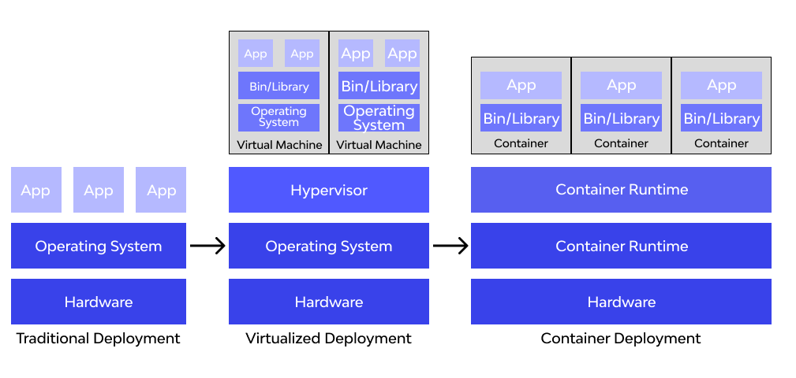
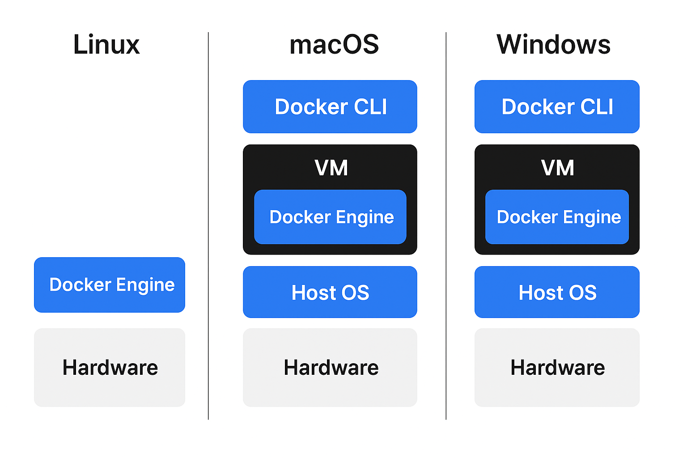
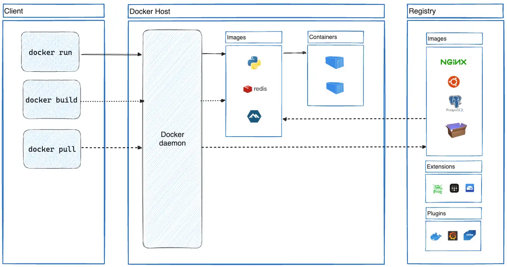

&nbsp;

Docker vs Virtual Machine (VM) is one of the **fundamentals** to really understand containerization. Let’s break it down clearly:

## 🔹 1. **Architecture**

- **VM (Virtual Machine):**
    
    - Runs on a **hypervisor** (like VMware, VirtualBox, KVM).
        
    - Each VM includes a **full OS** (kernel + user space) + application + libraries.
        
    - Heavy because every VM duplicates the OS.
        
- **Docker (Containers):**
    
    - Runs on a **Docker Engine** (container runtime).
        
    - Shares the **host OS kernel** with other containers.
        
    - Each container only has the **app + dependencies** (no full OS).
        
    - Lightweight and faster.
        

* * *

## 🔹 2. **Performance**

- **VM** → Slower startup (minutes), heavier resource usage.
    
- **Docker** → Starts in seconds, low overhead, better density (more apps per host).
    

* * *

## 🔹 3. **Isolation**

- **VM** → Strong isolation (each VM has its own OS). More secure but resource-heavy.
    
- **Docker** → Process-level isolation (shares host kernel). Lightweight, but slightly less secure than VMs.
    

* * *

## 🔹 4. **Portability**

- **VM** → VMs are tied to the hypervisor and OS. Larger images (GBs).
    
- **Docker** → Containers are portable across any system with Docker. Smaller images (MBs).
    

* * *

## 🔹 5. **Use Cases**

- **VMs**:
    
    - Running different OSes (Linux, Windows, BSD) on the same hardware.
        
    - Strong security isolation.
        
    - Running legacy monolithic apps.
        
- **Docker**:
    
    - Microservices & cloud-native apps.
        
    - CI/CD pipelines (fast build → test → deploy).
        
    - Scaling services quickly.
        

* * *

## 🔹 6. **Visual Comparison**

\*\*  
\*\*

* * *

✅ **Summary**:

- **VMs** → heavy, secure, full OS per app.
    
- **Docker** → lightweight, fast, portable, shares OS kernel.
    

* * *

&nbsp;

- Docker **always needs a Linux kernel** for Linux containers.
    
- On Linux → native.
    
- On macOS/Windows → a tiny Linux VM is auto-provisioned by Docker Desktop.
    
- This is what makes Docker **cross-platform** and portable.
    

## 

👉 **Docker was originally built for Linux only**, because it depends on **Linux kernel features** like:

- **Namespaces** → process isolation (`pid`, `net`, `mnt`, etc.)
    
- **cgroups** → resource limits (CPU, memory, etc.)
    
- **Union filesystems** (AUFS, OverlayFS, etc.)
    

So in the early days, you could only run Docker containers on a **Linux host OS**.

* * *

## 🔹 How Docker works on other OSes today

### 1\. **On macOS and Windows**

Since they don’t have a Linux kernel, Docker uses a **lightweight Linux virtual machine** under the hood:

- **Docker Desktop** runs a **small Linux VM** (using HyperKit on macOS, WSL2/Hyper-V on Windows).
    
- Inside that VM runs the **Docker Engine (dockerd)**.
    
- Your CLI (`docker run ...`) talks to the Docker Engine over a socket/bridge.
    

So, even on macOS/Windows, containers are still **Linux containers**, but they’re running in a hidden Linux VM.

* * *

### 2\. **Windows Containers (special case)**

On Windows Server, Microsoft added support for **Windows Containers**:

- These use **Windows kernel features** similar to namespaces/cgroups.
    
- They can run Windows apps in containers (not Linux apps).
    

But most of the world still uses **Linux containers** (even on Windows/macOS) — which is why Docker Desktop bundles that Linux VM.

* * *

## 🔹 Modern Setup

- **Linux host** → Docker runs natively (fastest, simplest).
    
- **macOS** → Docker Desktop starts a Linux VM using HyperKit (or now Apple Virtualization Framework).
    
- **Windows 10/11** → Docker Desktop uses WSL2 (preferred) or Hyper-V to run Linux containers.
    

* * *

✅ **Summary:**

- Docker still fundamentally depends on a **Linux kernel**.
    
- On non-Linux systems, Docker Desktop provides that kernel inside a **tiny VM** automatically.
    
- That’s why you can run the same container image on macOS, Windows, or Linux → portability!
    

* * *

# ✅ **Docker Architecture**

Docker is a platform that uses **containerization** to run applications in isolated environments called **containers**. The Docker architecture includes several components:

* * *

### 1\. **Docker Engine**

This is the core part of Docker and includes:

- **Docker Daemon (`dockerd`)**: A background process that manages Docker containers, images, networks, and volumes.
    
- **Docker Client (`docker`)**: The command-line interface (CLI) that users interact with. It communicates with the daemon using a REST API.
    
- **Docker API**: The interface through which the Docker client and other tools communicate with the Docker daemon.
    

* * *

### 2\. **Docker Objects**

These are the elements you interact with:

- **Images**: Read-only templates used to create containers. They contain the application and all dependencies.
    
- **Containers**: Running instances of images. Each container is isolated but lightweight.
    
- **Volumes**: Persistent storage used by containers.
    
- **Networks**: Enable communication between containers.
    

* * *

### 3\. **Docker Registries**

- Stores Docker images.
    
- **Docker Hub** is the default public registry.
    
- You can also use **private registries**.
    

* * *

### Docker Architecture Diagram



&nbsp;

## 🔒 **Namespace in Docker (and Linux Containers)**

Docker is written in the [Go programming language](https://golang.org/) and takes advantage of several features of the Linux kernel to deliver its functionality. Docker uses a technology called `namespaces` to provide the isolated workspace called the container. When you run a container, Docker creates a set of namespaces for that container.

These namespaces provide a layer of isolation. Each aspect of a container runs in a separate namespace and its access is limited to that namespace.

**Namespaces** are a Linux kernel feature that provide **process isolation** — the foundation of containers.

Each container runs as a set of processes, but **thanks to namespaces, those processes believe they’re the only ones running on the system**.

* * *

### Key Types of Namespaces Used by Docker:

| **Namespace** | **Purpose** |
| --- | --- |
| `PID` | Isolates process IDs — a container sees only its own processes. |
| `NET` | Gives each container its own network stack (interfaces, IPs, routes). |
| `MNT` | Isolates filesystem mount points. |
| `UTS` | Allows a container to have its own hostname and domain name. |
| `IPC` | Isolates inter-process communication (shared memory, semaphores). |
| `USER` | Isolates user and group IDs (UID/GID mapping). |

* * *

&nbsp;

* * *

## 🚀 Install Docker on Amazon Linux 2

1.  **Update packages**
    
    ```bash
    sudo yum update -y
    ```
    
2.  **Install Docker**
    
    ```bash
    sudo amazon-linux-extras enable docker
    sudo yum install -y docker
    ```
    
3.  **Start Docker service**
    
    ```bash
    sudo systemctl start docker
    sudo systemctl enable docker
    ```
    
4.  **Add ec2-user to docker group** (so you don’t need `sudo`)
    
    ```bash
    sudo usermod -aG docker ec2-user
    ```
    
    > ⚠️ You must log out and log back in for group changes to apply:
    
    ```bash
    exit
    ssh -i your-key.pem ec2-user@your-ec2-public-ip
    ```
    
5.  **Verify Docker**
    
    ```bash
    docker --version
    docker run hello-world
    ```
    

* * *

&nbsp;

&nbsp;

# Docker images, Containers

## 🐳 What is **Docker**?

Docker is a **containerization platform** that allows you to:

- Package applications with all their dependencies
    
- Run them consistently on any system
    
- Isolate them from other processes
    

* * *

## 📦 What is a **Docker Image**?

A **Docker image** is a **read-only template** that contains:

- Your application code
    
- Dependencies (libraries, runtimes)
    
- Configuration (environment variables, working directory)
    
- OS-level files (like Ubuntu or Alpine)
    

You can think of an image as a **blueprint or snapshot** of your application.

### 📌 Key Points:

- Images are **immutable**.
    
- Created using a `Dockerfile`.
    
- You can version them using tags (`nginx:1.25`, `python:3.10`, etc.).
    
- Can be shared via Docker Hub, AWS ECR, etc.
    

### Example of building an image:

```bash
docker build -t my-app:latest .
```

* * *

## 🧱 What is a **Docker Container**?

A **Docker container** is a **runtime instance of a Docker image**.

It’s the **actual running application**:

- Created from an image
    
- Has its own filesystem, networking, process space
    
- Is **isolated** from the host system and other containers
    
- Can read from the image but changes are written to a separate layer
    

### 📌 Key Points:

- Containers are **ephemeral** (temporary by nature).
    
- You can start, stop, pause, and delete containers.
    
- You can run multiple containers from the same image.
    

### Example of running a container:

```bash
docker run -d --name my-app-container my-app:latest
```

* * *

## 🔁 Analogy: Image vs Container

| Concept | Docker Image | Docker Container |
| --- | --- | --- |
| Analogy | Class in OOP | Object created from that class |
| Nature | Blueprint, static | Live, running instance |
| Mutability | Read-only | Read-write (with ephemeral changes) |
| Lifecycle | Built once, stored in registry | Created, started, stopped, removed |
| File System | Base template | Image + writable container layer |

* * *

## ⚙️ Docker Workflow Overview

1.  **Write Dockerfile** → Defines how the image is built
    
2.  **Build image** → `docker build -t my-app .`
    
3.  **Run container** → `docker run -d my-app`
    
4.  **Share image** → Push to Docker Hub or ECR
    

* * *

## 🔥 Example

### Dockerfile

```dockerfile
FROM node:18
WORKDIR /app
COPY . .
RUN npm install
CMD ["node", "index.js"]
```

### Commands:

```bash
docker build -t my-node-app .
docker run -d -p 3000:3000 my-node-app
```

This builds an image and runs a container from it.

* * *

## 🧠 Summary

| Feature | Docker Image | Docker Container |
| --- | --- | --- |
| What is it? | Blueprint of your app | Running instance of an image |
| Mutable? | No  | Yes (ephemeral write layer) |
| Lifecycle | Build → Store | Create → Start → Stop → Remove |
| Example | `nginx:latest` | A running nginx server |

* * *

&nbsp;

# Docker Layers- Writable Layer and Base Layer

🧱 What are Docker Layers?

Docker uses a **layered filesystem**, where each layer is:

- **Read-only**
    
- Created when building an image
    
- **Cached** to speed up future builds
    

This layered architecture makes Docker **efficient**, **fast**, and **lightweight**.

* * *

## 📦 Docker Image Layers

When you build a Docker image from a `Dockerfile`, each instruction (like `FROM`, `RUN`, `COPY`) creates a **new image layer**.

### 🧱 Example `Dockerfile`:

```dockerfile
FROM python:3.10          # Layer 1 (base layer)
WORKDIR /app              # Layer 2
COPY requirements.txt .   # Layer 3
RUN pip install -r requirements.txt  # Layer 4
COPY . .                  # Layer 5
CMD ["python", "app.py"]  # Layer 6
```

### 🔁 Result:

- Docker builds the image as a **stack of read-only layers**.
    
- These layers are **cached**, so if you rebuild, unchanged layers are reused.
    

* * *

## 📦 Base Layer (Image Layers)

- **Read-only**
    
- Shared between containers
    
- Created during image build (`docker build`)
    
- Examples: Ubuntu, Alpine, Node.js, Python, etc.
    

### ✅ Benefits:

- Shared across containers → saves disk space
    
- Immutable → can't be changed by the container
    
- Efficient for updates and deployment
    

* * *

## ✍️ Writable Layer (Container Layer)

When you **run a container**, Docker:

- Takes the image layers (read-only)
    
- Adds a **writable layer** on top
    

This writable layer is where:

- Your application writes files
    
- Temporary changes happen
    
- Any file modified will be stored **only in this layer**
    

### ⚠️ Important:

- The writable layer is **ephemeral** — when you delete the container, this layer and its data are gone **unless** you use a **volume**.

* * *

## 🧠 Visual Representation

```
Docker Container:
  ┌────────────────────────────┐
  │   Writable Layer (R/W)     │  ← Container writes happen here
  ├────────────────────────────┤
  │   Layer 6: CMD             │
  │   Layer 5: COPY . .        │
  │   Layer 4: RUN pip install │
  │   Layer 3: COPY reqs       │
  │   Layer 2: WORKDIR         │
  │   Layer 1: FROM python     │  ← Base image layer
  └────────────────────────────┘
```

* * *

## 🔧 Example: File Changes in Writable Layer

Imagine you run:

```bash
docker run -it python:3.10 bash
```

Inside the container:

```bash
touch hello.txt
```

- `hello.txt` is written to the **writable layer only**
    
- It does **not** change the `python:3.10` image
    
- When the container stops and is removed, the file is gone
    

* * *

## 📌 Summary

| Layer Type | Description | Mutable? | Persistent? |
| --- | --- | --- | --- |
| **Image Layers** | Built from Dockerfile instructions | ❌   | ✅ (cached) |
| **Base Layer** | The foundation (e.g., `FROM ubuntu`) | ❌   | ✅   |
| **Writable Layer** | Created at runtime for each container | ✅   | ❌ (ephemeral) |

* * *

## 🛠️ How to Persist Data?

- Use **Docker volumes** to store data **outside** the writable layer.
    
- Volumes are not deleted when the container is removed.
    

* * *

&nbsp;

&nbsp;

# Port BInding

Great question! Let's break down what **port binding** means — especially in the context of **Docker** and containers.

* * *

## 🔗 What is **Port Binding**?

**Port binding** is the process of **connecting a port on your host machine** (your computer or server) to a **port inside a Docker container**.

> 🧠 Think of it like plugging an outside wire (host) into an inside socket (container).

This is **how external traffic (like a web browser)** can reach a service running **inside a Docker container**.

* * *

## 🧭 Why Do We Need Port Binding?

By default:

- Containers are **isolated** from the host and the outside world.
    
- Services inside containers **can’t be accessed** from outside unless **you expose and bind a port**.
    

So if you’re running:

```bash
docker run -d nginx
```

It starts a container, but you **can’t access** the Nginx web server from your browser — because there’s **no port binding**.

* * *

## 🛠️ Syntax of Port Binding

```bash
docker run -p <host_port>:<container_port> image
```

| Part | Meaning |
| --- | --- |
| `host_port` | Port on your machine (outside) |
| `container_port` | Port inside the container (where the app is listening) |

* * *

### ✅ Example

```bash
docker run -d -p 8080:80 nginx
```

- The Nginx server **inside the container** listens on **port 80**.
    
- You bind it to **port 8080 on your host**.
    
- So now, when you go to `http://localhost:8080`, you're connected to Nginx inside the container.
    

* * *

## 🌐 Port Binding in Docker Compose

```yaml
services:
  web:
    image: nginx
    ports:
      - "8080:80"
```

Same effect: maps host port `8080` to container port `80`.

* * *

## ⚠️ Common Mistakes

| Mistake | Why it matters |
| --- | --- |
| `-p 80:80` used when port 80 is already in use | Causes conflict — "port already allocated" error |
| Only exposing container port without host binding | Service isn't reachable from outside |
| Binding wrong container port | App won’t respond because it's not listening on that port |

* * *

## 🧠 Bonus: Docker Networking Context

- **Port binding is only needed for access from outside the container.**
    
- If containers talk to each other inside a **Docker network**, you usually **don’t need port binding** — just service names and internal ports.
    

* * *

## 📝 Summary

| Term | Description |
| --- | --- |
| **Port Binding** | Connecting a host port to a container port |
| **Syntax** | `-p host_port:container_port` |
| **Use Case** | Expose services (web servers, APIs) to outside users |
| **Without it** | Your app runs, but can’t be reached from the host |

* * *

&nbsp;

* * *

### 🔹 Why the error happened

You tried to run two containers mapping host **port 8080 → container 3306**:

- `mysql-new` is already using `0.0.0.0:8080`
    
- When you ran `mysql-old`, Docker failed:
    
    ```
    Bind for 0.0.0.0:8080 failed: port is already allocated
    ```
    

👉 On a single host, you **cannot bind two containers to the same host port**.

* * *

### 🔹 Fix options

1.  **Use a different host port for the second container**  
    Example:
    
    ```bash
    docker run -d --name mysql-old -p 8081:3306 -e MYSQL_ROOT_PASSWORD=secretold mysql:8.0
    ```
    
    Now:
    
    - `mysql-new` → host port 8080 → container 3306
        
    - `mysql-old` → host port 8081 → container 3306
        
    
    ✅ Both can run simultaneously.
    

* * *

2.  **Run MySQL on standard port (3306)** (recommended if you want it to behave like a normal MySQL server):
    
    - Stop & remove the first container:
        
        ```bash
        docker stop mysql-new && docker rm mysql-new
        ```
        
    - Start again with standard port:
        
        ```bash
        docker run -d --name mysql-new -p 3306:3306 -e MYSQL_ROOT_PASSWORD=secret mysql:8.0
        ```
        

* * *

3.  **Use Docker networks (advanced)**  
    If containers only need to talk **to each other** (not the outside world), you don’t even need to expose ports. You can put them on the same Docker network and connect via container names.

* * *

✅ **Summary**:

- Only **one container per host port**.
    
- If you need multiple MySQL containers → give each a unique host port (`-p 8080:3306`, `-p 8081:3306`, etc.).
    
- If you want to expose one DB service → stick to `-p 3306:3306`.
    

&nbsp;

# **Docker network**

A **Docker network** is how containers talk to each other, to the host machine, or to the outside world.  
Think of it like a set of **virtual switches/routers** that Docker manages automatically.

* * *

## 🔹 Why Docker networks?

- By default, containers are isolated.
    
- If you want containers to communicate (e.g., a web app container needs to talk to a database container), you need a **network**.
    
- Networks also let you control **who can talk to whom** (security).
    

* * *

## 🔹 Types of Docker Networks

### 1\. **bridge** (default for containers)

- Created automatically when you install Docker.
    
- If you run `docker run ubuntu`, it joins the **bridge** network unless you say otherwise.
    
- Containers in the same bridge network can reach each other using IP addresses but not container names.
    
- Example:
    
    ```bash
    docker run -d --name webapp --network bridge nginx
    docker run -d --name db --network bridge mysql
    ```
    
    Here `webapp` can reach `db` by just using the name `db`.
    

* * *

### 2\. **host**

- Shares the host’s network stack.
    
- No network isolation → the container uses the host’s IP directly.
    
- Faster (no NAT), but less secure.
    
- Example:
    
    ```bash
    docker run --network host nginx
    ```
    
    The container’s port 80 is the host’s port 80.
    

* * *

### 3\. **none**

- No network at all.
    
- Container is fully isolated (no internet, no other containers).
    
- Example:
    
    ```bash
    docker run --network none ubuntu
    ```
    

* * *

### 4\. **user-defined networks** (custom)

- You can create your own bridge networks.
    
- Containers in the same custom network can **talk by name** (built-in DNS).
    
- Example:
    
    ```bash
    docker network create mynet
    docker run -d --name app1 --network mynet nginx
    docker run -d --name app2 --network mynet alpine ping app1
    ```
    
    Here `app2` can ping `app1` just by using its name → no need for IPs.
    

| Feature | Default `bridge` | Custom bridge (`docker network create`) |
| --- | --- | --- |
| Created by default | ✅ Yes | ❌ You must create manually |
| DNS container name lookup | ❌ No | ✅ Yes |
| Isolation | All containers share it | Isolated per network |
| Best practice | Only for simple testing | Recommended for apps & microservices |

* * *

### 5\. **overlay networks** (for Docker Swarm / multi-host)

- Lets containers on **different hosts** communicate.
    
- Useful in orchestrators like Docker Swarm or Kubernetes.
    

* * *

## 🔹 Key Commands

- List networks:
    
    ```bash
    docker network ls
    ```
    
- Inspect a network:
    
    ```bash
    docker network inspect bridge
    ```
    
- Create a network:
    
    ```bash
    docker network create mynet
    ```
    
- Remove a network:
    
    ```bash
    docker network rm mynet
    ```
    
- Prune unused networks:
    
    ```bash
    docker network prune
    ```
    

* * *

✅ **In short:**  
Docker networks are like virtual switches that connect containers together and/or to the outside world.

* * *

&nbsp;

Ah 👍 that error means the network **`mynet` still has containers attached to it**, so Docker won’t remove it.

* * *

### 🔹 Steps to fix

1.  **Check what containers are using it**:

```bash
docker network inspect mynet --format '{{json .Containers}}'
```

or (prettier if you have `jq`):

```bash
docker network inspect mynet | jq '.[0].Containers'
```

* * *

2.  **Disconnect the containers** from that network:

```bash
docker network disconnect mynet <container_id_or_name>
```

Do this for each container shown in step 1.

* * *

3.  **Stop & remove the containers** (if you don’t need them):

```bash
docker stop <container_id_or_name>
docker rm <container_id_or_name>
```

* * *

4.  Now try removing the network again:

```bash
docker network rm mynet
```

✅ This time it should work.

* * *

&nbsp;

&nbsp;

# **Docker Compose**

- **Docker** manages individual containers (`docker run ...`).
    
- **Docker Compose** is a tool to define and run **multi-container applications** using a **YAML file (`docker-compose.yml`)**.
    
- Instead of running 5 long `docker run` commands, you define services (containers), networks, and volumes in one file → then start everything with **`docker-compose up`**.
    

* * *

## 🔹 Why use Docker Compose?

1.  **Simplifies multi-container apps** (like web app + database + cache).
    
2.  **Declarative config** (all setup in `docker-compose.yml`).
    
3.  **Reproducible environments** (same setup works everywhere).
    
4.  **Networking handled automatically** (services can talk to each other by name).
    
5.  **One command to start/stop** (`up`, `down`).
    

## 🔹 When using a custom Docker Compose file, the correct syntax is:

```bash
docker compose -f <filename> up
```

For example, if your file is named `docker-compose.dev.yml`, you'd run:

```bash
docker compose -f docker-compose.dev.yml up
```

### 🧠 Quick Tips:

- You can chain multiple `-f` flags to layer configs:
    
    ```bash
    docker compose -f base.yml -f override.yml up
    ```
    
- The `-d` flag runs containers in detached mode:
    
    ```bash
    docker compose -f docker-compose.dev.yml up -d
    ```
    

* * *

## 🔹 Example: Node.js App + MongoDB

### 📂 Where to Run the `docker-compose.yml` File

By default, you should run `docker compose up` from **the same directory** where your `docker-compose.yml` file is located. Docker Compose looks for the file in your **current working directory**, unless you explicitly tell it otherwise using the `-f` flag.

#### ✅ Typical Workflow:

```bash
cd /path/to/project
docker compose up
```

If your file is named something else or lives elsewhere:

```bash
docker compose -f /path/to/your-file.yml up
```

### 🧠 Pro Tip for Modular Projects:

If you’re working with multiple environments (like `docker-compose.dev.yml`, `docker-compose.prod.yml`), you can layer them:

```bash
docker compose -f docker-compose.yml -f docker-compose.override.yml up
```

&nbsp;

### `docker-compose.yml`

```yaml
version: "3.9"

services:
  app:
    image: node:18
    container_name: myapp
    working_dir: /usr/src/app
    volumes:
      - .:/usr/src/app
    command: ["npm", "start"]
    ports:
      - "3000:3000"
    depends_on:
      - mongo

  mongo:
    image: mongo
    container_name: mymongo
    environment:
      MONGO_INITDB_ROOT_USERNAME: admin
      MONGO_INITDB_ROOT_PASSWORD: qwerty
    ports:
      - "27017:27017"
    volumes:
      - mongo_data:/data/db

volumes:
  mongo_data:
```

* * *

## 🔹 How it works

- **`app` service** → runs Node.js, maps port 3000.
    
- **`mongo` service** → runs MongoDB with credentials, persistent storage in a named volume.
    
- **`depends_on`** ensures `mongo` starts before `app`.
    
- **`mongo_data` volume** stores Mongo data permanently.
    

* * *

## 🔹 Commands

- Start everything:
    
    ```bash
    docker-compose up -d
    ```
    
- Stop everything:
    
    ```bash
    docker-compose down
    ```
    
- See logs:
    
    ```bash
    docker-compose logs -f
    ```
    
- Rebuild after changes:
    
    ```bash
    docker-compose up --build
    ```
    

* * *

## 🔹 Benefits in action

Without Compose:

```bash
docker run -d --name mongo -e MONGO_INITDB_ROOT_USERNAME=admin -e MONGO_INITDB_ROOT_PASSWORD=qwerty -p 27017:27017 mongo
docker run -d --name app --link mongo -p 3000:3000 node:18 npm start
```

With Compose:  
👉 Just `docker-compose up` 🎉

* * *

⚡ So Compose = **one file, one command, entire environment**.

&nbsp;

# Dockerizing an app

Dockerizing an app means packaging it into a **Docker container** — a lightweight, portable unit that includes everything your app needs to run: code, runtime, libraries, environment variables, and system tools. Think of it like turning your app into a self-sufficient capsule that behaves the same no matter where it’s deployed.

* * *

### 🔧 What Happens When You Dockerize:

1.  **You write a `Dockerfile`**  
    A set of instructions for building your app’s container image.
    
2.  **You build the image - go into the directory having Dockerfile and**
    
    ```bash
    docker build -t my-app .
    ```
    
3.  **You run the container**
    
    ```bash
    docker run -p 3000:3000 my-app
    ```
    
4.  **You scale or orchestrate with Docker Compose or Kubernetes**  
    Especially useful for multi-service apps (e.g., app + database + cache).
    

* * *

### 🚀 Benefits of Dockerizing:

- **Consistency across environments** (dev, test, prod)
- **Simplified deployment** and rollback
- **Isolation** from host system and other apps
- **Scalability** with orchestration tools
- **Portability** across platforms and clouds

* * *

&nbsp;

# **Dockerfile**

A **Dockerfile** is like a blueprint or recipe for building a Docker image. It’s a plain text file that contains a series of instructions which Docker reads and executes step-by-step to assemble your app into a container. Think of it as your app’s “build script” — defining what base image to use, what dependencies to install, how to configure the environment, and what command to run when the container starts.

* * *

### 🧱 Key Instructions in a Dockerfile (with examples)

Some of the most common instructions in a `Dockerfile` include:

- `FROM <image>` - this specifies the base image that the build will extend.
- `WORKDIR <path>` - this instruction specifies the "working directory" or the path in the image where files will be copied and commands will be executed.
- `COPY <host-path> <image-path>` - this instruction tells the builder to copy files from the host and put them into the container image.
- `RUN <command>` - this instruction tells the builder to run the specified command.
- `ENV <name> <value>` - this instruction sets an environment variable that a running container will use.
- `EXPOSE <port-number>` - this instruction sets configuration on the image that indicates a port the image would like to expose.
- `USER <user-or-uid>` - this instruction sets the default user for all subsequent instructions.
- `CMD ["<command>", "<arg1>"]` - this instruction sets the default command a container using this image will run.

| Instruction | Purpose | Example |
| :--- | :--- | :--- |
| FROM | Sets the base image for your container | FROM ubuntu:20.04 |
| WORKDIR | Sets the working directory inside the container | WORKDIR /app |
| COPY | Copies files from your host into the container | COPY . /testapp |
| RUN | Executes commands at build time | RUN mkdir -p testapp /  <br><br/>apt-get update && apt-get install -y nginx |
| CMD | Sets the default command to run when the container starts | CMD \["node", "/testapp/index.js"\] |
| EXPOSE | Documents which port the app listens on (doesn’t actually publish it) | EXPOSE 8080 |
| ENV | Sets environment variables inside the container | ENV ME_CONFIG_MONGODB_ADMINUSERNAME /  <br><br/>         NODE_ENV=production |
| LABEL | Adds metadata to the image | LABEL maintainer="raushan@example.com" |
| VOLUME | Creates a mount point for persistent or shared data | VOLUME /data |
| USER | Specifies which user runs the container process | USER appuser |
| HEALTHCHECK | Defines a command to check container health | \`HEALTHCHECK CMD curl --fail http://localhost:8080\\n\\texit 1\` |

* * *

### 🧠 Best Practices for You, Raushan:

- Use `WORKDIR` before `COPY` to keep paths clean.
    
- Combine `RUN` commands to reduce image layers.
    
- Prefer `CMD` for flexible defaults, and `ENTRYPOINT` for strict execution.
    
- Use `HEALTHCHECK` with alerting tools like Prometheus for container diagnostics.
    
- Always pin your `FROM` image versions for reproducibility.
    
- Use `.dockerignore` to exclude unnecessary files.
    
- Pin versions in `FROM` to avoid unexpected updates.
    
- Separate dev and prod Dockerfiles if needed.
    
- Document your build logic clearly in comments — I know you value clarity.
    

Sure! Let's go through this **Dockerfile** step-by-step so you understand exactly what each line is doing and **why** it’s used.

* * *

## 🧾 Full Dockerfile:

```Dockerfile
FROM 952840895893.dkr.ecr.ap-south-1.amazonaws.com/alpine-3:openjdk8
ENV PROJECTNAME="otp"
WORKDIR /usr/app/$PROJECTNAME
RUN mkdir log
RUN ln -s /usr/share/zoneinfo/Asia/Kolkata /etc/localtime
#EXPOSE 8080
COPY target/otp-service-0.0.1-SNAPSHOT.jar /usr/app/
#ENTRYPOINT ["/usr/bin/java", "-jar", "-Dspring.profiles.active=staging", "/usr/app/otp-service-0.0.1-SNAPSHOT.jar", "-server.port=8080"]
WORKDIR /tmp
COPY src/main/resources/jacoco/org.jacoco.agent-0.8.6-runtime.jar ./
COPY src/main/resources/jacoco/org.jacoco.cli-0.8.6-nodeps.jar ./
```

* * *

## 🔍 Line-by-Line Breakdown:

* * *

### `FROM 952840895893.dkr.ecr.ap-south-1.amazonaws.com/alpine-3:openjdk8`

- **Base image** is pulled from a **private AWS ECR registry**.
    
- Based on **Alpine Linux** (lightweight OS) with **OpenJDK 8** installed.
    
- All layers built on top of this.
    

> 🧠 This is the starting point for your image. Likely a minimal Alpine image with Java preinstalled.

* * *

### `ENV PROJECTNAME="otp"`

- Defines an **environment variable** called `PROJECTNAME` with value `otp`.
    
- Used later in the `WORKDIR`.
    

> ✅ Good practice for flexibility and reuse.

* * *

### `WORKDIR /usr/app/$PROJECTNAME`

- Sets the **working directory** inside the container to `/usr/app/otp`.
    
- All following `RUN`, `COPY`, etc., will be **relative to this path** unless changed later.
    

> 📂 This is where your app files will live.

* * *

### `RUN mkdir log`

- Creates a `log` directory under `/usr/app/otp`.
    
- Likely used to store log files generated by the application.
    

> 📝 Logs will go here, useful for debugging or file-based logging.

* * *

### `RUN ln -s /usr/share/zoneinfo/Asia/Kolkata /etc/localtime`

- Sets the container’s **timezone** to `Asia/Kolkata` by creating a symbolic link.
    
- This affects how timestamps (logs, system time) appear inside the container.
    

> 🕒 Helpful for India-based apps or developers who want logs in IST.

* * *

### `#EXPOSE 8080`

- This is **commented out**, but if used, it **documents** that your container will listen on **port 8080**.
    
- This **does not publish** the port — it’s informational (unless used with `docker run -p` or `docker-compose`).
    

> 💬 If you plan to serve HTTP or an API, uncomment this.

* * *

### `COPY target/otp-service-0.0.1-SNAPSHOT.jar /usr/app/`

- Copies your **compiled Java application JAR** into the container.
    
- The JAR was built locally (probably with Maven or Gradle) and placed in the `target/` folder.
    

> 🚀 This is the actual application you're going to run.

* * *

### `#ENTRYPOINT [...]`

- This is **commented out**, but it would normally start the Java app:
    
    ```bash
    java -jar -Dspring.profiles.active=staging /usr/app/otp-service-0.0.1-SNAPSHOT.jar -server.port=8080
    ```
    
- Meaning:
    
    - Run the JAR
        
    - Use **Spring Boot profile = `staging`**
        
    - Serve on **port 8080**
        

> 🚦 This is your **main app startup command** — probably handled elsewhere like in a script or orchestrator.

* * *

### `WORKDIR /tmp`

- Changes the working directory to `/tmp`.
    
- The next `COPY` commands will place files here.
    

> 📍 Used temporarily, maybe for testing, instrumentation, or startup scripts.

* * *

### `COPY src/main/resources/jacoco/org.jacoco.agent-0.8.6-runtime.jar ./`

### `COPY src/main/resources/jacoco/org.jacoco.cli-0.8.6-nodeps.jar ./`

- Copies two **JaCoCo (Java Code Coverage)** tools into the container.
    
- These are likely used for **instrumenting the app for code coverage** in testing or CI/CD.
    

> 🧪 Useful for collecting code coverage reports during test runs.

* * *

## 🧠 TL;DR: What Does This Dockerfile Do?

- Starts from a Java-ready Alpine Linux base image from AWS ECR.
    
- Sets timezone to IST.
    
- Creates app directory and log folder.
    
- Copies the Spring Boot `.jar` app.
    
- Includes **JaCoCo agent and CLI** for code coverage.
    
- Prepares everything to run the app (though the actual run command is commented out).
    

* * *

## 🧩 What's Missing or To Consider?

- If this image is for **production**, you might:
    
    - **Uncomment the ENTRYPOINT** or run the app another way.
        
    - Use a **multi-stage build** to keep it slim.
        
    - Set `EXPOSE 8080` if others need to know what port it listens on.
        
- If it's for **CI/testing**, the presence of JaCoCo makes sense.
    

* * *

Let me know if you want help:

- Writing the `ENTRYPOINT`/`CMD`
    
- Using this with Docker Compose or Kubernetes
    
- Explaining multi-stage builds or optimizing this image
    

I'm happy to help!

&nbsp;

&nbsp;

# Publishing a Docker image

Publishing a Docker image means **uploading it to a container registry** (like Docker Hub, GitHub Container Registry, or AWS ECR) so others — or your deployment pipelines — can pull and run it anywhere. It’s like pushing code to GitHub, but for containerized apps.

* * *

### 🚀 Steps to Publish a Docker Image (e.g., to Docker Hub)

#### 1\. **Create a Dockerfile**

This defines how your image is built. Example:

```Dockerfile
FROM node:lts
WORKDIR /app
COPY . .
RUN npm install
CMD ["node", "index.js"]
```

#### 2\. **Build the Image**

```bash
docker build -t username/repo-name:tag .
```

Example:

```bash
docker build -t raushan/my-app:latest .
```

#### 3\. **Log in to Docker Hub**

```bash
docker login
```

Enter your Docker Hub username and password.

#### 4\. **Push the Image**

```bash
docker push raushan/my-app:latest
```

This uploads the image to your Docker Hub repository.

#### 5\. **Verify the Upload**

Go to [Docker Hub](https://hub.docker.com/) and check your repo. You’ll see the image listed with its tag.

* * *

### 🧠 Pro Tips for You:

- Use semantic tags like `:v1.0.0`, `:dev`, `:prod` for clarity.
- Add `LABEL` metadata in your Dockerfile for maintainability.
- Automate builds and pushes with CI tools like GitHub Actions or GitLab CI.
- Use `docker tag` to rename or retag images before pushing.

* * *

&nbsp;

&nbsp;

# Docker Volumes

Docker volumes are a **persistent storage mechanism** managed by Docker that allows containers to **store and share data** independently of their lifecycle. Think of them as **detachable hard drives** for your containers — they keep your data safe even if the container is stopped, deleted, or rebuilt.

### 📦 Why Use Docker Volumes?

Containers are **ephemeral** by design — any data written inside them disappears when the container is removed. Volumes solve this by providing:

- **Data persistence** across container restarts
    
- **Isolation** from the host filesystem
    
- **Safe sharing** between multiple containers
    
- **Simplified backups and migration**
    

### 🧱 How Docker Volumes Work

- Docker stores volumes in a managed directory (usually `/var/lib/docker/volumes/`)
    
- You can mount them into containers using `--mount` or `-v`
    
- Volumes are created and tracked by Docker, unlike bind mounts which rely on host paths
    

&nbsp;

#### 1\. **Bind Mount (host path → container path)**

bash

```
docker run -it -v /home/raushan/logs:/app/data imagename
```

#### 2\. **Named Volume (Docker-managed volume → container path)**

bash

```
docker volume create mydata
docker run -it -v mydata:/app/data imagename
```

* * *

### 📦 1. **Using `-v` (shorthand syntax)**

```bash
docker run -v /host/path:/container/path myimage
```

#### 🔍 Example:

```bash
docker run -v /home/raushan/logs:/var/log/myapp myimage
```

- `/home/raushan/logs` → Host directory
- `/var/log/myapp` → Path inside the container

This mounts your local logs folder into the container so your app can read/write logs there.

* * *

### 🧱 2. **Using `--mount` (explicit syntax)**

```bash
docker run --mount type=bind,source=/host/path,target=/container/path myimage
```

#### 🔍 Example:

```bash
docker run --mount type=bind,source=/home/raushan/config,target=/etc/myapp myimage
```

This is more verbose but **recommended for clarity and advanced options**, like read-only mounts:

```bash
docker run --mount type=bind,source=/home/raushan/config,target=/etc/myapp,readonly myimage
```

* * *

### 🧠 Key Differences

| Feature | `-v` Syntax | `--mount` Syntax |
| --- | --- | --- |
| Simplicity | ✅ Easy to type | ❌ More verbose |
| Readability | ❌ Less clear | ✅ More explicit |
| Advanced flags | ❌ Limited | ✅ Supports `readonly`, `propagation`, etc. |
| Recommended | For quick use | For production clarity |

* * *

### 🧰 Bonus Tip for You:

If you're using Docker Compose, the syntax looks like this:

```yaml
volumes:
  - /host/path:/container/path
```

Or with named volumes:

```yaml
volumes:
  data-volume:
    driver: local

services:
  app:
    volumes:
      - data-volume:/app/data
```

* * *

In this Docker Compose snippet:

```yaml
version: '3'
services:
  app:
    image: myimage
    volumes:
      - mydata:/app/data

volumes:
  mydata:
```

### 🔍 What Each Part Means:

- `mydata` → This is a **named volume**, **not** a host path. It's managed by Docker and stored in its internal volume directory (usually `/var/lib/docker/volumes/<mydata/_data>`).
- `/app/data` → This is the **mount point inside the container**, where the volume will be accessible.

So you're telling Docker:

> “Create or use a volume called `mydata`, and mount it inside the container at `/app/data`.”

* * *

### 🧠 Key Differences from Bind Mounts

| Type | Left Side (`mydata`) |
| --- | --- |
| **Named Volume** | Docker-managed volume name |
| **Bind Mount** | Host filesystem path (e.g. `/home/raushan/logs`) |

If you wanted to use a **host path** instead, you'd write:

```yaml
volumes:
  - /home/raushan/logs:/app/data
```

* * *

&nbsp;

# 🔹 Syntax Summary

- **Named Volume**
    
    ```yaml
    service:
      volumes:
        - volume_name:/path/in/container
    volumes:
      volume_name:
    ```
    
- **Bind Mount**
    
    ```yaml
    service:
      volumes:
        - ./local_folder:/path/in/container
    ```
    
- **Anonymous Volume**
    
    ```yaml
    service:
      volumes:
        - /path/in/container
    ```
    

* * *

By default, **Docker stores named volumes** under:

```
/var/lib/docker/volumes/
```

Each named volume has its own directory inside there:

```
/var/lib/docker/volumes/<volume_name>/_data/
```

### Example:

If your `docker-compose.yml` defines:

```yaml
volumes:
  mongo_data:
```

and a service mounts it like:

```yaml
services:
  mongo:
    image: mongo
    volumes:
      - mongo_data:/data/db
```

Then Docker will create:

```
/var/lib/docker/volumes/mongo_data/_data/
```

🔹 That `_data` directory is where Mongo actually stores its database files.

&nbsp;

### 📂 Structure of a volume on the host

When you create a named volume, Docker makes a directory under `/var/lib/docker/volumes/<volume_name>/`. Inside it you’ll see:

```
/var/lib/docker/volumes/<volume_name>/
├── _data     👈 actual files/data stored here
├── config.json (metadata about the volume)
```

- `config.json` → internal metadata Docker keeps.
    
- `_data` → the real directory that gets mounted into the container.
    

🔹 Even if you remove the container, the volume (and data) remains until you explicitly run:

```bash
docker volume rm mongo_data
```

or

```bash
docker volume prune
```

* * *

&nbsp;

&nbsp;

Great question! Let's break it down step-by-step.

* * *

## 🔍 What does **API** mean?

**API** stands for **Application Programming Interface**.

### ✅ In simple terms:

An **API** is like a **menu in a restaurant**:

- It tells you **what you can ask for** (endpoints, parameters).
    
- It **hides the kitchen** (implementation details).
    
- You **send a request**, and it **returns a response**.
    

* * *

## 📦 Examples of Regular APIs (aka “normal APIs”)

| API Type | Example Use |
| --- | --- |
| REST API | A weather API that returns current weather when you request `/weather?city=London`. |
| Payment API | Stripe API to process payments. |
| Social API | Twitter API to get tweets. |
| Maps API | Google Maps API to get location data. |

These APIs are generally **web-based (HTTP)**, follow standards like **REST** or **GraphQL**, and expose **business or user-facing services**.

* * *

## 🐳 What is the **Docker API**?

The **Docker API** is a **special-purpose API** that lets you **interact programmatically with the Docker Engine**.

### ✅ What can you do with the Docker API?

You can:

- Build images
    
- Start/stop containers
    
- Manage networks and volumes
    
- Inspect containers
    
- Monitor resource usage
    

### 🔧 Access Methods:

- **Docker CLI** (e.g., `docker run`, `docker build`) → actually uses the Docker API under the hood.
    
- **Programmatically** using HTTP/Unix socket.
    
- **Docker SDKs** (e.g., `docker-py` in Python) → also use the Docker API.
    

* * *

## 💡 How is Docker API different from a "normal" API?

| Feature | **Docker API** | **Regular API (REST, etc.)** |
| --- | --- | --- |
| Purpose | Control/manage Docker Engine (containers, images) | Expose application/business logic |
| Audience | DevOps, developers managing infra/tools | App developers, users |
| Protocol | HTTP over Unix socket or TCP | Usually HTTP over TCP (web) |
| Authentication | Local socket, TLS certificates (for remote) | Tokens, OAuth, API keys |
| Interface | System-level operations | App-level data/services |
| Example Operation | Start a container: `POST /containers/create` | Get user data: `GET /users/123` |

* * *

## 🛠 Example: Docker API Request

You can send a raw HTTP request to Docker:

```bash
curl --unix-socket /var/run/docker.sock http://localhost/containers/json
```

This asks the Docker Engine for a list of running containers.

* * *

## 🧠 Summary

| Term | Meaning |
| --- | --- |
| **API** | Interface for apps to talk to each other |
| **Docker API** | Special API to control the Docker Engine |
| **Difference** | Docker API is infrastructure/system focused, regular APIs are typically app/business logic focused |

* * *

&nbsp;

| Standard | Data Format | Protocol | Use Case | Pros | Cons |
| --- | --- | --- | --- | --- | --- |
| REST | JSON, XML | HTTP | Web APIs | Simple, scalable, flexible | No formal contract, less strict |
| SOAP | XML | HTTP, SMTP | Enterprise apps, legacy | Formal, standardized | Verbose, complex |
| GraphQL | JSON | HTTP | Flexible queries | Precise data fetching | Learning curve, complexity |
| gRPC | Protocol Buffers | HTTP/2 | Microservices | High performance | Binary, harder to debug |