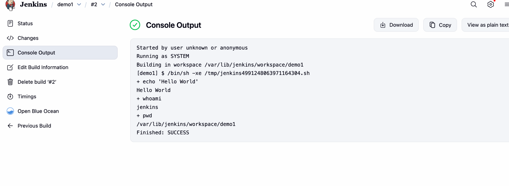
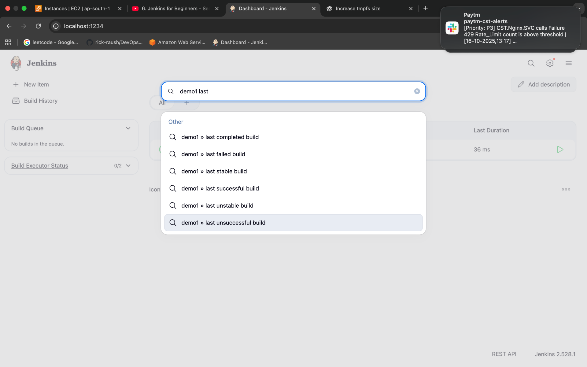
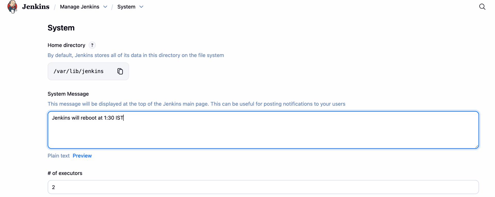
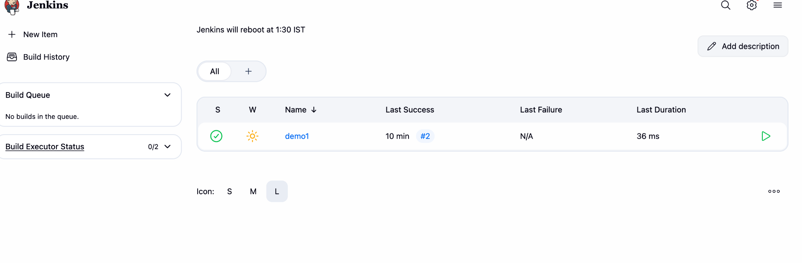
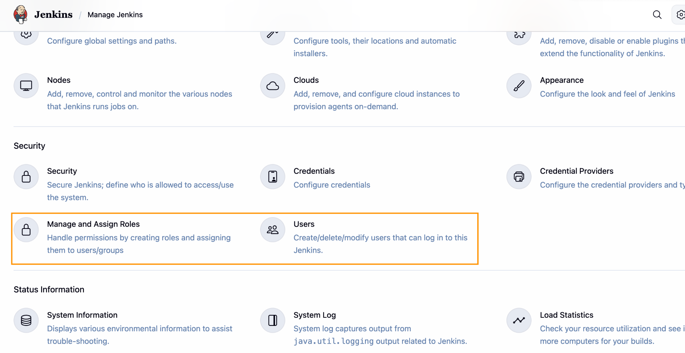

Configure - Build Steps - Execute Shell

****

&nbsp;

Search Pane usage

****

&nbsp;

**System Configuration**

****

****

&nbsp;

Users and Role based Strategy Management

&nbsp;

&nbsp;

**Configuration options when creating a Jenkins Freestyle project**

* * *

## 🔹 Jenkins Job Options Explained

### **1\. Discard Old Builds**

- Lets you **limit how many past builds Jenkins keeps**.
    
- Prevents your server from filling up with old build logs/artifacts.
    
- Example: Keep only the last **10 builds** or builds from the last **7 days**.
    

* * *

### **2\. GitHub Project**

- If you check this, you can paste your **GitHub repo URL**.
    
- Jenkins will show a “GitHub project” link on the job page.
    
- Helpful for quick navigation to the source repo.
    

* * *

### **3\. This Project is Parameterized**

- Lets you define **input parameters** for the build (so you can run builds differently each time).
    
- Examples:
    
    - **String Parameter** → enter version number at build time.
        
    - **Choice Parameter** → select `dev`, `staging`, or `prod`.
        
    - **Boolean Parameter** → check/uncheck a feature flag.
        
- Very useful for **reusable jobs**.
    

* * *

### **4\. Throttle Builds**

- Limits how many builds of this job can run **at the same time**.
    
- Useful if the build is resource-heavy (e.g., only allow 1 running build at once).
    
- Can also throttle across a group of jobs.
    

* * *

### **5\. Execute Concurrent Builds if Necessary**

- By default, Jenkins **queues builds** if one is already running.
    
- If you enable this, Jenkins can run **multiple builds in parallel** (for this job), if resources allow.
    
- Example: Run 3 test builds for different branches at the same time.
    

* * *

### **6\. Quiet Period**

- A delay (in seconds) Jenkins waits after a build trigger before starting the build.
    
- Useful to avoid “spam builds” if many commits come in quickly.
    
- Example: Quiet Period = `60` → wait 1 min before running, so multiple commits get built together.
    

* * *

### **7\. Retry Count**

- Number of times Jenkins will **retry SCM (Git, SVN, etc.) checkout** if it fails.
    
- Example: Retry Count = `3` → Jenkins retries cloning repo 3 times before failing.
    

* * *

### **8\. Block Build When Upstream Project is Building**

- If another project (upstream) triggers this job, Jenkins waits until the upstream build finishes.
    
- Prevents conflicts when dependent jobs run.
    

* * *

### **9\. Block Build When Downstream Project is Building**

- The opposite: wait until a **downstream job** finishes before starting this one.
    
- Ensures dependent jobs don’t overlap.
    

* * *

### **10\. Use Custom Workspace**

- By default, Jenkins creates a workspace for each job under `/var/lib/jenkins/workspace/<job-name>`.
    
- If you enable this, you can specify a **custom directory**.
    
- Useful if:
    
    - You need to share a workspace between jobs.
        
    - Or if you want a fixed location for build files.
        

* * *

⚡ In short:

- **Discard old builds** → housekeeping.
    
- **GitHub project** → link to repo.
    
- **Parameterized** → flexible inputs.
    
- **Throttle/Concurrent** → control parallel jobs.
    
- **Quiet period/Retry** → stability.
    
- **Block upstream/downstream** → avoid clashes.
    
- **Custom workspace** → special location.
    

* * *

&nbsp;