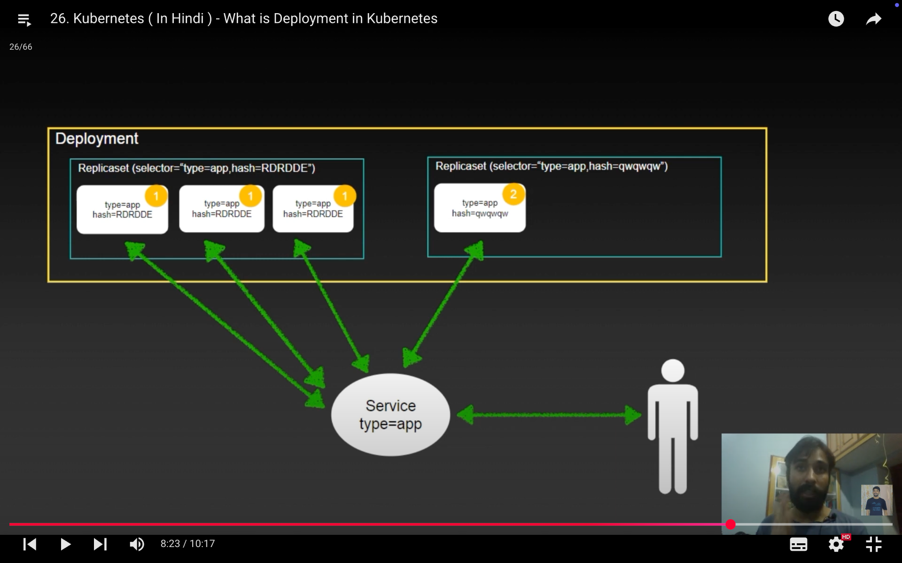

&nbsp;

## ✅ What is a Deployment in Kubernetes?

A **Deployment** is a Kubernetes resource that helps you **manage and update a group of Pods** in a controlled and automated way.

A **Deployment** is a **higher-level controller** in Kubernetes that:

- **Manages ReplicaSets**, which in turn manage **Pods**.
    
- Provides **automated rollout, rollback, and update management** for your application.
    
- Helps ensure zero downtime during updates using **rolling updates**.
    
- Tracks the **history** of changes (versions) for potential rollback.
    

* * *

## 🤔 Why Did We Need Deployment if We Already Had ReplicaSet?

A **ReplicaSet** ensures a desired number of Pods are running — but it’s **not very smart** beyond that. It doesn’t manage **updates**, **rollbacks**, or **version control**.

* * *

### 🔥 Limitations of ReplicaSet (RS)

| Feature | ReplicaSet Supports? |
| --- | --- |
| Keep N pods running | ✅ Yes |
| Rolling updates | ❌ No |
| Rollbacks | ❌ No |
| Declarative update history | ❌ No |
| Strategy control (e.g., maxSurge) | ❌ No |

If you wanted to **update your app** with a new image or configuration using ReplicaSets, you'd have to:

- Manually create a new RS,
    
- Scale down the old one,
    
- Scale up the new one,
    
- Monitor the rollout manually...
    

→ **This is error-prone and not scalable**.

* * *

### ✅ What Deployments Add on Top of ReplicaSets

| Feature | Description |
| --- | --- |
| **Rolling updates** | Seamlessly updates Pods one-by-one or in batches (configurable). |
| **Rollback support** | Easily revert to a previous RS version using one command. |
| **Declarative updates** | You declare what you want, Deployment manages the transition. |
| **History tracking** | Maintains revision history for RS versions it has created. |
| **Strategy config** | Supports `RollingUpdate` and `Recreate` strategies with options like `maxSurge`, `maxUnavailable`. |

* * *

&nbsp;



&nbsp;

Here's a **fully structured and well-formatted Deployment YAML** named `deployment1.yml`, covering all the main fields you’ll commonly use in a real-world deployment.

* * *

## 📄 `deployment1.yml` – Full Example with Structure & Syntax

```yaml
apiVersion: apps/v1           # API group for Deployments
kind: Deployment              # Resource type

metadata:
  name: my-deployment         # Name of the deployment
  labels:                     # Labels for the deployment resource itself
    app: myapp
    environment: production

spec:
  replicas: 3                 # Desired number of pod replicas

  selector:                   # How to identify the pods this Deployment manages
    matchLabels:
      app: myapp              # Must match pod template labels exactly

  strategy:                   # (Optional) Rollout strategy
    type: RollingUpdate
    rollingUpdate:
      maxSurge: 1             # Allow 1 extra pod (above desired count) during update
      maxUnavailable: 1       # Allow 1 unavailable pod during update

  template:                   # Pod template — defines what the pods will look like
    metadata:
      labels:                 # These labels must match the selector above
        app: myapp
        tier: backend

    spec:
      containers:
      - name: myapp-container             # Container name
        image: nginx:1.25                 # Docker image to use
        ports:
        - containerPort: 80               # Port exposed inside the pod

        env:                              # (Optional) Environment variables
        - name: ENV
          value: production

        resources:                        # (Optional) Resource requests/limits
          requests:
            cpu: "100m"
            memory: "128Mi"
          limits:
            cpu: "250m"
            memory: "256Mi"

        livenessProbe:                    # (Optional) Pod health check
          httpGet:
            path: /
            port: 80
          initialDelaySeconds: 10
          periodSeconds: 5

        readinessProbe:                   # (Optional) Determines if pod is ready for traffic
          httpGet:
            path: /
            port: 80
          initialDelaySeconds: 5
          periodSeconds: 5

      restartPolicy: Always               # Default for Deployments (optional)
```

* * *

## ✅ Key Sections Explained

| Section | Purpose |
| --- | --- |
| `apiVersion`, `kind` | Define the resource type |
| `metadata` | Names and labels the deployment |
| `spec.replicas` | Number of desired pods |
| `spec.selector` | Identifies pods this deployment manages |
| `spec.strategy` | Controls how updates are rolled out |
| `spec.template` | Template for the pods (must match selector) |
| `template.spec.containers` | Defines the actual app container(s) |

* * *

## 🧪 Deploy it:

```bash
kubectl apply -f deployment1.yml
```

* * *

&nbsp;

&nbsp;

* * *

## ✅ When is a Deployment **rollout triggered**?

A **rollout** happens **only when Kubernetes detects a change in the Pod template** inside the Deployment.  
That means:

### ✅ **Rollout is triggered when you change:**

- `spec.template.spec.containers[*].image` (e.g., changing the image version)
    
- Environment variables
    
- Resource limits
    
- Volume mounts
    
- Labels/annotations inside the **`spec.template.metadata`** (not the outer metadata)
    

> Basically, anything inside `spec.template` — since that's what defines the Pod.

* * *

### ❌ Rollout is **not triggered** when you change:

- `metadata.name` or labels of the Deployment itself
    
- `spec.replicas` (just scales, doesn’t roll out new Pods)
    
- Labels/annotations outside `spec.template`
    
- Strategy fields like `maxSurge` or `maxUnavailable`
    

* * *

## 🔍 Commands to **monitor rollout**

### ✅ 1. Check rollout status:

```bash
kubectl rollout status deployment <deployment-name>
```

> Shows if the Deployment is still updating or has completed the rollout.

* * *

### ✅ 2. View rollout history:

```bash
kubectl rollout history deployment <deployment-name>
```

> Shows previous versions (revisions) of the Deployment, including image changes.

* * *

### ✅ 3. Watch changes in real time:

```bash
kubectl get pods -l app=<your-app-label> -w
```

> The `-w` flag watches pod changes as the rollout progresses.

* * *

## 📌 Bonus: Manually trigger a rollout (without changing spec)

If you want to **force a rollout** even when there’s no real change, use:

```bash
kubectl rollout restart deployment <deployment-name>
```

> This forces the Deployment to restart all Pods, triggering a rollout.

* * *

## Summary

| Action | Triggers Rollout? |
| --- | --- |
| Changing container image | ✅ Yes |
| Changing env vars / volume mounts | ✅ Yes |
| Changing replica count | ❌ No |
| Changing labels outside pod template | ❌ No |
| `kubectl rollout restart` | ✅ Yes (manual) |

* * *

&nbsp;

```bash
kubectl apply -f dep.yml; kubectl get rs -o wide -w
```

is **similar**, but not **exactly** the same as:

```bash
kubectl apply -f dep.yml; watch kubectl get rs -o wide
```

Let’s break down the **differences** 👇

* * *

## 🔁 Difference Between `watch` vs `kubectl -w`

| Command | Behavior |
| --- | --- |
| `watch kubectl get rs -o wide` | Re-runs `kubectl get` every 2 seconds (snapshot view on interval) |
| `kubectl get rs -o wide -w` | Opens a **stream** to watch real-time updates as they happen (event-based) |

* * *

&nbsp;

&nbsp;

**`maxUnavailable`**, **`maxSurge`** in a Kubernetes **Deployment**'s **rolling update strategy**.

* * *

## 🚀 Where are these used?

They are part of the Deployment’s **rolling update strategy**, which controls how Kubernetes **updates pods** with zero or minimal downtime.

You define them under:

```yaml
spec:
  strategy:
    type: RollingUpdate
    rollingUpdate:
      maxSurge: <value>
      maxUnavailable: <value>
  minReadySeconds: <value>
```

* * *

## ✅ 1. `maxSurge`

> **How many extra pods can be created temporarily during an update.**

- It allows Kubernetes to **create more pods than desired replicas** (temporarily) to maintain availability.
    
- You can specify:
    
    - An absolute number (e.g. `1`)
        
    - A percentage (e.g. `25%`)
        

### Example:

```yaml
replicas: 3
rollingUpdate:
  maxSurge: 1
```

- During an update, up to **4 pods** (3 desired + 1 surge) can exist temporarily.
    
- This helps keep service available while old pods are being terminated.
    

* * *

## ✅ 2. `maxUnavailable`

> **How many pods can be unavailable during the update.**

- Limits how many pods **can be taken down at the same time** while updating.
    
- You can specify:
    
    - A number (e.g. `1`)
        
    - A percentage (e.g. `25%`)
        

### Example:

```yaml
replicas: 4
rollingUpdate:
  maxUnavailable: 1
```

- At most **1 pod can be unavailable** at any moment during the rollout.
    
- Ensures minimum service availability.
    

* * *

### 🔄 How `maxSurge` and `maxUnavailable` work together

| Setting | Effect |
| --- | --- |
| `maxSurge: 1` | 1 extra pod allowed during update (temp total = 4 pods) |
| `maxUnavailable: 1` | At most 1 pod can be taken down during the update |

These values **balance speed and availability** during rollouts.

* * *

## `minReadySeconds`

> **How long a new pod must be “ready” before it's considered available.**

- Prevents rolling forward too quickly by ensuring that new pods are **stable**.
    
- Helps catch **flaky pods** or startup issues.
    

### Example:

```yaml
minReadySeconds: 10
```

- A newly started pod must be in the `Ready` state for **at least 10 seconds** before it's considered "available".
    
- The Deployment won't proceed with replacing more pods until this time passes.
    

* * *

## 🧠 Summary Table

| Field | Purpose | Example |
| --- | --- | --- |
| `maxSurge` | How many **extra pods** can be added during update | `1` or `25%` |
| `maxUnavailable` | How many **pods can be down** during update | `0`, `1`, or `30%` |
| `minReadySeconds` | How long a new pod must be ready before considered valid | `10` seconds |

* * *

## 🧪 Bonus Example:

```yaml
strategy:
  type: RollingUpdate
  rollingUpdate:
    maxSurge: 1
    maxUnavailable: 0
minReadySeconds: 5
```

- Allows 1 extra pod
    
- Ensures no downtime (`maxUnavailable: 0`)
    
- Each new pod must be stable for 5 seconds before moving on
    

* * *

&nbsp;

Excellent question! 🙌

In a Kubernetes **Deployment YAML**, the fields you mentioned:

```yaml
strategy:
  type: RollingUpdate
  rollingUpdate:
    maxSurge: 1
    maxUnavailable: 0
minReadySeconds: 5
```

They are part of the **`spec`** section.

* * *

### ✅ Full YAML Structure (Simplified for Clarity)

```yaml
apiVersion: apps/v1          # <-- Top-level: API group
kind: Deployment             # <-- Resource type
metadata:                    # <-- Metadata (name, labels)
  name: my-deployment

spec:                        # <-- The main Deployment spec
  replicas: 3                # Number of pods
  selector:                  # How to identify managed pods
    matchLabels:
      app: myapp

  strategy:                  # <-- Update strategy lives here
    type: RollingUpdate
    rollingUpdate:
      maxSurge: 1
      maxUnavailable: 0

  minReadySeconds: 5         # <-- Also part of spec (same level as strategy)

  template:                  # <-- Pod template
    metadata:
      labels:
        app: myapp
    spec:
      containers:
      - name: myapp
        image: nginx:latest
```

* * *

### ✅ Final Answer:

- **`strategy`** and **`minReadySeconds`** both go under:  
    🔽 `**spec**` of the **Deployment**

* * *

&nbsp;

**Default values** in a Kubernetes Deployment for rollout strategy parameters:

* * *

## ✅ Default Rolling Update Strategy in Deployments

When you create a Deployment and do **not** explicitly specify the `strategy`, Kubernetes uses the following defaults:

### 🧠 **Default `strategy.type`**

```yaml
strategy:
  type: RollingUpdate
```

> This means rolling updates are the default — **Kubernetes does not recreate all pods at once** unless you change the strategy to `Recreate`.

* * *

## 🔧 Default `maxSurge` and `maxUnavailable`

When using the default `RollingUpdate` strategy and you **do not set** `maxSurge` and `maxUnavailable`, the following defaults apply:

| Field | Default Value |
| --- | --- |
| `maxSurge` | `25%` |
| `maxUnavailable` | `25%` |

So for example, if your Deployment has `replicas: 4`:

- **maxSurge 25%** → Kubernetes can create **1 extra pod** (25% of 4)
    
- **maxUnavailable 25%** → Kubernetes can take **1 pod offline** at a time during the rollout
    

> These defaults are balanced for **safe, gradual rollouts** with minimal downtime.

&nbsp;

&nbsp;

* * *

## ✅ 1. **How to Add a Message to a Rollout Revision**

Kubernetes **doesn’t natively support custom messages** per rollout revision (like Git commit messages). However, there are a couple of **workarounds** to annotate your rollout:

### ✅ Workaround: Use annotations to record messages

You can add an annotation to your Deployment to describe the change.

**Add a rollout message (change cause)** directly in a **Deployment YAML** file and have it show up in the rollout history.

* * *

## ✅ YAML with Annotation for Rollout Message

```yaml
apiVersion: apps/v1
kind: Deployment
metadata:
  name: firstdeploy
  annotations:  #<-----
    kubernetes.io/change-cause: "Initial deployment with nginx 1.25"
spec:
  replicas: 2
  selector:
    matchLabels:
      app: myapp
  template:
    metadata:
      labels:
        app: myapp
    spec:
      containers:
      - name: nginx
        image: nginx:1.25
        ports:
        - containerPort: 80
```

> 📝 The `kubernetes.io/change-cause` annotation is placed under `metadata` of the **Deployment**, not the Pod template.

* * *

## 🧪 Apply the Deployment

```bash
kubectl apply -f deployment1.yml
```

* * *

## 🔍 View Rollout History with Message

```bash
kubectl rollout history deployment firstdeploy
```

You should see:

```
REVISION  CHANGE-CAUSE
1         Initial deployment with nginx 1.25
```

* * *

## 🧠 Tip for Future Updates

If you update the deployment (e.g. image version), you can **add a new annotation before applying**, like this:

```bash
kubectl annotate deployment firstdeploy \
  kubernetes.io/change-cause="Updated to nginx 1.26" --overwrite
  
kubectl set image deployment firstdeploy nginx=nginx:1.26
```

This ensures your **revision history includes meaningful messages**.

```bash
kubectl rollout history deployment firstdeploy
```

You’ll see:

```
REVISION  CHANGE-CAUSE
1         Updated to version 1.26
2         <none>
```

> 🔔 Tip: Add the annotation **before** or **as part of** applying the YAML to capture the reason.

| Scenario | What happens? |
| --- | --- |
| You annotate **now**, then rollout later | The rollout revision will include the message you added *before* the rollout. |
| You annotate **long ago**, then rollout | The rollout revision will use the *latest* annotation value at rollout time. |
| You annotate **after** rollout | The annotation is updated on Deployment, but rollout history won’t change for past revisions. |

* * *

## ✅ 2. **How to Roll Back to a Specific Revision**

Yes, your syntax is **almost correct**, just needs a small fix. ✅

### Correct Command:

```bash
kubectl rollout undo deployment firstdeploy --to-revision=1
```

This command tells Kubernetes to **revert the Deployment** named `firstdeploy` back to **revision 1**.

* * *

## 🧪 Bonus: View All Rollout History

```bash
kubectl rollout history deployment firstdeploy
```

Output example:

```
REVISION  CHANGE-CAUSE
1         Updated to version 1.25
2         Rolled back to 1.25
3         Updated env var
```

> Use this to choose the revision number for rollback.

* * *

## ✅ Summary

| Action | Command |
| --- | --- |
| Add a rollout message | `kubectl annotate deployment <name> kubernetes.io/change-cause="..."` |
| View history with messages | `kubectl rollout history deployment <name>` |
| Roll back to previous rev | `kubectl rollout undo deployment <name>` |
| Roll back to specific rev | `kubectl rollout undo deployment <name> --to-revision=<number>` |

* * *

&nbsp;

Here's how you can **pause** and **resume** a rollout of a Kubernetes Deployment using `kubectl`.

* * *

## ⏸️ Pause Rollout

### Command:

```bash
kubectl rollout pause deployment <deployment-name>
```

### Example:

```bash
kubectl rollout pause deployment firstdeploy
```

### ✅ What it does:

- **Pauses** the rollout of a Deployment.
    
- Useful when you want to make **multiple changes** (like image + env vars) and then apply them **all at once**, instead of triggering separate rollouts for each.
    
- While paused, **no new Pods will be rolled out**, even if you change the Deployment spec.
    

* * *

## ▶️ Resume Rollout

### Command:

```bash
kubectl rollout resume deployment <deployment-name>
```

### Example:

```bash
kubectl rollout resume deployment firstdeploy
```

### ✅ What it does:

- **Resumes** a paused rollout.
    
- If any spec changes were made while the rollout was paused, they will now be applied and the rollout will proceed.
    

* * *

## 🧠 When to Use This?

### 📌 Use `pause` when:

- You want to **batch multiple changes** (e.g., image + config) into a single rollout.
    
- You're doing controlled testing or staging.
    

### 📌 Use `resume` when:

- You're ready to apply the changes and proceed with the rollout.

* * *

## 🧪 Bonus: Check rollout status

```bash
kubectl rollout status deployment <deployment-name>
```

It will show:

- `"paused"` if rollout is paused
    
- Progress messages if rollout is ongoing
    
- `"successfully rolled out"` when complete
    

* * *

&nbsp;

&nbsp;