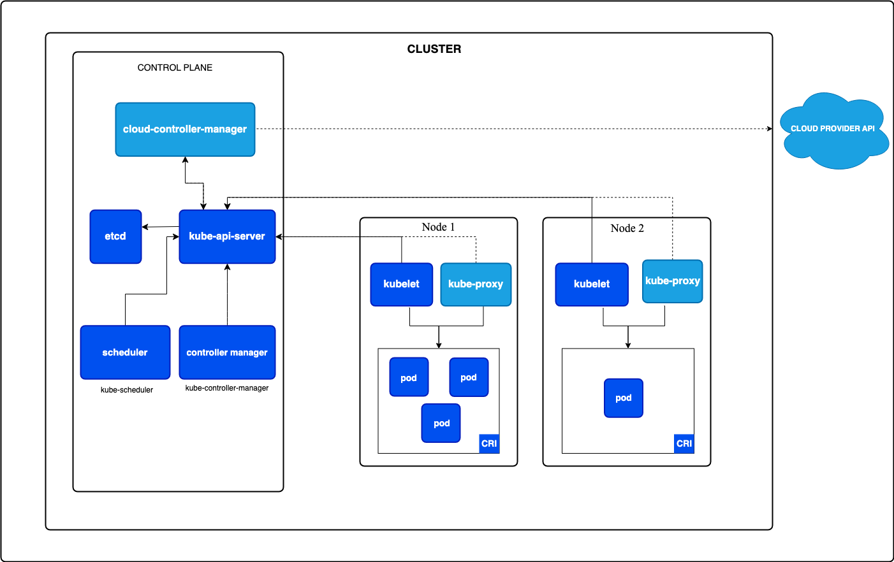

K8s (short for **Kubernetes**) is an **open-source container orchestration platform** that automates:

- **Deployment** → runs your application containers easily across many machines.(manages replica set)
    
- **Scaling** → automatically adjusts the number of containers based on load.
    
- **Load balancing** → distributes traffic across healthy containers.
    
- **Self-healing** → restarts failed containers, reschedules them if a node dies.
    
- **Service discovery & networking** → gives containers DNS names and IPs to communicate.
    
- **Storage orchestration** → attaches persistent storage volumes to containers.
    

* * *

### Why the name **Kubernetes (K8s)?**

- Kubernetes comes from the Greek word for **“helmsman”** or **“pilot”** (someone who steers a ship).
    
- It was originally designed at **Google**, based on their internal system **Borg**.
    
- The short form **K8s** comes from replacing the 8 middle letters in “Kubernetes” with **8**.
    

* * *

### Example:

Without Kubernetes, if you had 100 containers:

- You’d manually start/stop them, monitor health, handle scaling, and route traffic.

With Kubernetes:

- You just declare **“I want 100 replicas of this app”**, and Kubernetes ensures that happens automatically.

* * *

👉 In simple terms:  
**Kubernetes = the operating system for your containerized applications** — it keeps them running, healthy, and scalable across a cluster of machines.

&nbsp;

## ****

## **1\. Control Plane Components (brains of the cluster)**

These manage the overall cluster state and decisions:

- **kube-apiserver**
    
    - The **entry point** for all Kubernetes commands (via `kubectl` or API calls).
        
    - Exposes the Kubernetes API.
        
    - Validates and processes REST requests, then updates etcd or communicates with other control plane components.
        
- **etcd**
    
    - A **distributed key-value store** that stores the **entire cluster state** (pods, configs, secrets, etc.).
        
    - Acts like the “database” of Kubernetes.
        
- **scheduler (kube-scheduler)**
    
    - Decides **which node a new pod should run on**, based on resource availability, constraints, taints/tolerations, affinity, etc.
- **controller manager (kube-controller-manager)**
    
    - Runs different controllers in the background to keep the cluster in the desired state.
        
    - Examples:
        
        - **Node controller** → manages node health.
            
        - **Replication controller** → ensures the desired number of pod replicas.
            
        - **Endpoint controller** → joins Services & Pods.
            
- **cloud-controller-manager**
    
    - Only used in cloud environments (AWS, GCP, Azure, etc.).
        
    - Connects Kubernetes with the cloud provider APIs (for load balancers, storage volumes, nodes).
        

* * *

## **2\. Worker Node Components (where workloads run)**

Nodes are the machines (VMs/servers) that actually run your application pods.

- **kubelet**
    
    - Agent running on each node.
        
    - Ensures containers described in Pods are running and healthy.
        
    - Talks to the container runtime (Docker, containerd, CRI-O).
        
- **kube-proxy**
    
    - Handles **networking and load balancing** for services inside the node.
        
    - Forwards traffic to the correct pod using iptables/IPVS rules.
        
    - Great question. Let’s break down **what `kube-proxy` is**, how it works, and why it’s important in Kubernetes networking.
        
        * * *
        
        ## 🔌 What is `kube-proxy`?
        
        **`kube-proxy` is a network component that runs on every node in your Kubernetes cluster.**
        
        Its job is to handle **routing of traffic** to your cluster’s Services (i.e., `ClusterIP`, `NodePort`, `LoadBalancer`, etc.).
        
        > Think of `kube-proxy` as the traffic controller that decides:  
        > *"Which Pod should get this request sent to the Service?"*
        
        * * *
        
        ## ⚙️ Responsibilities of `kube-proxy`
        
        `kube-proxy` ensures that:
        
        1.  **Clients can talk to Services using stable IPs (ClusterIPs).**
            
        2.  **Traffic gets load-balanced across the right backend Pods.**
            
        3.  **Networking rules are kept up to date (iptables or IPVS).**
            
        
        * * *
        
        ## 🎯 Example
        
        Suppose you have a Service like this:
        
        ```yaml
        apiVersion: v1
        kind: Service
        metadata:
          name: myapp-service
        spec:
          selector:
            app: myapp
          ports:
            - port: 80
              targetPort: 8080
        ```
        
        This Service gets a **ClusterIP**, e.g., `10.96.0.5`.
        
        When you run:
        
        ```bash
        curl http://10.96.0.5
        ```
        
        You’re hitting a **virtual IP**. This isn't bound to a single Pod — it's handled by `kube-proxy`, which:
        
        - Checks which Pods match the selector `app=myapp`
            
        - Chooses one backend Pod
            
        - Forwards the request to its IP and port (`PodIP:8080`)
            
        - Keeps this mapping updated as Pods come and go
            
        
        * * *
        
        ## 🔍 How does `kube-proxy` actually route traffic?
        
        There are 3 modes:
        
        | Mode | Description |
        | --- | --- |
        | **iptables** | Default mode. Sets up iptables rules to route traffic to Pods. Fast, no extra process in data path. |
        | **IPVS** | More advanced. Uses Linux IP Virtual Server for better load balancing performance. |
        | **userspace** | Legacy mode. kube-proxy itself forwards traffic. Slower and mostly deprecated. |
        
        > You can check which mode you're using by looking at the kube-proxy config or logs.
        
        * * *
        
        ## 📍 Where does `kube-proxy` run?
        
        - As a **DaemonSet** — one pod per node
            
        - Typically in the `kube-system` namespace
            
        - It monitors the Kubernetes API for Service and Endpoint changes
            
        
        * * *
        
        ## 🚫 What `kube-proxy` is NOT
        
        - Not part of the CNI (Container Network Interface) — it doesn't assign IPs to pods.
            
        - Not a reverse proxy like NGINX or Envoy — it operates at the IP level, not HTTP level.
            
        - Not responsible for Ingress — that’s handled by Ingress Controllers.
            
        
        * * *
        
        ## ✅ Summary
        
        | Feature | Description |
        | --- | --- |
        | Purpose | Route traffic from Services to backend Pods |
        | Runs on | Every node (as a DaemonSet) |
        | Handles | ClusterIP, NodePort, LoadBalancer |
        | Uses | iptables, IPVS, or userspace |
        | Watches | Kubernetes Services and Endpoints |
        | Acts as | The network glue between Services and Pods |
        
        * * *
        
        Let me know if you want to see a live traffic flow diagram or how to debug `kube-proxy` in your cluster!
        
- **Container Runtime (CRI)**
    
    - The software that runs containers.
        
    - Examples: **Docker, containerd, CRI-O**.
        
    - Kubernetes talks to it via the **Container Runtime Interface (CRI)**.
        
- **Pods**
    
    - The **smallest deployable unit** in Kubernetes.
        
    - A pod can have **one or multiple containers** that share network and storage.
        

* * *

## **3\. External Component**

- **Cloud Provider API**
    
    - Kubernetes integrates with cloud providers (AWS, Azure, GCP) for resources like:
        
        - Load balancers
            
        - Block storage (EBS, Persistent Disks)
            
        - Auto-scaling nodes
            

* * *

✅ **Summary of Flow**:

1.  User issues a command → **kube-apiserver**.
    
2.  **etcd** stores the desired state.
    
3.  **scheduler** decides placement of pods.
    
4.  **controller manager** ensures the desired state is maintained.
    
5.  On a node, **kubelet** starts the pod via **CRI**.
    
6.  **kube-proxy** makes sure networking & service discovery works.
    

* * *

Basic Commands (Beginner):  
  create Create a resource from a file or from stdin  
  expose Take a replication controller, service, deployment or pod and expose it as a new Kubernetes service  
  run Run a particular image on the cluster  
  set Set specific features on objects

Basic Commands (Intermediate):  
  explain Get documentation for a resource  
  get Display one or many resources  
  edit Edit a resource on the server  
  delete Delete resources by file names, stdin, resources and names, or by resources and label selector

Deploy Commands:  
  rollout Manage the rollout of a resource  
  scale Set a new size for a deployment, replica set, or replication controller  
  autoscale Auto-scale a deployment, replica set, stateful set, or replication controller

Cluster Management Commands:  
  certificate Modify certificate resources  
  cluster-info Display cluster information  
  top Display resource (CPU/memory) usage  
  cordon Mark node as unschedulable  
  uncordon Mark node as schedulable  
  drain Drain node in preparation for maintenance  
  taint Update the taints on one or more nodes

Troubleshooting and Debugging Commands:  
  describe Show details of a specific resource or group of resources  
  logs Print the logs for a container in a pod  
  attach Attach to a running container  
  exec Execute a command in a container  
  port-forward Forward one or more local ports to a pod  
  proxy Run a proxy to the Kubernetes API server  
  cp Copy files and directories to and from containers  
  auth Inspect authorization  
  debug Create debugging sessions for troubleshooting workloads and nodes  
  events List events

Advanced Commands:  
  diff Diff the live version against a would-be applied version  
  apply Apply a configuration to a resource by file name or stdin  
  patch Update fields of a resource  
  replace Replace a resource by file name or stdin  
  wait Experimental: Wait for a specific condition on one or many resources  
  kustomize Build a kustomization target from a directory or URL

Settings Commands:  
  label Update the labels on a resource  
  annotate Update the annotations on a resource  
  completion Output shell completion code for the specified shell (bash, zsh, fish, or powershell)

Subcommands provided by plugins:

Other Commands:  
  api-resources Print the supported API resources on the server  
  api-versions Print the supported API versions on the server, in the form of "group/version"  
  config Modify kubeconfig files  
  plugin Provides utilities for interacting with plugins  
  version Print the client and server version information

&nbsp;

Great question 👍 Let’s go step by step.

* * *

## 🔹 What are **resources** in Kubernetes?

In Kubernetes, a **resource** is any API object that you can manage through the Kubernetes API (via `kubectl`, manifests, or client libraries).  
They represent different parts of the cluster — workloads, services, storage, config, etc.

Think of them as **building blocks of your cluster**.

* * *

## 🔑 Major Categories of Resources

### 1\. **Workload resources** (define applications)

- **Pod** → Smallest deployable unit, runs containers.
    
- **ReplicaSet** → Ensures a specific number of Pods are running.
    
- **Deployment** → Manages ReplicaSets, provides rolling updates.
    
- **StatefulSet** → For stateful apps (databases, Kafka, etc.).
    
- **DaemonSet** → Ensures one Pod runs on every (or selected) node.
    
- **Job** → Run a task to completion.
    
- **CronJob** → Run jobs on a schedule.
    

* * *

### 2\. **Service & Networking resources**

- **Service** → Exposes Pods with a stable IP/DNS.
    
- **Ingress** → Manages external access (HTTP/HTTPS).
    
- **NetworkPolicy** → Controls traffic rules between Pods.
    
- **Endpoints** → Links Services to Pods.
    

* * *

### 3\. **Config & Storage resources**

- **ConfigMap** → Stores configuration (non-sensitive data).
    
- **Secret** → Stores sensitive data (passwords, tokens).
    
- **PersistentVolume (PV)** → Actual storage resource in the cluster.
    
- **PersistentVolumeClaim (PVC)** → Request for storage by a Pod.
    
- **StorageClass** → Defines types of storage (fast SSD, slow HDD, etc.).
    

* * *

### 4\. **Cluster resources**

- **Node** → A worker machine (VM or physical).
    
- **Namespace** → Logical partition inside a cluster.
    
- **Role / ClusterRole** → Define permissions.
    
- **RoleBinding / ClusterRoleBinding** → Assign roles to users/service accounts.
    
- **ServiceAccount** → Identity for Pods to access API.
    

* * *

### 5\. **Control & Policy resources**

- **ResourceQuota** → Limits resources (CPU, memory, objects) in a namespace.
    
- **LimitRange** → Sets default/maximum values for Pods/containers.
    
- **HorizontalPodAutoscaler (HPA)** → Scales Pods based on CPU/memory/metrics.
    
- **PodDisruptionBudget (PDB)** → Controls voluntary disruptions (e.g., during maintenance).
    

* * *

## 📌 How to list resources

```bash
kubectl api-resources
```

This shows all resource types available in your cluster.

Example output (partial):

```
NAME              SHORTNAMES   APIGROUP   NAMESPACED   KIND
pods              po                       true        Pod
services          svc                      true        Service
deployments       deploy       apps        true        Deployment
nodes             no                       false       Node
configmaps        cm                       true        ConfigMap
```

* * *

✅ **Summary:**  
Resources in Kubernetes are the **objects you create and manage** (Pods, Deployments, Services, ConfigMaps, etc.). They define how your app runs, connects, and stores data.

* * *

&nbsp;

# How to **create a Pod in Kubernetes**.

There are **two main ways**:

* * *

## **1\. Imperative way (quick, direct command)**

If you just want to spin up a Pod quickly:

```bash
kubectl run my-pod --image=nginx --restart=Never
```

- `my-pod` → name of the Pod
    
- `--image=nginx` → container image used inside the Pod
    
- `--restart=Never` → ensures Kubernetes creates just a **Pod**, not a Deployment
    

✅ This will immediately create a Pod running **Nginx**.

* * *

## **2\. Declarative way (using YAML manifest)**

More common in real-world usage because it’s reusable & version-controlled.

Create a file called **`pod.yaml`**:

```yaml
apiVersion: v1
kind: Pod
metadata:
  name: my-pod
  labels:
    app: demo
spec:
  containers:
    - name: nginx-container
      image: nginx:latest
      ports:
        - containerPort: 80
```

Then apply it:

```bash
kubectl apply -f pod.yaml
```

* * *

## **Check Pod Status**

```bash
kubectl get pods
```

See details (logs, events, IP, etc.):

```bash
kubectl describe pod my-pod
kubectl logs my-pod
```

* * *

## **Summary**

- **Imperative** → `kubectl run` (fast testing).
    
- **Declarative** → YAML manifests (`kubectl apply -f`) (best practice).
    

* * *

&nbsp;

In Kubernetes, you can use `kubectl` to **list resources**. Here are the most common ways:

* * *

## **1\. List Pods**

```bash
kubectl get pods
```

Show all Pods in the current namespace.

Add details:

```bash
kubectl get pods -o wide
```

* * *

## **2\. List all resource types**

If you’re not sure what resources exist:

```bash
kubectl api-resources
```

This prints all resource kinds (Pods, Deployments, Services, ConfigMaps, etc.).

* * *

## **3\. List a specific resource**

Examples:

```bash
kubectl get nodes
kubectl get deployments
kubectl get services
kubectl get configmaps
kubectl get secrets
kubectl get namespaces
```

* * *

## **4\. List everything in the namespace**

```bash
kubectl get all
```

This shows Pods, Services, Deployments, ReplicaSets, etc. (but not *everything* like ConfigMaps/Secrets).

* * *

## **5\. List across all namespaces**

```bash
kubectl get all --all-namespaces
```

* * *

## **6\. Get resource usage (CPU/Memory)**

If Metrics Server is installed:

```bash
kubectl top pod
kubectl top node
```

* * *

⚡ Tip:  
To explore, run:

```bash
kubectl get --help
```

and

```bash
kubectl explain <resource>
```

(e.g. `kubectl explain pod`) → shows full spec and fields.

\*\*helpful in writing yaml

* * *

&nbsp;

Let’s break down **`kubectl describe`** and **`kubectl get … -w` (watch)**.

* * *

## 🔎 `kubectl describe`

- Shows **detailed information** about a specific resource.
    
- Useful for debugging (you can see events, status, labels, annotations, etc.).
    

### Example:

```bash
kubectl describe pod firstpod
```

You’ll see:

- Pod name, namespace
    
- Node it’s running on
    
- Labels & annotations
    
- Container details (image, ports, env vars)
    
- Status & conditions
    
- Events (pulling image, errors, scheduling, etc.)
    

👉 **Best use:** Debugging problems like `ImagePullBackOff`, `CrashLoopBackOff`, or scheduling failures.

* * *

## 👀 `kubectl get … -w` (watch)

- Continuously **watches resource changes** in real time.
    
- Equivalent to running `watch kubectl get pods`, but built into `kubectl`.
    

### Example:

```bash
kubectl get pods -w
```

You’ll see Pod status updates live:

```
NAME        READY   STATUS              RESTARTS   AGE
firstpod    0/1     ContainerCreating   0          2s
firstpod    0/1     Running             0          6s
firstpod    1/1     Running             0          10s
```

Stop watching → press **Ctrl+C**.

👉 **Best use:**

- Monitor Pods starting up.
    
- Watch scaling events (Deployments, ReplicaSets).
    
- Watch for changes in Services, Nodes, etc.
    

* * *

✅ **In short:**

- `kubectl describe <resource>` → **Deep dive into one resource’s details & events**.
    
- `kubectl get <resource> -w` → **Live watch of status changes across resources**.
    

* * *

&nbsp;

Deleting a Pod in Kubernetes is simple 👍 You use `kubectl delete`.

* * *

## **1\. Delete by name**

If you know the Pod name:

```bash
kubectl delete pod <pod-name>
```

Example:

```bash
kubectl delete pod firstpod
```

* * *

## **2\. Delete from YAML manifest**

If you created it with a YAML file:

```bash
kubectl delete -f pod.yaml
```

* * *

## **3\. Delete all Pods in current namespace**

⚠️ Careful: This will wipe out all Pods.

```bash
kubectl delete pods --all
```

* * *

## **4\. Force delete (if stuck in Terminating state)**

Sometimes Pods hang in `Terminating`. Then use:

```bash
kubectl delete pod <pod-name> --grace-period=0 --force
```

* * *

## **5\. Verify**

Check remaining Pods:

```bash
kubectl get pods
```

* * *

⚡ Reminder:  
If the Pod is managed by a **Deployment**, **ReplicaSet**, or **DaemonSet**, deleting it will make Kubernetes recreate it immediately.  
👉 In that case, you should delete the higher-level object (`kubectl delete deployment <name>`) instead.

* * *

> &nbsp;

## ✅ Correct Way to "Stop" a Pod

In Kubernetes, you don't "stop" a pod — you either **delete** it or **scale down** the controller managing it.

* * *

### 📌 Case 1: Pod is standalone (not part of a Deployment)

To stop (delete) the pod:

```bash
kubectl delete pod demo
```

This **terminates** the pod. But if it's managed by a controller (like a Deployment), it will be **recreated automatically**.

* * *

### 📌 Case 2: Pod is managed by a **Deployment**, **ReplicaSet**, etc.

To stop the pod **without it coming back**, you need to modify the controller.

#### Option A: Scale the Deployment to 0 replicas

```bash
kubectl scale deployment <deployment-name> --replicas=0
```

#### Option B: Delete the Deployment

```bash
kubectl delete deployment <deployment-name>
```

* * *

### 🧠 Why There's No `kubectl stop`

Kubernetes doesn't use a `start`/`stop` model like traditional systems — it’s **declarative**. You declare what you want (e.g., 2 replicas), and Kubernetes makes it happen.

If you want “nothing running,” your declaration should be `replicas: 0` — or delete the object entirely.

* * *

Let me know your use case — I can guide you based on whether you're using Pods, Deployments, CronJobs, etc.

&nbsp;

Let’s compare **DaemonSet vs Deployment** — since both create Pods but are used in **different scenarios**.

* * *

## 🔑 **1\. Purpose**

- **Deployment** → runs **apps that serve user traffic** (like web servers, APIs).
    
- **DaemonSet** → runs **node-level agents** (like log collectors, monitoring, networking).
    

* * *

## 🔑 **2\. Pod placement**

- **Deployment** → Pods are scheduled **anywhere in the cluster** (based on scheduler decisions).
    
- **DaemonSet** → Ensures **1 Pod per Node** (or per selected Nodes using node selectors/affinity).
    

* * *

## 🔑 **3\. Scaling**

- **Deployment** → You can scale replicas up/down:
    
    ```bash
    kubectl scale deployment myapp --replicas=5
    ```
    
- **DaemonSet** → No manual scaling. Scaling = **add/remove nodes**, since it’s tied to nodes, not replicas.
    

* * *

## 🔑 **4\. Use cases**

- **Deployment**
    
    - Web apps (Nginx, Node.js, Java Spring Boot).
        
    - Backend services (APIs, databases as StatefulSets in some cases).
        
- **DaemonSet**
    
    - Monitoring agents (Prometheus Node Exporter, Datadog agent).
        
    - Logging (Fluentd, Promtail, Filebeat).
        
    - Networking (CNI plugins, kube-proxy).
        

* * *

## 📊 **Side-by-Side Example**

| Feature | Deployment | DaemonSet |
| --- | --- | --- |
| Pod scheduling | Anywhere in cluster | 1 Pod per node (or subset) |
| Scaling | Manual (replicas) or auto-scaling | Based on number of nodes |
| Typical use case | Applications serving traffic | Node-level services/agents |
| Example | `nginx` web server | `fluentd` log collector |

* * *

✅ **Summary**

- Use a **Deployment** when you want **apps that scale horizontally** (more replicas = more capacity).
    
- Use a **DaemonSet** when you want **one Pod per Node** (system-level agents).
    

&nbsp;

* * *

## ✏️ Label management with `kubectl`

### Add a label

```bash
kubectl label pod firstpod env=dev
```

### Update a label

```bash
kubectl label pod firstpod env=prod --overwrite
```

### Show labels

```bash
kubectl get pod firstpod --show-labels
```

* * *

## ❌ How to delete a label

You can delete a label by adding a **trailing dash (`-`)** to the key.

Example:

```bash
kubectl label pod firstpod env-
```

This removes the `env` label from `firstpod`.

* * *

## 📌 Summary

- **Labels** = metadata tags (key=value).
    
- Used for grouping, selecting, and organizing resources.
    
- **Delete a label** with:
    
    ```bash
    kubectl label <resource> <name> <label-key>-
    ```
    

* * *

## ✅ Label all Pods in the current namespace

```bash
kubectl label pods --all team=dev
```

- `--all` → selects all Pods in the namespace.
    
- `team=dev` → label to apply.
    

* * *

## ✅ Label all Pods in a specific namespace

```bash
kubectl label pods --all team=dev -n my-namespace
```

* * *

## ✅ Using `kubectl get` + `xargs` (for complex cases)

If you want to label only Pods that match a filter:

```bash
kubectl get pods -n my-namespace -o name | xargs kubectl label -n my-namespace team=dev
```

* * *

## 🔍 Verify labels

```bash
kubectl get pods --show-labels
```

* * *

⚡ Important:

- If some Pods already have the same label key (e.g., `team`), you need `--overwrite`:
    
    ```bash
    kubectl label pods --all team=dev --overwrite
    ```
    
- If Pods are managed by **ReplicaSets / Deployments**, labeling the Pods directly is **temporary** → when Pods restart, new Pods **won’t inherit that label** unless you add the label to the **Deployment spec** instead.
    

* * *

&nbsp;

👍 The **`--dry-run`** flag in `kubectl` is used for **testing and validation without actually making changes** to the cluster.

* * *

## ✨ What `--dry-run` does

- Simulates the action (create, apply, delete, etc.).
    
- Doesn’t persist anything in Kubernetes.
    
- Useful to **preview YAML** or **validate resources** before applying.
    

* * *

## 🔑 Types of `--dry-run` (depending on `kubectl` version)

1.  **Old versions (< v1.18)**
    
    - `--dry-run=true` → client-side dry run (just validates locally).
2.  **Newer versions (v1.18+)**
    
    - `--dry-run=client` → check locally (don’t talk to the server).
        
        - Only checks:
            
            - YAML/command syntax is valid.
                
            - Required fields are present.
                
    - `--dry-run=server` → send request to the API server, validate against cluster (but don’t persist).
        
        - Checks against:
            
            - Cluster schema (is the object valid?).
                
            - Admission controllers (e.g., security policies, quotas, RBAC).
                
            - Existing resources (e.g., conflicts).
                
    - Old kubectl → `--dry-run` = client mode.
        
    - New kubectl → you must specify `client`, `server`, or `none`.
        

* * *

## 🛠 Examples

### ✅ Generate YAML without creating the object

```bash
kubectl run nginx --image=nginx --dry-run=client -o yaml
```

- Prints YAML for the Pod definition instead of creating it.
    
- `-o yaml` → output format.
    

### ✅ Test apply without persisting

```bash
kubectl apply -f pod.yaml --dry-run=server
```

- Validates against the live cluster (checks schema, admission controllers, etc.).
    
- Doesn’t actually create/update the resource.
    

### ✅ Validate deletion

```bash
kubectl delete pod mypod --dry-run=client
```

- Just shows what would happen if deleted, but won’t delete.

* * *

## 📌 Summary

- `--dry-run=client` → validate locally, don’t touch API server.
    
- `--dry-run=server` → check against cluster rules, but don’t save.
    
- Super useful for **YAML generation, debugging, and validation**.
    

* * *

&nbsp;

**YAML** stands for **“YAML Ain’t Markup Language”**.  
It’s a **human-readable data serialization format** used to define configuration.

- Simple, clean, and easy to read compared to JSON or XML.
    
- Uses **indentation** instead of curly braces (`{}`) or angle brackets (`<>`).
    
- Widely used in **Kubernetes**, **Ansible**, **Docker Compose**, **CI/CD pipelines**, etc.
    

* * *

## 🔑 Key Features of YAML

- **Key-value pairs** (`name: nginx`)
    
- **Indentation matters** (spaces, not tabs).
    
- **Lists** using `-` (dash).
    
- Supports **scalars** (strings, numbers, booleans) and **nested objects**.
    

* * *

## 📌 Example YAML (Kubernetes Pod)

apiVersion: v1  
kind: Pod  
metadata:  
  name: mypod  
  labels:  
    app: demo  
spec:  
  containers:  
    - name: nginx-container  
      image: nginx:latest  
      ports:  
        - containerPort: 80

### Breakdown:

- `apiVersion` → which version of K8s API to use.
    
- `kind` → type of object (Pod, Deployment, Service, etc.).
    
- `metadata` → name, labels, annotations.
    
- `spec` → specification (desired state).
    

&nbsp;

* * *

## 🔹 1. Difference between `.yml` and `.yaml`

👉 **There is NO functional difference.**

- Both are valid file extensions for **YAML files**.
    
- Kubernetes (and most tools) accept both.
    
- Historically:
    
    - `.yaml` is the official extension (recommended by YAML maintainers).
        
    - `.yml` became popular because old OSes limited file extensions to 3 characters.
        

✅ In Kubernetes, you can use either:

```bash
kubectl apply -f pod.yaml
kubectl apply -f pod.yml
```

Both will work exactly the same.

* * *

## 🔹 2. Difference between `kubectl create` and `kubectl apply`

### 🛠️ `kubectl create`

- Creates a resource **from scratch**.
    
- If the resource already exists → ❌ error.
    
- One-time operation.
    
- Best when you are creating something for the **first time**.
    

Example:

```bash
kubectl create -f pod.yaml
```

* * *

### 🛠️ `kubectl apply`

- Creates the resource if it doesn’t exist.
    
- If it already exists → updates it (patches the changes).
    
- Declarative style → always tries to match the cluster state to your YAML.
    
- Best when managing resources via GitOps or repeated updates.
    

Example:

```bash
kubectl apply -f pod.yaml
```

* * *

## 📊 Side-by-side

| Command | Behavior | Use case |
| --- | --- | --- |
| `kubectl create` | Create new resource, error if exists | First-time creation |
| `kubectl apply` | Create if not exists, update if it does | Continuous management, updates |

* * *

✅ **Summary**:

- `create` → one-time, fails if exists.
    
- `apply` → smart, create-or-update, preferred for day-to-day usage.
    

&nbsp;

**Object Management** in Kubernetes is all about **how you create, update, and delete resources (objects) like Pods, Deployments, Services, etc.**

Kubernetes gives us **3 main approaches** to manage objects:

* * *

## 🔹 1. **Imperative commands**

- You tell Kubernetes exactly *what to do right now*.
    
- One-liners like `kubectl run`, `kubectl expose`, `kubectl delete`.
    
- Quick & simple but not reusable.
    

✅ Example:

```bash
kubectl run nginx --image=nginx
kubectl expose pod nginx --port=80 --type=ClusterIP
```

⚠️ Problem → No saved YAML file, hard to reproduce later.

* * *

## 🔹 2. **Imperative object configuration**

- You define objects in YAML/JSON files.
    
- Use `kubectl create -f` or `kubectl delete -f`.
    
- The file acts as **source of truth**, but you still have to manually re-run commands for updates.
    

✅ Example:

```bash
kubectl create -f pod.yaml
kubectl delete -f pod.yaml
```

⚠️ Problem → Updates require re-creating objects.

* * *

## 🔹 3. **Declarative object configuration** ✅ (recommended)

- You write manifests in YAML/JSON.
    
- Use `kubectl apply -f`.
    
- Kubernetes compares the file with current cluster state and makes adjustments.
    
- Perfect for GitOps and CI/CD pipelines.
    

✅ Example:

```bash
kubectl apply -f pod.yaml
```

- If the Pod doesn’t exist → it’s created.
    
- If it exists → it’s updated to match YAML.
    
- If fields are removed → they’re removed from the live object.
    

* * *

## 📊 Comparison

| Approach | Command Style | Pros | Cons |
| --- | --- | --- | --- |
| **Imperative commands** | `kubectl run ...` | Quick, easy to learn | Not reusable, no record |
| **Imperative config** | `kubectl create -f file` | File-based, repeatable | Updates require delete/create |
| **Declarative config** | `kubectl apply -f file` | GitOps-friendly, idempotent | Harder to debug at first |

* * *

## 🔎 Checking applied objects

- View YAML from cluster (with defaults added by API):

```bash
kubectl get pod mypod -o yaml
```

- Edit a live object:

```bash
kubectl edit pod mypod
```

- Remove with:

```bash
kubectl delete -f pod.yaml
```

* * *

✅ **Summary:**

- Object management = **Imperative commands**, **Imperative config**, **Declarative config**.
    
- For production → always use **Declarative (apply)** with YAML stored in Git (GitOps).
    

* * *

&nbsp;

&nbsp;

The `-f` flag in both `kubectl create` and `kubectl apply` simply means:

👉 **"Use the resource definition from a file (or directory or URL)"**

* * *

## 🔹 Examples

### Create from a YAML file

```bash
kubectl create -f pod.yaml
```

Reads the Pod spec from `pod.yaml` and creates it.

### Apply from a YAML file

```bash
kubectl apply -f pod.yaml
```

Reads the Pod spec from `pod.yaml` and creates or updates it.

* * *

## 🔹 Other ways to use `-f`

### 1\. From multiple files

```bash
kubectl apply -f pod1.yaml -f pod2.yaml
```

### 2\. From a directory

```bash
kubectl apply -f ./manifests/
```

👉 Will apply **all YAMLs** in that folder.

### 3\. From a URL

```bash
kubectl apply -f https://k8s.io/examples/pods/simple-pod.yaml
```

* * *

✅ **Summary:**

- `-f` = "file input".
    
- Works with **files, directories, or URLs**.
    
- Used in both `kubectl create` and `kubectl apply`.
    

* * *

&nbsp;

`kubectl explain`.(useful while using yaml for resource creation)

* * *

## 🔹 `kubectl explain pod`

This command shows the **schema documentation** for the Pod resource.  
Example:

```bash
kubectl explain pod
```

Output (simplified):

```
KIND:     Pod
VERSION:  v1

DESCRIPTION:
     Pod is a collection of containers that can run on a host.
     This resource is created by clients and scheduled onto hosts.
FIELDS:
   apiVersion   <string>
   kind         <string>
   metadata     <Object>
   spec         <Object>
   status       <Object>
```

👉 By default, it only shows **top-level fields**.

* * *

## 🔹 `kubectl explain pod.spec`

If you want details for a subfield (like `spec`), you drill down:

```bash
kubectl explain pod.spec
```

Example output:

```
FIELDS:
   containers  <[]Object>
   nodeName    <string>
   restartPolicy <string>
   volumes     <[]Object>
   ...
```

* * *

## 🔹 `--recursive` flag

If you add `--recursive`, you get the **entire nested tree** of fields.

```bash
kubectl explain pod --recursive | less
```

- Dumps *all possible fields* for a Pod and its children (`metadata`, `spec`, `containers`, etc.).
    
- `| less` makes it scrollable so you don’t get overwhelmed.
    

* * *

## 📌 Practical tips

- To explore container fields:
    
    ```bash
    kubectl explain pod.spec.containers
    ```
    
- To see what’s inside `ports`:
    
    ```bash
    kubectl explain pod.spec.containers.ports
    ```
    
- To see `env` variables:
    
    ```bash
    kubectl explain pod.spec.containers.env
    ```
    

* * *

✅ **Summary**

- `kubectl explain <resource>` → top-level fields & description.
    
- `kubectl explain <resource>.<field>` → drill down into schema.
    
- `--recursive` → full tree (good for exploration, but long).
    

* * *

&nbsp;

Creating a Pod using YAML is one of the **first real steps** in Kubernetes. Let’s go step by step.

* * *

## 🔹 1. Write a Pod YAML manifest

Create a file called **`firstpod.yaml`** with this content:

```yaml
#first use kubectl explain <resource> and explain.field or explain --recursive to get the schema then proceed
#kubectl run firstpod --image=nginx --restart=Never --dry-run -o yaml > sample.yml
#kubectl run firstpod --image=nginx --dry-run -o yaml
apiVersion: v1
kind: Pod
metadata:
  creationTimestamp: null
  labels:
    run: firstpod
  name: firstpod
spec:
  containers:
  - image: nginx
    name: firstpod
    resources: {}
  dnsPolicy: ClusterFirst
  restartPolicy: Always
status: {}
#/\This is the ouput with which we can write our file -->

apiVersion: v1
kind: Pod
metadata:
  name: firstpod
  labels:
    app: learn
spec:
  containers:
    - name: nginx-container
      image: nginx:latest
      ports:
        - containerPort: 80
```

### Breakdown

- `apiVersion: v1` → Pods are part of the core v1 API.
    
- `kind: Pod` → The resource type is Pod.
    
- `metadata` → Name and labels for identification.
    
- `spec` → Specification of containers and configuration.
    
- `containers` → List of containers in the Pod.
    
    - `name` → Name of the container.
        
    - `image` → Which image to use (here nginx).
        
    - `ports` → Container ports exposed.
        

* * *

## 🔹 2. Apply the YAML to the cluster

Run:

```bash
kubectl apply -f firstpod.yaml <--dry-run to check>
```

or

```bash
kubectl create -f firstpod.yaml #--dry-run to check

```

- `create` → only creates, errors if already exists.
    
- `apply` → creates or updates (preferred in most cases).
    

* * *

## 🔹 3. Verify the Pod

```bash
kubectl get pods
```

You should see:

```
NAME       READY   STATUS    RESTARTS   AGE
firstpod   1/1     Running   0          10s
```

To check details:

```bash
kubectl describe pod firstpod
```

* * *

✅ **Summary:**

1.  Write YAML → `firstpod.yaml`.
    
2.  Create → `kubectl apply -f firstpod.yaml`.
    
3.  Verify → `kubectl get pods`.
    

* * *

&nbsp;

&nbsp;

**`kubectl diff`** command that helps you compare your **YAML file (desired state)** with the **live object in the cluster (current state)**.

* * *

## 🔹 `kubectl diff`

```bash
kubectl diff -f pod.yaml
```

### What it does:

- Looks at your manifest file (`pod.yaml`).
    
- Fetches the live version of the same object from the cluster.
    
- Shows the **differences** (like `git diff`).
    
- Nothing is applied — it’s a **preview**.
    

* * *

## 🔹 Example

Say you have this live Pod in the cluster:

```yaml
containers:
  - name: nginx
    image: nginx:1.19
```

And in your local `pod.yaml` you change:

```yaml
containers:
  - name: nginx
    image: nginx:1.21
```

Running:

```bash
kubectl diff -f pod.yaml
```

Output:

```diff
- image: nginx:1.19
+ image: nginx:1.21
```

👉 This means if you do `kubectl apply -f pod.yaml`, Kubernetes will update the Pod’s image.

* * *

## 🔹 Flags

- `--server-side` → use server-side diff (talks to API server).
    
- `--kubeconfig` → specify cluster context.
    

* * *

## 📌 Difference between `kubectl diff` and `--dry-run`

- **`kubectl diff`** → shows **what will change** (field by field).
    
- **`kubectl apply --dry-run=server`** → validates if the YAML is accepted, but doesn’t show the diff.
    

* * *

✅ **Summary:**

- `kubectl diff` = preview changes before applying.
    
- Great for CI/CD pipelines → fail the pipeline if diffs exist that aren’t applied.
    

* * *

&nbsp;

&nbsp;

* * *

# 🔹 Why Pods are (mostly) immutable

In Kubernetes, a **Pod** represents a running instance of one or more containers.

- Once a Pod is created and scheduled onto a Node, the **scheduler, kubelet, and networking** have already made assumptions based on its spec (volumes, network, containers, etc.).
    
- If you could arbitrarily change a Pod’s spec (like container env, volume mounts, or networking), it would **break consistency** — kubelet might already be running containers that don’t match the new definition.
    

So, Kubernetes enforces **immutability**:  
👉 You cannot change most fields of `Pod.spec` after creation.

* * *

# 🔹 What you *can* change in a running Pod

Kubernetes makes a small exception for fields that are safe to update:

- `spec.containers[*].image` → update container image.
    
- `spec.initContainers[*].image` → update init container image.
    
- `spec.activeDeadlineSeconds`.
    
- Additions to `spec.tolerations`.
    
- `spec.terminationGracePeriodSeconds` (narrow condition).
    

These are safe because they don’t affect fundamental scheduling or identity of the Pod.

Pods themselves are mostly immutable once created, but certain fields **can be updated** in some ways:

- **`spec.containers[].image`**: You can update the container image using controllers like **Deployments**, which create new pods with the updated image. Directly patching a running pod's image isn’t supported — you update the Deployment spec, and Kubernetes rolls out new pods.
    
- **`metadata.labels` and `metadata.annotations`**: These can be updated anytime on a pod.
    
- **`spec.containers[].resources.limits/requests`**: In some cases, resource requests/limits can be updated via pod spec update **only if the pod is controlled by a controller** and the update is rolling out new pods (like in a Deployment).
    
- **`spec.activeDeadlineSeconds`** and some other limited fields.
    

* * *

# 🔹 What you **cannot** change

Once a pod is created, the following fields are **immutable** and **cannot be changed** without deleting and recreating the pod:

- **`metadata.name`** (Pod name)
    
- **`spec.containers[].name`** (Container name)
    
- **`spec.containers[].ports`** (Container ports)
    
- **`spec.restartPolicy`**
    
- **`spec.volumes`** (the volume definitions)
    
- **`spec.nodeName`**
    
- **`spec.securityContext`**
    
- **`spec.dnsPolicy`**
    
- **`spec.hostNetwork`**
    
- **`spec.serviceAccountName`**
    
- **`spec.affinity`**
    
- **`spec.tolerations`**
    
- Any other part of the pod spec that defines its fundamental structure
    
- Container names
    
- Env vars
    
- Ports
    
- Volume mounts
    
- Node selectors / affinity
    
- Labels that are part of `spec.selector`
    

If you try to change these → API server rejects with `Forbidden`.

* * *

# 🔹 So how do we “update” a Pod?

You **delete and recreate** it with the new spec:

```bash
kubectl delete pod mypod
kubectl apply -f pod.yaml
```

Or better → use **higher-level controllers**:

- **Deployment** / **ReplicaSet**: manages Pods and replaces them automatically when you change spec.
    
- **DaemonSet**: for node-wide Pods.
    
- **StatefulSet**: for stateful apps.
    

This is why in real clusters, people rarely manage raw Pods. They manage **Deployments** and let Kubernetes handle Pod recreation.

* * *

# 🔹 Analogy

Think of a Pod like a **virtual machine snapshot**:

- Once booted, you can tweak the software (image version), but you can’t suddenly change the VM’s CPU count, disk, or network config without recreating it.

* * *

✅ **Summary:**  
Pods are mostly immutable because their spec is tightly bound to scheduling, networking, and container runtime. Only a few safe fields (like images) are mutable. For all other changes → recreate the Pod or let a **controller** (like a Deployment) manage updates automatically.

* * *

&nbsp;

&nbsp;

* * *

# 🔹 What is `kubectl exec`?; R**un a command inside a container of a Pod**

`kubectl exec` lets you **run a command inside a container of a Pod**.  
Think of it like doing `ssh` into a VM, but here you’re attaching to a container.

* * *

# 🔹 Basic syntax

```bash
kubectl exec <pod-name> -- <command>
```

If the Pod has multiple containers:

```bash
kubectl exec <pod-name> -c <container-name> -- <command>
```

* * *

# 🔹 Examples

### 1\. Run a simple command inside a Pod

```bash
kubectl exec firstpod -- ls /
```

Runs `ls /` inside the default container of `firstpod`.

### 2\. Run inside a specific container

```bash
kubectl exec firstpod -c nginx -- env
```

Shows environment variables of the `nginx` container in the Pod.

### 3\. Get an interactive shell

```bash
kubectl exec -it firstpod -c nginx -- /bin/bash
```

(or `/bin/sh` if `bash` isn’t installed).  
The `-it` flag gives you an **interactive terminal**.

### 4\. Run a one-off command (without `-it`)

```bash
kubectl exec firstpod -- date
```

Just prints the date from inside the container.

* * *

# 🔹 When to use `exec`

- Debugging a running Pod.
    
- Checking environment variables.
    
- Looking at logs/config files.
    
- Testing connectivity inside a Pod’s network namespace (e.g., `ping`, `curl`).
    

* * *

✅ **Summary:**

- `kubectl exec` runs commands inside containers.
    
- Use `-c` for multi-container Pods.
    
- Use `-it` for interactive shells.
    
- New syntax requires `--` before the command.
    

* * *

👉 Do you want me to show you the difference between `kubectl exec` vs `kubectl logs` (since both are often used for debugging)?

&nbsp;

&nbsp;

# **Setting commands in Pod containers**

Great question 🚀 — you’re asking about **setting commands in Pod containers** (i.e., what runs when the container starts).

In Kubernetes, this is controlled by **`command`** and **`args`** in the Pod spec.

* * *

# 🔹 Command vs Args

- `command` → overrides the container’s **ENTRYPOINT** from the image.
    
- `args` → overrides the container’s **CMD** from the image.
    

📌 If you don’t set them, the defaults from the container image are used.

* * *

# 🔹 Example 1: Simple Pod with custom command

```yaml
apiVersion: v1
kind: Pod
metadata:
  name: cmdpod
spec:
  containers:
    - name: busybox
      image: busybox
      command: ["echo", "Hello from Kubernetes!"]
```

👉 This Pod will start, print `Hello from Kubernetes!`, and then exit.

* * *

# 🔹 Example 2: Separate `command` and `args`

```yaml
apiVersion: v1
kind: Pod
metadata:
  name: cmdargpod
spec:
  containers:
    - name: busybox
      image: busybox
      command: ["sleep"]        # ENTRYPOINT
      args: ["3600"]            # CMD
```

👉 This Pod will run `sleep 3600` and stay alive for 1 hour.

* * *

# 🔹 Example 3: Multiple containers with different commands

```yaml
apiVersion: v1
kind: Pod
metadata:
  name: multicmdpod
spec:
  containers:
    - name: c1
      image: busybox
      command: ["sh", "-c", "echo Container1 && sleep 1000"]
    - name: c2
      image: busybox
      command: ["sh", "-c", "echo Container2 && sleep 1000"]
```

👉 Each container runs its own command inside the same Pod.

* * *

# 🔹 Tips

- Always wrap shell commands in:
    
    ```yaml
    command: ["sh", "-c", "your command here"]
    ```
    
    so you can use pipes, env vars, etc.
    
- For debugging, `busybox` or `alpine` images are handy.
    

* * *

✅ **Summary:**

- Use `command` to override ENTRYPOINT.
    
- Use `args` to override CMD.
    
- Together → you define exactly what runs inside your Pod container.
    

* * *

👉 Do you want me to show you how to **edit your existing `firstpod`** to add a command (like keeping it alive with `sleep`) so you can exec in anytime?

&nbsp;

Okay 👍 let’s slow it down and make it **super clear** with simple examples.

* * *

## 🔹 Background

Every Docker image (and therefore every container in Kubernetes) has a **default startup behavior**:

- **ENTRYPOINT** → the main program the container runs.
    
- **CMD** → the default arguments for that program.
    

In Kubernetes, these map to:

- **`command:`** → overrides ENTRYPOINT.
    
- **`args:`** → overrides CMD.
    

* * *

## 🔹 Example 1: Default behavior (nginx image)

If you run just `nginx` image without setting anything:

- ENTRYPOINT = `nginx`
    
- CMD = `-g daemon off;`
    

So the container starts nginx server automatically.

* * *

## 🔹 Example 2: Override only args

```yaml
apiVersion: v1
kind: Pod
metadata:
  name: sleep-pod
spec:
  containers:
    - name: busy
      image: busybox
      command: ["sleep"]   # ENTRYPOINT
      args: ["39"]         # CMD
```

👉 This runs:

```
sleep 39
```

meaning the container will just sleep for 39 seconds, then exit.

So your example with `args: ["sleep", "39"]` is **not correct** ❌ unless you also set `command: ["sh", "-c"]`.  
Because `args` only provide *arguments*, not the command itself.

* * *

## 🔹 Example 3: Override command + args together

```yaml
apiVersion: v1
kind: Pod
metadata:
  name: sleep-pod2
spec:
  containers:
    - name: busy
      image: busybox
      command: ["sh", "-c"]       # ENTRYPOINT
      args: ["sleep 39"]          # CMD
```

👉 This runs:

```
sh -c "sleep 39"
```

Now the container will run `sleep 39` for 39 seconds.

* * *

## 🔹 Difference between the two forms

- **Form A (command + args separate):**
    
    ```yaml
    command: ["sleep"]
    args: ["39"]
    ```
    
    → Executes `sleep 39`
    
- **Form B (use sh -c):**
    
    ```yaml
    command: ["sh", "-c"]
    args: ["sleep 39"]
    ```
    
    → Also executes `sleep 39`, but this way lets you run complex shell commands like pipes (`|`), multiple commands (`&&`), etc.
    

* * *

✅ **Summary:**

- `command` = what program to run.
    
- `args` = arguments to pass to that program.
    
- `args: ["sleep", "39"]` by itself won’t work — you need `command: ["sleep"]`.
    

* * *

&nbsp;

&nbsp;

Yes, in Kubernetes, **all containers in the same pod share the same network namespace**. This means:

* * *

### ✅ **They share:**

- **IP address** (the Pod’s IP)
    
- **Network interfaces**
    
- **localhost (127.0.0.1)** space
    
- **Ports (must be unique per container)**
    

* * *

### 🔗 **How Can Containers in a Pod Communicate?**

Since they share the same network namespace, **containers in the same pod can communicate with each other via `localhost` and the port numbers they expose**.

* * *

### 🔧 Example:

Let’s say your pod has two containers:

#### Container A

- Runs a web server on port **8080**

#### Container B

- Wants to access Container A’s server

#### ✅ Container B can make a request like:

```bash
curl http://localhost:8080
```

> No need for DNS, no need to know the pod IP — just use `localhost`!

* * *

### ⚠️ Important Notes:

- **Ports must not conflict**: Two containers in the same pod **cannot use the same port** on `localhost`.
    
- This shared network setup is **only within a pod**. Other pods cannot access these containers via `localhost`; they'd need to use the **pod IP**, a **Service**, or **DNS name**.
    

* * *

### 📦 Use Case Example: Sidecar Pattern

This shared network is often used in the **sidecar pattern**, where:

- One container runs the main app
    
- The second container logs, monitors, or proxies the app’s traffic
    

They can talk over `localhost` without exposing ports externally.

* * *

### 🧪 Want to test this?

You can create a simple pod with two containers like this:

```yaml
apiVersion: v1
kind: Pod
metadata:
  name: two-container-pod
spec:
  containers:
  - name: web
    image: nginx
    ports:
    - containerPort: 80
  - name: sidecar
    image: busybox
    command: ['sh', '-c', 'while true; do wget -qO- http://localhost:80; sleep 5; done']
```

In this example:

- `web` runs `nginx` on port 80
    
- `sidecar` continuously curls it via `localhost`
    

* * *

&nbsp;

Great question. Let's clear up what it really means when we say:

> "**Two containers in the same pod cannot use the same port on `localhost`**"

This is **true**, and it has to do with **how the network namespace is shared** in a Kubernetes pod.

* * *

## 🔍 What It Means Technically

In a Kubernetes pod, **all containers share the same network stack** — including:

- The **same IP address**
    
- The **same set of ports** (on that IP and on `localhost`)
    
- The **same network interfaces**
    

So:

> If **Container A** is using port `8080`, and **Container B** also tries to bind to port `8080`, **it will fail** with an “address already in use” error.

Why? Because **both containers are trying to bind to the same port** on the **same IP address** (the pod's IP or `localhost`), which isn't allowed in Linux networking.

* * *

### 🧪 Example:

```yaml
apiVersion: v1
kind: Pod
metadata:
  name: conflict-pod
spec:
  containers:
  - name: app1
    image: nginx
    ports:
    - containerPort: 8080
  - name: app2
    image: nginx
    ports:
    - containerPort: 8080   # 🚫 This will cause a port conflict!
```

This pod will likely **crash** or one container will fail to start, because **both are trying to bind to port `8080` on the same IP**.

* * *

## ✅ How to Avoid This

Use **different ports** for each container:

```yaml
containers:
- name: app1
  image: nginx
  ports:
  - containerPort: 8080
- name: app2
  image: nginx
  ports:
  - containerPort: 9090  # ✅ different port
```

Then, within the pod:

- `app1` can serve on `localhost:8080`
    
- `app2` can serve on `localhost:9090`
    
- They can talk to each other via `localhost:<port>`
    

* * *

## 🧠 Analogy

Imagine two people trying to talk on the **same phone line** at the **same time** — only one can "bind" to the line. That's like two processes trying to bind to the same port on the same network namespace.

* * *

## 🚀 Bonus Tip: What if you need same port?

If your use case requires **both containers using the same port internally**, consider:

- Putting each container in **separate pods** (they’ll each have their own network namespace).
    
- Access them through a **Service** or **localhost:port** using a **sidecar proxy** like Envoy or Istio that maps traffic between them.
    

* * *

&nbsp;

&nbsp;

# **`initContainers`**

An **`initContainer`** in Kubernetes is a **special type of container** that runs **before the main application containers** in a Pod start.

* * *

## 🧠 TL;DR:

> **`initContainers` are used to prepare the environment** for your main container(s), such as setting up config files, waiting for a service to be ready, or performing database migrations.

* * *

## 🔍 Key Characteristics

| Feature | Description |
| --- | --- |
| **Runs before app containers** | Runs sequentially; main containers wait for all initContainers to finish. |
| **Runs to completion** | It must exit successfully (`exit 0`) or the Pod will restart it. |
| **Separate from main containers** | Can use different images, tools, and configurations. |
| **No concurrency** | InitContainers run **one at a time**, in the order they're defined. |

* * *

## 🛠️ Example Use Case

Suppose your app container depends on a config file downloaded from an external source.

```yaml
apiVersion: v1
kind: Pod
metadata:
  name: demo-pod
spec:
  initContainers:
  - name: init-download-config
    image: busybox
    command: ['sh', '-c', 'wget -O /config/config.json http://example.com/config.json']
    volumeMounts:
    - name: config-volume
      mountPath: /config

  containers:
  - name: app-container
    image: my-app:latest
    volumeMounts:
    - name: config-volume
      mountPath: /app/config

  volumes:
  - name: config-volume
    emptyDir: {}
```

### What happens:

1.  `init-download-config` runs first and downloads the config file.
    
2.  Once it's done, `app-container` starts and uses the downloaded file.
    

* * *

## ✅ Common Uses for `initContainers`

- Wait for a **database** or service to be ready (e.g., loop + curl).
    
- Set up files, configs, or **copy secrets**.
    
- Do **DB migrations** or other one-time setup tasks.
    
- Perform **checks or validations** before app starts.
    

* * *

## 🧯 Important Notes

- If an initContainer fails, the Pod **won’t start** until it succeeds.
    
- They have their own resources, image, env, etc.
    
- They're ideal for using tools or binaries not needed in your main image.
    

* * *

This example defines a simple Pod that has two init containers. The first waits for `myservice`, and the second waits for `mydb`. Once both init containers complete, the Pod runs the app container from its `spec` section.

```yaml
apiVersion: v1
kind: Pod
metadata:
  name: myapp-pod
  labels:
    app.kubernetes.io/name: MyApp
spec:
  containers:
  - name: myapp-container
    image: busybox:1.28
    command: ['sh', '-c', 'echo The app is running! && sleep 3600']
  initContainers:
  - name: init-myservice
    image: busybox:1.28
    command: ['sh', '-c', "until nslookup myservice.$(cat /var/run/secrets/kubernetes.io/serviceaccount/namespace).svc.cluster.local; do echo waiting for myservice; sleep 2; done"]
  - name: init-mydb
    image: busybox:1.28
    command: ['sh', '-c', "until nslookup mydb.$(cat /var/run/secrets/kubernetes.io/serviceaccount/namespace).svc.cluster.local; do echo waiting for mydb; sleep 2; done"]
```

&nbsp;

&nbsp;