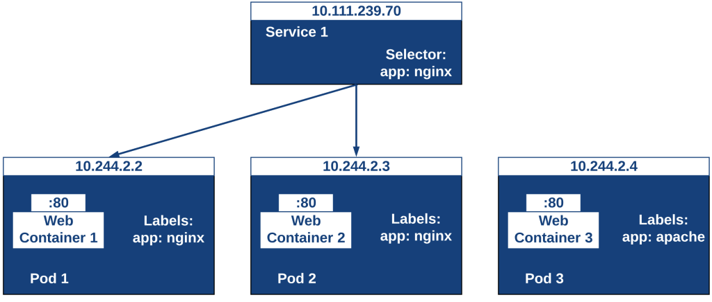

Great follow-up — this is one of the most important concepts in Kubernetes, so let’s break it down clearly:

* * *

## 🔧 What does **"Expose a resource as a network service"** mean?

When you create Pods in Kubernetes, they:

- Get their own **IP addresses**
    
- Can come and go (be restarted, replaced, scaled up/down)
    

This makes it hard to **reliably access them**, especially if you're trying to connect to a group of Pods (like replicas of a web server).

So Kubernetes gives you the **Service** object — a stable, reliable way to access your Pods **through a single name and IP**, even if the actual Pods change.

* * *

## 🧱 What is a **Service object**?

A **Service** in Kubernetes is a **logical abstraction** that:

- **Selects** a group of Pods using **labels**
    
- **Gives them a stable DNS name and IP address**
    
- **Routes traffic** to them using **load balancing**
    

It's like a smart internal "router" or "load balancer" that hides the dynamic nature of Pods.



* * *

## What does `kubectl expose` do?

- `kubectl expose` creates a **Service** object to expose a resource (Pod, Deployment, ReplicaSet, etc.) as a network service.
    
- It automates the creation of a Service that points to your Pods.
    
- You can specify the type of service (ClusterIP, NodePort, LoadBalancer, etc.).
    

* * *

### 📦 Example:

Suppose you have a Deployment with 3 web server Pods (each running on port `8080`):

```bash
kubectl expose <resource> <name> --port=<port> --target-port=<targetPort> --type=<type> --name=<serviceName>

kubectl expose deployment myapp --port=80 --target-port=8080
```

- `<resource>`: The resource type (pod, deployment, replicaset, etc.)
    
- `<name>`: Name of the resource you want to expose
    
- `--port`: The port that the service will expose/ the port that cluster listens on
    
- `--target-port`: The port on the Pod/container that the traffic is forwarded to/ redirected to (optional, defaults to `--port`)
    
- `--type`: Type of the service (`ClusterIP`, `NodePort`, `LoadBalancer`, or `ExternalName`)
    
- `--name`: Name of the service (optional; defaults to the resource name)
    

What happens:

- Kubernetes creates a **Service** object named `myapp`
    
- It gets an internal **ClusterIP** (e.g. `10.96.0.12`)
    
- Inside the cluster, **other Pods can access this service** via:
    
    - IP: `10.96.0.12`
        
    - DNS: `myapp.default.svc.cluster.local`
        
- Traffic to port `80` on the service is forwarded to port `8080` on the matching Pods
    

* * *

## 🧪 Real-world analogy

> Think of Pods like freelancers who change phone numbers often. A Service is like a business phone number that always reaches whichever freelancers are currently available, without you needing to know their current numbers.

* * *

## 🧾 Example YAML for a Service

Here’s what a Service object might look like if you define it yourself (instead of using `kubectl expose`):

```yaml
apiVersion: v1
kind: Service
metadata:
  name: myapp
spec:
  selector:
    app: myapp  # selects Pods with label 'app=myapp'
  ports:
  - protocol: TCP
    port: 80          # port clients use to talk to the service
    targetPort: 8080  # port on the Pod the traffic is forwarded to
  type: ClusterIP     # internal-only service
```

* * *

## ✅ Summary

| Concept | Description |
| --- | --- |
| **Pod IPs** | Temporary, change over time |
| **Service object** | Provides stable access to Pods via IP/DNS |
| **kubectl expose** | A shortcut to create a Service for your Pods/Deployment |
| **ClusterIP (default)** | Service type for internal communication |
| **Selector** | Tells the Service which Pods to route traffic to |

* * *

&nbsp;

Yes, **you absolutely can create a Service that forwards to multiple Pods**, and that's actually one of the **main reasons Services exist** in the first place: to **load balance traffic** across a group of Pods.

* * *

## ✅ To forward a Service to multiple Pods:

You need to make sure:

1.  All the target Pods **share the same label(s)**
    
2.  The Service **uses a selector** that matches that label
    

* * *

## 🔧 Example Step-by-Step

Let’s say you want to forward to **3 Pods** running `nginx`.

* * *

### ✅ Step 1: Create multiple Pods with the same label

#### Option A: Use a Deployment (recommended)

```yaml
apiVersion: apps/v1
kind: Deployment
metadata:
  name: nginx-deploy
spec:
  replicas: 3
  selector:
    matchLabels:
      app: nginx
  template:
    metadata:
      labels:
        app: nginx
    spec:
      containers:
      - name: nginx
        image: nginx
        ports:
        - containerPort: 80
```

Apply it:

```bash
kubectl apply -f nginx-deployment.yaml
```

This will create 3 Pods with label `app=nginx`.

* * *

### ✅ Step 2: Create a Service that selects all Pods with that label

```yaml
#kubectl expose pod nginx-1 --port=80 --target-port=80 --name=nginx-service --selector=app=nginx


apiVersion: v1
kind: Service
metadata:
  name: nginx-service
spec:
  selector:
    app: nginx      # This matches all 3 Pods
  ports:
    - protocol: TCP
      port: 80          # Service port
      targetPort: 80    # Container port
  type: ClusterIP       # Or NodePort / LoadBalancer if needed
```

> 🔹 **Imperative (`kubectl expose`)**:  
> “Create a Service **for this specific resource** (e.g., a Pod or Deployment), and optionally use this selector.”

> 🔹 **Declarative (YAML)**:  
> “Here’s a Service that should send traffic to **any Pods matching this selector** — I don't care what created the Pods.”

Apply it:

```bash
kubectl apply -f nginx-service.yaml
```

Run a test pod:

```bash
kubectl run testclient --image=busybox -it --restart=Never -- /bin/sh
```

Inside the shell:

```sh
wget -O- http://nginx-service:80
```

Run it a few times — each request will be **load balanced** across the 3 Pods behind the Service.

* * *

### 🧠 Why the difference?

- In the **imperative approach**, you’re referencing an actual **resource**, like:
    
    `kubectl expose pod nginx-1 --port=80 --target-port=80 --name=nginx-service --selector=app=nginx`
    
    - Kubernetes uses the labels on that Pod (or your `--selector`) to generate the service.
        
    - You're telling it: **“Create a service for *that*.”**
        

* * *

- In the **declarative approach**, you're just defining the desired **state**:
    
    `selector: app: nginx`
    
    - You don’t care where the Pods came from (Pod, Deployment, ReplicaSet, etc.)
        
    - You just say: **“Send traffic to any Pods with this label.”**
        

&nbsp;

# ✅ Why is the behavior different?

Because imperative commands like `kubectl expose` are designed for:

- **Beginners**
    
- **Quick experiments**
    
- **Auto-configuration**
    

While YAML is designed for:

- **Precise infrastructure-as-code**
    
- **Repeatable deployments**
    
- **Full control, no assumptions**
    

* * *

## 🧠 Analogy

Think of it like this:

|     | **Imperative (`kubectl expose`)** | **Declarative (YAML)** |
| --- | --- | --- |
| Like saying | “Hey Kubernetes, expose this pod please — figure out the rest.” | “Here is a blueprint of exactly what I want. Don’t guess.” |
| Kubernetes behavior | Helpful assistant | Contractual executor |

* * *

## ✅ TL;DR

> ✅ Yes, YAML has the same risks (typos, label mismatches, unintended targets) — **but** it’s your responsibility to get it right. Kubernetes won’t hold your hand there.
> 
> 🚀 In contrast, `kubectl expose` tries to be **friendly and forgiving** — that’s why it **requires the resource type**, so it can auto-fill things and avoid common mistakes.✅ Step 3: Test It

&nbsp;

* * *

## 🔁 What Happens Internally?

- The Service’s **selector** (`app=nginx`) matches multiple Pods.
    
- Kubernetes maintains an **Endpoints list** (you can view it with `kubectl get endpoints nginx-service`).
    
- Each request to the Service is **round-robined** across the list of IPs.
    

* * *

## 🚫 Bonus: What if you don’t want to use labels?

Then you'd need to **manually create an Endpoints object**, but that’s rarely used. It's much cleaner to use labels.

* * *

## 🧠 Summary

| Component | Purpose |
| --- | --- |
| **Labels** on Pods | Used to group them |
| **Service selector** | Matches Pods based on labels |
| **Service IP/DNS** | Stable entry point for access |
| **Load balancing** | Automatically handled by Kubernetes across matching Pods |

* * *

&nbsp;

&nbsp;

&nbsp;

Absolutely! Kubernetes has several **types of Service objects** to handle different use cases depending on how you want to expose your application. Here’s a clear rundown of each type:

* * *

## Kubernetes Service Types

| Type | Description | Use Case / Access Scope |
| --- | --- | --- |
| **ClusterIP** (default) | Exposes the service on an internal IP in the cluster. Only accessible **within the cluster**. | For internal communication between Pods or services inside the cluster. |
| **NodePort** | Exposes the service on the same port of each Node’s IP at the **node level**. Accessible from outside the cluster via `<NodeIP>:<NodePort>`. | To expose services externally on a fixed port on all nodes. Good for testing or small setups. |
| **LoadBalancer** | Creates an external load balancer (usually cloud provider-managed) and exposes the service externally via that LB. | For production environments needing cloud provider managed load balancing. |
| **ExternalName** | Maps the service to a DNS name by returning a CNAME record, without creating a proxy. | To proxy a Kubernetes service to an external DNS name (outside the cluster). |

## How to choose?

| Scenario | Best Service Type |
| --- | --- |
| Internal-only communication | ClusterIP |
| Expose service on node port | NodePort |
| Expose service to external clients | LoadBalancer |
| Use external service DNS | ExternalName |

* * *

### Quick `kubectl expose` examples:

- Create a **ClusterIP** service (default):

```bash
kubectl expose deployment myapp --port=80
```

- Create a **NodePort** service:

```bash
kubectl expose deployment myapp --type=NodePort --port=80
```

- Create a **LoadBalancer** service (on supported cloud platforms):

```bash
kubectl expose deployment myapp --type=LoadBalancer --port=80
```

* * *

&nbsp;

Here are example YAML manifests for each **Service type** with explanations on how traffic flows:

* * *

# 1\. **ClusterIP (Internal only)**

```yaml
apiVersion: v1
kind: Service
metadata:
  name: myapp-clusterip
spec:
  selector:
    app: myapp
  ports:
    - protocol: TCP
      port: 80        # Service port inside cluster
      targetPort: 8080 # Container port on Pods
  type: ClusterIP   # Default type
```

### Traffic flow:

- Pods inside the cluster access this service via its internal ClusterIP or DNS name (e.g., `myapp-clusterip.default.svc.cluster.local`).
    
- Requests on port 80 get forwarded to port 8080 on selected Pods.
    
- External clients **cannot** access this service.
    

* * *

# 2\. **NodePort (External access via Node IP)**

🚪 What is a NodePort?

A **NodePort** is a type of Kubernetes **Service** that exposes your application **on a static port** on **each node's IP address**, so you can access it **from outside the cluster**.

> It allows you to reach your service using:  
> **`<NodeIP>:<NodePort>`**

* * *

## 📦 NodePort in the Big Picture

### Here's how traffic flows with NodePort:

```text
You
 |
 v
<NodeIP>:<NodePort>  ─────────┐
                             |
                      [kube-proxy]
                             |
        ┌────────────┬────────────┬────────────┐
        v            v            v
    Pod A        Pod B        Pod C      (Matching selector)
```

- NodePort listens on **all nodes**, even if Pods are not running on all nodes.
    
- `kube-proxy` takes care of routing requests to one of the **Pods** that match the **selector**.
    

* * *

## 🔧 Example YAML for a NodePort Service

```yaml
apiVersion: v1
kind: Service
metadata:
  name: myapp-nodeport
spec:
  type: NodePort
  selector:
    app: myapp
  ports:
    - port: 80           # Service port (internal)
      targetPort: 8080   # Container port in the Pod
      nodePort: 30080    # Exposed port on the node (optional)
```

If `nodePort` is not specified, Kubernetes will assign one from the default range:  
📍 **30000–32767**

* * *

## 🎯 Accessing the Service

Assuming:

- You have a node with IP: `192.168.1.10`
    
- `nodePort` is `30080`
    

Then, you can access the service from your machine like this:

```bash
curl http://192.168.1.10:30080
```

This will be routed to one of the matching Pods.

* * *

## ✅ Summary Table

| Field | Description |
| --- | --- |
| `type: NodePort` | Tells Kubernetes to expose the service externally |
| `port` | The port the Service exposes **inside** the cluster |
| `targetPort` | The port the container is listening on |
| `nodePort` | The port exposed on **all cluster nodes** |

* * *

## 🛠️ When to Use NodePort?

Use NodePort when:

- You want **quick external access** to a Service without setting up a LoadBalancer.
    
- You are **in a bare-metal cluster** or local dev setup (like Minikube or kind).
    
- You’re okay with manually managing ports.
    

* * *

## ⚠️ Limitations

- Port range is limited: **30000–32767**
    
- Can expose your nodes to the public Internet (be careful)
    
- No DNS name — you access via raw IP and port
    
- Not ideal for production unless behind a proper **ingress controller** or **load balancer**
    

* * *

## 🔁 Comparison with Other Service Types

| Service Type | Accessible From | Load-Balancing? | External IP Needed? |
| --- | --- | --- | --- |
| **ClusterIP** | Inside cluster only | ✅   | ❌   |
| **NodePort** | Outside cluster (via NodeIP:Port) | ✅   | ❌   |
| **LoadBalancer** | Outside (via cloud load balancer) | ✅   | ✅ (cloud provided) |
| **ExternalName** | Inside cluster only (DNS alias) | ❌   | ❌   |

* * *

&nbsp;

Difference between `kubectl describe` and `kubectl get` when working with resources like services:

* * *

### `kubectl get`

- **Purpose:** Lists resources or retrieves their basic information.
    
- **Output:** Shows a concise summary — usually the key fields in a table or YAML/JSON if requested.
    
- **Example:**
    
    ```bash
    kubectl get service firstservice
    ```
    
    Output is a short table: name, type, cluster IP, ports, age.
    
- **With output formats:**  
    You can use `-o yaml` or `-o json` to get the full resource manifest (all fields).  
    Example:
    
    ```bash
    kubectl get service firstservice -o yaml
    ```
    
    This outputs the entire service spec in YAML format, including `spec.ports.targetPort`, selectors, annotations, etc.
    

* * *

### `kubectl describe`

- **Purpose:** Provides a detailed human-readable summary of a resource.
    
- **Output:** More verbose and descriptive, includes events, detailed info about ports, selectors, endpoints, and sometimes status or error messages.
    
- **Example:**
    
    ```bash
    kubectl describe service firstservice
    ```
    
    Output includes sections like:
    
    - Name, Namespace, Labels, Annotations
        
    - Selector
        
    - Type, IPs
        
    - Ports (showing port and targetPort)
        
    - Endpoints (actual pod IPs backing the service)
        
    - Events related to the service (if any)
        

* * *

### When to use which?

- Use **`kubectl get`** when you want quick info or need the raw resource YAML/JSON for scripting or automation.
    
- Use **`kubectl describe`** when you want a detailed human-readable report, especially useful for troubleshooting or seeing events and runtime info.
    

* * *

**In your case:**  
To find the `targetPort`, both can work:

- `kubectl get svc firstservice -o yaml` → shows full config, including `targetPort`.
    
- `kubectl describe svc firstservice` → shows `targetPort` in the Ports section clearly and events if any.
    

* * *

&nbsp;

**Multiple services can expose different ports and redirect to the same target port** (on pods). Kubernetes fully supports this.

* * *

### ✅ Example Scenario:

Let’s say you have a pod running a web app on **container port 8080**.

You can create **multiple services** like this:

#### 1\. First Service (exposes port 80 → 8080)

```yaml
apiVersion: v1
kind: Service
metadata:
  name: web-service-80
spec:
  selector:
    app: myapp
  ports:
    - port: 80
      targetPort: 8080
  type: ClusterIP
```

#### 2\. Second Service (exposes port 443 → 8080)

```yaml
apiVersion: v1
kind: Service
metadata:
  name: web-service-443
spec:
  selector:
    app: myapp
  ports:
    - port: 443
      targetPort: 8080
  type: ClusterIP
```

Both services point to the same `targetPort` (8080 on the pod), but expose different service ports.

* * *

### 🔁 You can even use different types:

- One service as a `ClusterIP`
    
- Another as a `NodePort`
    
- A third as a `LoadBalancer`
    

All pointing to the **same backend targetPort** — as long as your pods can handle the incoming traffic.

* * *

### 🚫 What you can’t do:

- Two services cannot use the **same NodePort** (e.g., both trying to use NodePort `31000`). That will cause a conflict.

* * *

### 🔍 Real-World Use Case:

You might expose:

- `Service A` on port `80` for general web traffic.
    
- `Service B` on port `8081` for internal admin traffic.
    
- Both forward to `targetPort: 8080` on the same pod.
    

This is often used to:

- Simulate different entry points
    
- Attach different ingress rules or network policies
    
- Support different client access methods (HTTP vs admin vs API)
    

* * *

&nbsp;

**Two different Kubernetes Services can listen on the same port number** (e.g., `port: 80`) and redirect to the **same target port** (e.g., `targetPort: 8080`) **as long as**:

- They have **different names**, and
    
- They're not using a conflicting **NodePort** (if `type: NodePort`), and
    
- They're in the **same or different namespaces** (depending on how you're organizing them)
    

* * *

### 🧠 Think of it this way:

- A **Service is just an internal abstraction** — it creates a virtual IP (`ClusterIP`) and a port mapping.
    
- That port mapping is **per service** — not global, unless you're exposing it externally via `NodePort` or `LoadBalancer`.
    

* * *

### 🔄 Example: Two ClusterIP services using same port → same pod target port

#### Service A

```yaml
apiVersion: v1
kind: Service
metadata:
  name: service-a
spec:
  selector:
    app: myapp
  ports:
    - port: 80
      targetPort: 8080
  type: ClusterIP
```

#### Service B

```yaml
apiVersion: v1
kind: Service
metadata:
  name: service-b
spec:
  selector:
    app: myapp
  ports:
    - port: 80
      targetPort: 8080
  type: ClusterIP
```

✅ This is totally valid.  
Each service gets its own `ClusterIP`, and listens on **port 80**, forwarding to the same **targetPort 8080** on pods.

* * *

### ⚠️ But if the services are of type `NodePort`, **then you can't** do this unless:

- You explicitly specify different `nodePort` values, or
    
- Let Kubernetes auto-assign them (they'll be different).
    

#### ❌ Invalid example:

```yaml
# BAD: Two services with the same NodePort (31000)
spec:
  type: NodePort
  ports:
    - port: 80
      targetPort: 8080
      nodePort: 31000  # conflict if used in multiple services
```

This will fail because **NodePorts must be unique across the cluster.**

* * *

### ✅ So, summary:

| Service Type | Can use same `port` and `targetPort`? | Notes |
| --- | --- | --- |
| ClusterIP | ✅ Yes | No conflict |
| NodePort | ⚠️ Only if NodePorts are different | NodePorts must be unique |
| LoadBalancer | ✅ Yes (like NodePort underneath) | Still must avoid same NodePort |

* * *

&nbsp;

In Kubernetes, when you create a **NodePort** service, it is **not tied to any specific node**.

* * *

### ✅ Key Point:

> **NodePort opens the port on *every* node in the cluster**, regardless of where the pods are running.

So if you have 3 nodes, and you create a NodePort service with `nodePort: 31000`, then **port 31000 is open on all 3 nodes**.

* * *

### 🔁 What happens when you access a node via the NodePort?

- You can hit **any node’s IP** on that `nodePort`.
    
- Kubernetes (via `kube-proxy`) will route the request to one of the backend pods selected by the service — even if the pod isn't running on that node.
    

* * *

### 🧪 Example

Let’s say:

- You have a service:

```yaml
type: NodePort
ports:
  - port: 80
    targetPort: 8080
    nodePort: 31000
```

- You have these nodes:

```
kubectl get nodes -o wide

NAME     INTERNAL-IP     EXTERNAL-IP
node-1   192.168.1.10     34.122.99.10
node-2   192.168.1.11     34.122.99.11
node-3   192.168.1.12     34.122.99.12
```

You can access your service via:

```
http://34.122.99.10:31000
http://34.122.99.11:31000
http://34.122.99.12:31000
```

✅ All of those will work — Kubernetes takes care of routing traffic to the correct pod.

* * *

### 🛠 How kube-proxy makes this happen

- `kube-proxy` runs on **each node**, and it programs iptables or IPVS rules so that NodePort traffic is handled properly.
    
- If a node receives a request on that NodePort, it either forwards it to a local pod (if available) or to a pod on another node.
    

* * *

### 🚨 Important Notes

| Scenario | Behavior |
| --- | --- |
| Node has no matching pod | Traffic still gets routed to other nodes where pods are running |
| All pods are on one node | NodePort still open on all nodes; requests from other nodes are routed to the pod |
| Firewall blocks port | You must ensure firewall or cloud security rules allow incoming traffic on the NodePort (e.g., 31000) |

* * *

### TL;DR

- **NodePort is not assigned to one node.**
    
- It’s open on **every node** in the cluster.
    
- You can access your app using any node's IP and the NodePort.
    

&nbsp;

You're getting the error:

```
error: resource(s) were provided, but no name was specified
```

because `kubectl delete all` expects you to either:

- Provide a specific **resource name**, or
    
- Use the `--all` flag to delete **all resources of all types** in the current namespace.
    

* * *

### ✅ To delete **all resources** (pods, services, deployments, etc.) in the current namespace:

```bash
kubectl delete all --all
```

* * *

### 🧠 What `all` means in this context:

`kubectl delete all` refers to:

- `pods`
    
- `services`
    
- `replicationcontrollers`
    
- `deployments`
    
- `replicasets`
    
- `statefulsets` (depending on the cluster version)
    

> It does **not** delete things like configmaps, secrets, PVCs, ingresses, etc.

* * *

### 🔥 If you want to delete **everything** in the namespace (more destructive):

```bash
kubectl delete all --all
kubectl delete configmap --all
kubectl delete secret --all
kubectl delete pvc --all
kubectl delete ingress --all
```

Or, if you're cleaning up everything in a dev/test namespace:

```bash
kubectl delete namespace <your-namespace>
```

Then recreate the namespace if needed.

* * *

&nbsp;

* * *

# 3\. **LoadBalancer (Cloud-provider managed LB)**

* * *

# 4\. **ExternalName (DNS alias to external service)**

&nbsp;

&nbsp;

&nbsp;

* * *

# Summary Table

| Service Type | Access from inside cluster | Access from outside cluster | Use case |
| --- | --- | --- | --- |
| ClusterIP | Yes | No  | Internal-only services |
| NodePort | Yes | Yes (via NodeIP:NodePort) | Expose service on node IP & port |
| LoadBalancer | Yes | Yes (via cloud LB IP/DNS) | Production external access via LB |
| ExternalName | Yes (via DNS) | N/A | Point to external DNS service |

* * *

&nbsp;