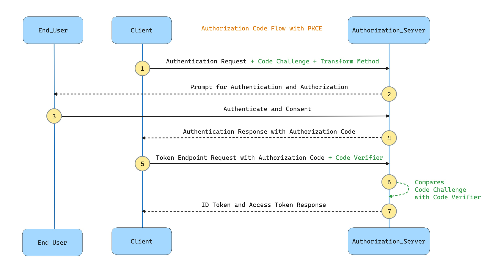

## What is OAuth?

- **OAuth (Open Authorization)** is a **delegated authorization framework** (not authentication by itself).
    
- It lets a **user** grant a **third-party application** access to resources they own on another service (the **resource server**) — without giving away their username/password.
    
- Access is controlled using **temporary tokens** instead of credentials.
    

* * *

## 🧩 Key Components

1.  **Resource Owner** → The user (e.g., you).
    
2.  **Client Application** → The app requesting access (e.g., Slack integration).
    
3.  **Authorization Server** → Issues tokens (e.g., Google Accounts).
    
4.  **Resource Server** → Hosts data (e.g., Google Drive API).
    

 

# How OAuth Works (Simplified Flow)

- **1.** **User Action:**
    
    You try to use a feature in an application that requires access to another service (e.g., an app wants to access your Google contacts).
    
- **2.** **Authorization Request:**
    
    The application redirects you to the service's authorization server (like Google's) to request permission.
    
- **3.** **User Consent:**
    
    You log in to your account and approve the application's request for specific access (the ["scope"](https://www.google.com/search?safe=active&sca_esv=0f2da4589a5603d0&rlz=1C5GCEM_enIN1174IN1174&q=%22scope%22&sa=X&ved=2ahUKEwjasuDvo7yPAxXeT2cHHVIJAh4QxccNegUI6wMQAQ&mstk=AUtExfCHFR8RJ_qD8KFCDTfOeeUi7gEvIzC2IqhgSKMiraKLfCYHHqckxsx48Q25xf5ZioQedzIrri4__HLqjRZcbvPIbtQ02TSIpMOdLTwkdAN90Lbrcpm9eRHlPso6s0em74xDD1BMGS6NIP2LAHchGYtFgwuW8uX8jwd86xtmJksfzJdrFItUE2XEIap_YZPZVeXn&csui=3)).
    
- **4.** **Authorization Grant:**
    
    The authorization server provides an authorization code or token to the requesting application, confirming your consent.
    
- **5.** **Access Tokens:**
    
    The application uses this token to obtain short-lived access tokens from the authorization server.
    
- **6.** **Data Access:**
    
    The application uses the access token to make authorized API calls and retrieve the specified data from the other service.
    

&nbsp;

# Key Benefits

- **Security:**
    
    Users don't have to share their actual passwords with third-party applications.
    
- **Granular Control:**
    
    Users can grant specific permissions, rather than giving full account control.
    
- **Convenience:**
    
    It facilitates integrations and single sign-on (SSO) experiences across different platforms.
    

&nbsp;

# OAuth vs. Authentication

- **OAuth (Authorization):** Grants permission for an application to access specific data or resources on behalf of a user.
    
- **Authentication:** Verifies a user's identity, confirming who they are.
    

&nbsp;

# **OAuth2 grant types**

## 🔑 Modern / Commonly Used OAuth2 Grant Types

1.  **Authorization Code**
    
    - Standard, secure, server-side flow.
        
    - Widely used by web apps (with backend).
        
2.  **Authorization Code with PKCE (Proof Key for Code Exchange)**
    
    - Enhancement of Authorization Code.
        
    - Designed for **SPAs & mobile apps** (no client secret).
        
    - Prevents interception of authorization code.
        
3.  **Client Credentials**
    
    - Machine-to-machine (M2M).
        
    - No user → just service/service tokens.
        
4.  **Device Code Flow**
    
    - For devices without keyboards (TVs, IoT).
        
    - User logs in separately and approves.
        
5.  **Refresh Token**
    
    - Not a flow by itself, but used to **renew access tokens** without user logging in again.
        
    - Important for long-lived sessions.
        

* * *

## 🗂️ Legacy / Deprecated OAuth2 Flows

6.  **Implicit Flow** ❌
    
    - Tokens returned directly in URL fragment (`#`).
        
    - Used in old SPAs.
        
    - Insecure → replaced by **PKCE**.
        
7.  **Password Grant (ROPC)** ❌
    
    - User gives username + password to client app.
        
    - Breaks security principles.
        
    - Deprecated except in very limited, trusted environments.
        

* * *

## 📌 Summary Table

| Grant Type | Use Case | Status |
| --- | --- | --- |
| **Auth Code** | Web apps with backend | ✅   |
| **Auth Code + PKCE** | Mobile & SPAs | ✅   |
| **Client Credentials** | Machine-to-machine | ✅   |
| **Device Code** | TVs, IoT | ✅   |
| **Refresh Token** | Extending sessions | ✅   |
| **Implicit Flow** | Legacy SPAs | ❌   |
| **Password Grant** | Legacy trusted apps | ❌   |

* * *

&nbsp;

* * *

## 🚨 The Problem (without PKCE)

- In the **plain Authorization Code flow**, the **authorization code** is sent back to the client through a redirect (browser → app).
    
- If the app is a **public client** (SPA, mobile app), it **cannot safely store a client secret**.
    
- An attacker could:
    
    - Intercept the **authorization code** (via malicious app, browser plugin, or network).
        
    - Exchange it directly with the Authorization Server for an **access token**.
        
    - Now the attacker can act as the user.
        

* * *

## ✅ The PKCE Solution

PKCE = **Proof Key for Code Exchange**.  
It adds a **one-time secret handshake** between the app and the authorization server, so even if the code is stolen, the attacker can’t use it.

&nbsp;



* * *

### 🔑 Steps in PKCE Flow

1.  **App generates a random string** called `code_verifier`.  
    Example: `dBjftJeZ4CVP-mB92K27uhbUJU1p1r_wW1gFWFOEjXk`
    
2.  It hashes it (SHA256) → becomes `code_challenge`.  
    Example: `E9Melhoa2OwvFrEMTJguCHaoeK1t8URWbuGJSstw-cM`
    
3.  App starts the login:
    
    - Sends `code_challenge` (not the verifier) with the auth request.
        
    - Authorization Server stores it temporarily.
        
4.  User logs in → Authorization Server redirects with an **authorization code**.
    
5.  App exchanges the code for a token:
    
    - It sends the `code_verifier` along with the authorization code.
6.  Authorization Server checks:
    
    - Hash(`code_verifier`) == `code_challenge` sent earlier?
        
    - If yes → issue token.
        
    - If no → reject.
        

* * *

### 🔐 Why this prevents interception

- If an attacker steals just the **authorization code**, they still **don’t have the `code_verifier`**.
    
- Without the verifier, they can’t complete the exchange → the code is useless to them.
    
- The real app is the only one that knows the original `code_verifier`.
    

* * *

## 📌 Analogy

Think of it like a **lock and key**:

- The `code_challenge` is the lock given to the auth server.
    
- The `code_verifier` is the only key that can open it.
    
- The authorization code alone is like knowing the door exists — but without the key, you can’t get in.
    

&nbsp;

&nbsp;

&nbsp;

## OAuth 2.0 Summary including client_id and secret

### Key Entities

- **User (Resource Owner)** → Person using the application.
    
- **Client** → Application requesting access (web app, mobile app, backend service).
    
- **Authorization Server** → OAuth provider (e.g., Keycloak, Auth0, Google).
    
- **Resource Server** → API being accessed.
    

* * *

### What is `client_id`?

`client_id` identifies the **application**, not the user.

Example:

```text
client_id = web-app-123
```

OAuth uses it to:

- Identify the application making the request.
    
- Validate redirect URIs.
    
- Apply client-specific policies/scopes.
    
- Show the application's name on the consent screen.
    
- Associate issued tokens with that application.
    
    ex : {  
      "sub": "user123",  
      "client_id": "web-app-123",  
      "scope": "profile"  
    }
    

`client_id` is **public** and can safely appear in URLs, browser code, mobile apps, etc.

* * *

### What is `client_secret`?

`client_secret` proves the application's identity.

Example:

```text
client_id     = web-app-123
client_secret = super-secret
```

It must remain private and should only exist on servers you control.

* * *

### Public vs Confidential Clients

| Client Type | Example | Can Keep Secret? |
| --- | --- | --- |
| Public | React SPA, Angular SPA, Android App, iOS App, Desktop App | No  |
| Confidential | Backend service, Java app, Node.js API, Go service | Yes |

* * *

### Why can't SPAs use a client secret?

A **SPA (Single Page Application)** runs in the user's browser.

Examples:

- React
    
- Angular
    
- Vue
    

Since the browser downloads all application code:

```text
Browser → JavaScript → User can inspect it
```

Any embedded secret can be extracted.

Therefore SPAs are treated as **public clients**.

* * *

### What are React and Angular?

Tools used to build modern web applications:

- **React** → UI library.
    
- **Angular** → Full web framework.
    

Both commonly build SPAs where the page loads once and then communicates with APIs without full page reloads.

* * *

### Mobile and Desktop Apps

Although they don't run in a browser, they still run on the user's device.

Users can:

- Decompile mobile apps.
    
- Reverse engineer desktop applications.
    

Therefore OAuth also treats them as **public clients**.

* * *

### Typical OAuth Flows

#### Public Clients (SPA/Mobile/Desktop)

Use:

```text
Authorization Code Flow + PKCE
```

Authentication:

```text
client_id ✓
client_secret ✗
```

* * *

#### Confidential Clients (Backend Services)

Use:

```text
Authorization Code Flow
```

Authentication:

```text
client_id ✓
client_secret ✓
```

* * *

### Mental Model

```text
User        = Who is granting access
client_id   = Which application is asking
client_secret = Proof that the application is genuine
access token = What permissions were granted
```

In short:

- `client_id` identifies the application.
    
- `client_secret` authenticates the application.
    
- Browser, mobile, and desktop apps are **public clients** and cannot securely store secrets.
    
- Backend services are **confidential clients** and can securely use `client_secret`.
    
- Public clients typically use **OAuth Authorization Code Flow with PKCE**.
    

&nbsp;